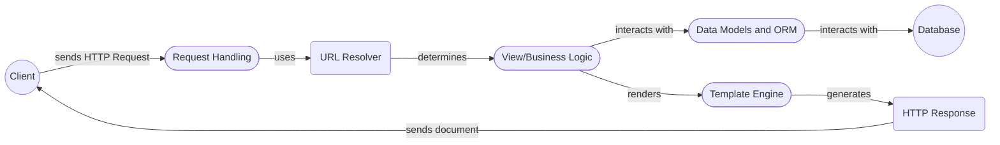

# Django High-Level Data Flow Overview

Django is a high-level Python web framework that encourages rapid development and clean, pragmatic design. It provides a robust set of tools and conventions for building web applications, including an ORM, templating engine, form handling, and more. Django follows the Model-View-Template (MVT) architectural pattern to organize the application's structure.

## Data Flow Diagram

## Component Descriptions

**1. Client:** Represents the user or system that initiates an HTTP request to the Django application. It interacts with the Request Handling component by sending HTTP requests and receiving HTTP responses.

**2. Request Handling:** This component receives HTTP requests from the client, processes them, and generates HTTP responses. It uses the URL Resolver to determine the appropriate view to execute based on the request's URL. 

   *Related Files:*
    *   `django.core.handlers.wsgi.WSGIHandler`: Handles the WSGI request/response cycle.
    *   `django.http.request.HttpRequest`: Represents an incoming HTTP request.
    *   `django.http.response.HttpResponse`: Represents an HTTP response.
    *   `django.urls.resolvers.URLResolver`: Resolves URLs to their corresponding views.
    *   `django.urls.base.resolve`: Core URL resolution function.

**3. URL Resolver:** Responsible for mapping incoming URLs to specific views within the Django application. It determines which view should handle a particular request based on the URL patterns defined in the project's `urls.py` files. It interacts with the Request Handling component by receiving the request's URL and determining the appropriate view to execute.

**4. View/Business Logic:** Contains the application's business logic and processes the request data. It interacts with the Data Models and ORM component to retrieve or store data in the database. It also interacts with the Template Engine to render the response.

**5. Data Models and ORM:** Defines the application's data structure and provides an interface for interacting with the database. It uses Django's ORM to abstract database operations, allowing developers to work with Python objects instead of writing raw SQL queries. It interacts with the View/Business Logic component by providing methods for retrieving and storing data.

   *Related Files:*
    *   `django.db.models.base.Model`: Base class for defining data models.
    *   `django.db.models.query.QuerySet`: Represents a collection of database objects.
    *   `django.db.fields.*`: Defines various field types for data models.

**6. Database:** Stores the application's data. The ORM interacts with the database to perform CRUD operations.

**7. Template Engine:** Responsible for rendering dynamic content using templates. It handles template loading, context processing, and rendering the final output, allowing developers to separate the presentation layer from the application logic. It interacts with the View/Business Logic component by receiving data to be rendered and generating the final HTML output.

   *Related Files:*
    *   `django.template.engine.Engine`: Core template engine class.
    *   `django.template.context.Context`: Represents the template context.
    *   `django.template.loader.get_template`: Loads a template from the file system or other sources.
    *   `django.template.base.Template`: Represents a compiled template.

**8. HTTP Response:** Represents the final HTTP response that is sent back to the client. It contains the rendered content, status code, and headers. It interacts with the Template Engine by receiving the rendered HTML output and sending it back to the client.