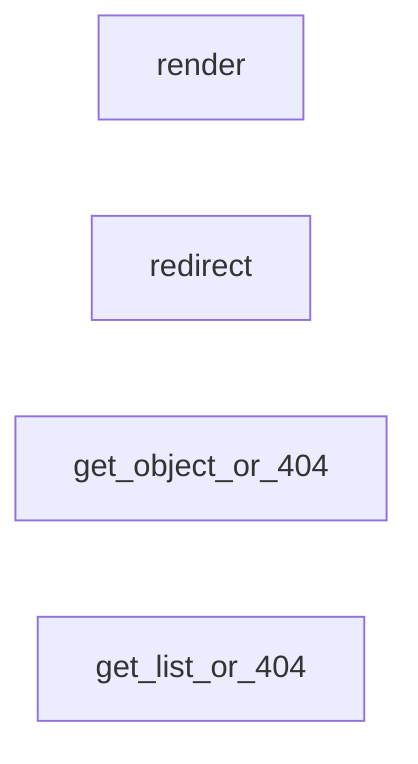

## Component Details

Analysis of the codebase structure and components

### render
Renders a template with a given context and returns an HttpResponse object.

**Related Classes/Methods**:

- `django.shortcuts.render` (full file reference)

### redirect
Returns an HttpResponseRedirect to the URL passed as parameter.

**Related Classes/Methods**:

- `django.shortcuts.redirect` (full file reference)

### get_object_or_404
Uses get() to return an object, or raises a Http404 exception if the object is not found.

**Related Classes/Methods**:

- `django.shortcuts.get_object_or_404` (full file reference)

### get_list_or_404
Uses filter() to return a list of objects, or raises a Http404 exception if the list is empty.

**Related Classes/Methods**:

- `django.shortcuts.get_list_or_404` (full file reference)

### [FAQ](https://github.com/CodeBoarding/GeneratedOnBoardings/tree/main?tab=readme-ov-file#faq)