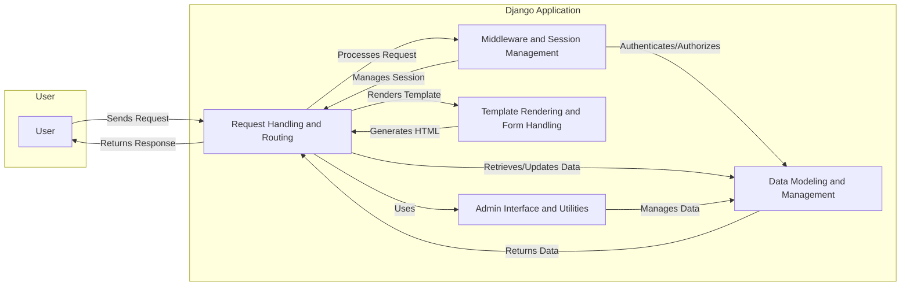

Okay, I will generate an onboarding document for the Django project based on the provided component analysis.

**Project Description**

Django is a high-level Python web framework that encourages rapid development and clean, pragmatic design. It provides a robust set of tools and conventions for building web applications, emphasizing reusability and "pluggability" of components, rapid development, and the principle of "don't repeat yourself." Django handles much of the hassle of web development, so you can focus on writing the application without needing to reinvent the wheel.

**Data Flow Diagram**

**Component Descriptions**

*   **Request Handling and Routing:** This component is the entry point for all incoming HTTP requests. It receives requests from the user, processes them, and routes them to the appropriate view based on the URL configuration. It interacts with the `Middleware and Session Management` component to handle authentication, authorization, and session management. It also interacts with the `Data Modeling and Management` component to retrieve or update data based on the request. Finally, it uses the `Template Rendering and Form Handling` component to render the response and returns it to the user. It uses `Admin Interface and Utilities` for admin related tasks.

*   **Middleware and Session Management:** This component provides global request and response processing functionalities, including security features like CSRF protection, session management, and locale handling. It authenticates and authorizes requests before they reach the data layer. It manages user sessions and provides session data to the `Request Handling and Routing` component.

*   **Data Modeling and Management:** This component defines the structure and behavior of data models, manages database interactions, and handles schema migrations. It provides an abstraction layer for interacting with the database, ensuring data integrity. It receives data requests from the `Request Handling and Routing` component and returns the requested data. It is also used by the `Admin Interface and Utilities` component for data management tasks.

*   **Template Rendering and Form Handling:** This component loads, compiles, and renders templates to generate dynamic HTML content. It also processes user input through forms, including validation and data cleaning. It receives data from the `Request Handling and Routing` component and renders it into a template. It then returns the generated HTML to the `Request Handling and Routing` component for inclusion in the response.

*   **Admin Interface and Utilities:** This component provides a user-friendly interface for managing data models and includes utilities for static files serving and internationalization. It simplifies data management and enhances the user experience. It interacts with the `Data Modeling and Management` component to manage data. It is used by the `Request Handling and Routing` component to serve static files and handle internationalization.