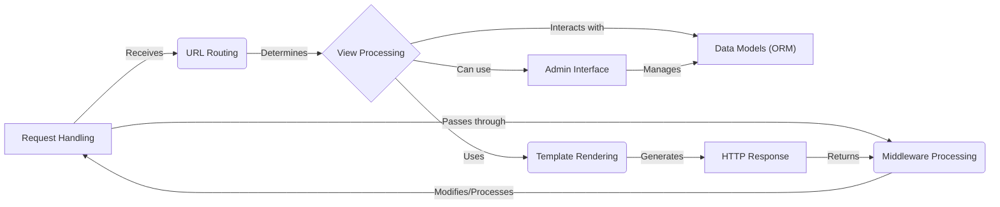

## Django High-Level Data Flow Overview

Django is a high-level Python web framework that encourages rapid development and clean, pragmatic design. It takes care of much of the hassle of web development, so you can focus on writing your app without needing to reinvent the wheel. It is free and open source.

### Component Descriptions:

**Request Handling:** This component is the entry point for all incoming HTTP requests. It receives the request and passes it to the URL Routing component to determine the appropriate view to execute. It also receives the final HTTP response from the Middleware Processing component and sends it back to the client.

**URL Routing:** This component maps incoming URLs to specific views or handlers within the application. It receives the request from the Request Handling component and uses the URL patterns defined in the application's `urls.py` files to determine which view should handle the request. It then passes the request to the View Processing component.

**View Processing:** This component executes the logic associated with a specific URL. It receives the request from the URL Routing component and interacts with the Data Models (ORM) component to retrieve or update data. It then uses the Template Rendering component to generate the HTML content for the response. It can also use the Admin Interface to manage data.

**Template Rendering:** This component combines templates with data to generate dynamic HTML content for the user interface. It receives the data from the View Processing component and uses the Django template engine to render the template with the data. It then passes the generated HTML content back to the View Processing component.

**Data Models (ORM):** This component provides an object-relational mapper (ORM) to interact with the database using Python objects. It allows the View Processing component to retrieve and update data without writing raw SQL queries. The Admin Interface also uses this component to manage data.

**Middleware Processing:** This component provides a hook to intercept and process requests and responses globally. It sits between the Request Handling component and the rest of the application, allowing you to modify the request before it reaches the view or the response before it is sent to the client. It enables functionalities like authentication, session management, and CSRF protection. It receives the request from the Request Handling component and passes it back to the Request Handling component after processing.

**Admin Interface:** This component offers a built-in interface for managing the application's data models. It allows administrators to easily create, read, update, and delete data without writing any code. It interacts with the Data Models (ORM) component to manage data and is used by the View Processing component.

**HTTP Response:** This component is responsible for creating and sending HTTP responses back to the client. It receives the rendered HTML from the Template Rendering component and sets the appropriate headers and status code for the response. It then passes the response to the Middleware Processing component.
