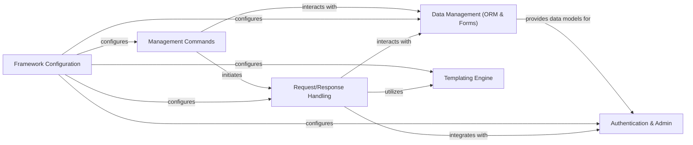

## Details

Django is a high-level Python web framework that encourages rapid development and clean, pragmatic design. It follows the Model-View-Template (MVT) architectural pattern, providing a robust set of tools for building complex, database-driven web applications. The core flow involves handling web requests through WSGI/ASGI handlers, processing them through a middleware stack, interacting with the ORM for data persistence, rendering dynamic content via the templating engine, and managing application state and configuration. Management commands provide a command-line interface for administrative tasks, integrating with various core components.

### Request/Response Handling [[Expand]](./Request_Response_Handling.md)
Manages the web request lifecycle, including routing, middleware processing, and response generation. It serves as the primary entry point for web interactions.

**Related Classes/Methods**:

- <a href="https://github.com/django/django//blob/django/core/handlers/wsgi.py#L113-L144" target="_blank" rel="noopener noreferrer">`django.core.handlers.wsgi.WSGIHandler`:113-144</a>
- <a href="https://github.com/django/django//blob/django/core/handlers/asgi.py#L139-L380" target="_blank" rel="noopener noreferrer">`django.core.handlers.asgi.ASGIHandler`:139-380</a>
- <a href="https://github.com/django/django//blob/django/http/request.py#L53-L488" target="_blank" rel="noopener noreferrer">`django.http.request.HttpRequest`:53-488</a>
- <a href="https://github.com/django/django//blob/django/http/response.py#L366-L436" target="_blank" rel="noopener noreferrer">`django.http.response.HttpResponse`:366-436</a>
- <a href="https://github.com/django/django//blob/django/contrib/sessions/middleware.py#L12-L77" target="_blank" rel="noopener noreferrer">`django.contrib.sessions.middleware.SessionMiddleware`:12-77</a>
- <a href="https://github.com/django/django//blob/django/contrib/messages/middleware.py#L6-L26" target="_blank" rel="noopener noreferrer">`django.contrib.messages.middleware.MessageMiddleware`:6-26</a>
- <a href="https://github.com/django/django//blob/django/contrib/sites/middleware.py#L6-L12" target="_blank" rel="noopener noreferrer">`django.contrib.sites.middleware.CurrentSiteMiddleware`:6-12</a>
- <a href="https://github.com/django/django//blob/django/contrib/auth/middleware.py#L30-L41" target="_blank" rel="noopener noreferrer">`django.contrib.auth.middleware.AuthenticationMiddleware`:30-41</a>

### Data Management (ORM & Forms) [[Expand]](./Data_Management_ORM_Forms_.md)
Provides a Pythonic interface for database interaction (ORM) and facilitates the creation, validation, and processing of HTML forms, often tightly integrated with models.

**Related Classes/Methods**:

- <a href="https://github.com/django/django//blob/django/db/models/base.py" target="_blank" rel="noopener noreferrer">`django.db.models.base.Model`</a>
- <a href="https://github.com/django/django//blob/django/db/models/manager.py" target="_blank" rel="noopener noreferrer">`django.db.models.manager.Manager`</a>
- <a href="https://github.com/django/django//blob/django/db/models/query.py#L279-L2071" target="_blank" rel="noopener noreferrer">`django.db.models.query.QuerySet`:279-2071</a>
- <a href="https://github.com/django/django//blob/django/forms/forms.py#L432-L433" target="_blank" rel="noopener noreferrer">`django.forms.forms.Form`:432-433</a>
- <a href="https://github.com/django/django//blob/django/forms/models.py#L585-L586" target="_blank" rel="noopener noreferrer">`django.forms.models.ModelForm`:585-586</a>
- <a href="https://github.com/django/django//blob/django/db/migrations/migration.py#L9-L222" target="_blank" rel="noopener noreferrer">`django.db.migrations.migration.Migration`:9-222</a>

### Templating Engine [[Expand]](./Templating_Engine.md)
Enables dynamic content generation by combining data with predefined HTML structures, providing mechanisms for loading, compiling, and rendering templates.

**Related Classes/Methods**:

- <a href="https://github.com/django/django//blob/django/template/engine.py" target="_blank" rel="noopener noreferrer">`django.template.engine.Engine`</a>
- <a href="https://github.com/django/django//blob/django/template/base.py#L138-L288" target="_blank" rel="noopener noreferrer">`django.template.base.Template`:138-288</a>
- <a href="https://github.com/django/django//blob/django/template/context.py#L141-L176" target="_blank" rel="noopener noreferrer">`django.template.context.Context`:141-176</a>

### Framework Configuration [[Expand]](./Framework_Configuration.md)
Manages project-wide settings, application registration, and the overall setup and initialization of the Django framework.

**Related Classes/Methods**:

- <a href="https://github.com/django/django//blob/django/apps/registry.py" target="_blank" rel="noopener noreferrer">`django.apps.registry.Apps`</a>
- <a href="https://github.com/django/django//blob/django/apps/config.py#L13-L274" target="_blank" rel="noopener noreferrer">`django.apps.config.AppConfig`:13-274</a>
- <a href="https://github.com/django/django//blob/django/conf/__init__.py#L39-L148" target="_blank" rel="noopener noreferrer">`django.conf.__init__.LazySettings`:39-148</a>

### Authentication & Admin [[Expand]](./Authentication_Admin.md)
Handles user accounts, authentication, authorization, and provides a ready-to-use administrative interface for managing application data.

**Related Classes/Methods**:

- <a href="https://github.com/django/django//blob/django/contrib/auth/models.py#L517-L526" target="_blank" rel="noopener noreferrer">`django.contrib.auth.models.User`:517-526</a>
- <a href="https://github.com/django/django//blob/django/contrib/auth/backends.py#L54-L242" target="_blank" rel="noopener noreferrer">`django.contrib.auth.backends.ModelBackend`:54-242</a>
- <a href="https://github.com/django/django//blob/django/contrib/admin/sites.py#L30-L606" target="_blank" rel="noopener noreferrer">`django.contrib.admin.sites.AdminSite`:30-606</a>
- <a href="https://github.com/django/django//blob/django/contrib/admin/options.py#L635-L2341" target="_blank" rel="noopener noreferrer">`django.contrib.admin.options.ModelAdmin`:635-2341</a>

### Management Commands [[Expand]](./Management_Commands.md)
Provides a structured command-line interface for executing administrative tasks such as database migrations, static file collection, and running the development server.

**Related Classes/Methods**:

- <a href="https://github.com/django/django//blob/django/core/management/base.py#L187-L619" target="_blank" rel="noopener noreferrer">`django.core.management.base.BaseCommand`:187-619</a>
- <a href="https://github.com/django/django//blob/django/core/management/commands/migrate.py#L17-L509" target="_blank" rel="noopener noreferrer">`django.core.management.commands.migrate.Command`:17-509</a>
- <a href="https://github.com/django/django//blob/django/core/management/commands/runserver.py#L27-L201" target="_blank" rel="noopener noreferrer">`django.core.management.commands.runserver.Command`:27-201</a>

### [FAQ](https://github.com/CodeBoarding/GeneratedOnBoardings/tree/main?tab=readme-ov-file#faq)