```mermaid
graph LR
    Request_Response_Cycle["Request-Response Cycle"]
    Data_Persistence_Models["Data Persistence & Models"]
    User_Interface_Forms["User Interface & Forms"]
    Application_Core_Configuration["Application Core & Configuration"]
    Security_User_Management["Security & User Management"]
    Utilities_Services["Utilities & Services"]
    Testing_Framework["Testing Framework"]
    Request_Response_Cycle -- "dispatches to" --> User_Interface_Forms
    User_Interface_Forms -- "receives data from" --> Request_Response_Cycle
    Request_Response_Cycle -- "interacts with" --> Data_Persistence_Models
    Data_Persistence_Models -- "is used by" --> Request_Response_Cycle
    Request_Response_Cycle -- "uses" --> Security_User_Management
    Security_User_Management -- "protects" --> Request_Response_Cycle
    Request_Response_Cycle -- "is configured by" --> Application_Core_Configuration
    Application_Core_Configuration -- "configures" --> Request_Response_Cycle
    Request_Response_Cycle -- "uses" --> Utilities_Services
    Utilities_Services -- "supports" --> Request_Response_Cycle
    Data_Persistence_Models -- "is used by" --> User_Interface_Forms
    User_Interface_Forms -- "interacts with" --> Data_Persistence_Models
    Data_Persistence_Models -- "is used by" --> Security_User_Management
    Security_User_Management -- "manages data in" --> Data_Persistence_Models
    Data_Persistence_Models -- "is managed by" --> Application_Core_Configuration
    Application_Core_Configuration -- "configures" --> Data_Persistence_Models
    Data_Persistence_Models -- "is optimized by" --> Utilities_Services
    Utilities_Services -- "supports" --> Data_Persistence_Models
    User_Interface_Forms -- "uses" --> Security_User_Management
    Security_User_Management -- "integrates with" --> User_Interface_Forms
    Application_Core_Configuration -- "configures" --> User_Interface_Forms
    Utilities_Services -- "supports" --> User_Interface_Forms
    Application_Core_Configuration -- "configures" --> Security_User_Management
    Security_User_Management -- "is configured by" --> Application_Core_Configuration
    Application_Core_Configuration -- "configures" --> Utilities_Services
    Utilities_Services -- "is configured by" --> Application_Core_Configuration
    Testing_Framework -- "tests" --> Request_Response_Cycle
    Testing_Framework -- "tests" --> Data_Persistence_Models
    Testing_Framework -- "tests" --> User_Interface_Forms
    Testing_Framework -- "tests" --> Security_User_Management
    click Request_Response_Cycle href "https://github.com/CodeBoarding/GeneratedOnBoardings/blob/main/django/Request-Response Cycle.md" "Details"
    click Data_Persistence_Models href "https://github.com/CodeBoarding/GeneratedOnBoardings/blob/main/django/Data Persistence & Models.md" "Details"
    click User_Interface_Forms href "https://github.com/CodeBoarding/GeneratedOnBoardings/blob/main/django/User Interface & Forms.md" "Details"
    click Application_Core_Configuration href "https://github.com/CodeBoarding/GeneratedOnBoardings/blob/main/django/Application Core & Configuration.md" "Details"
    click Security_User_Management href "https://github.com/CodeBoarding/GeneratedOnBoardings/blob/main/django/Security & User Management.md" "Details"
    click Utilities_Services href "https://github.com/CodeBoarding/GeneratedOnBoardings/blob/main/django/Utilities & Services.md" "Details"
    click Testing_Framework href "https://github.com/CodeBoarding/GeneratedOnBoardings/blob/main/django/Testing Framework.md" "Details"
```

## Component Details

The Django framework's architecture is centered around a robust Request-Response Cycle, which orchestrates how web requests are processed, routed, and responded to. This cycle heavily relies on the Data Persistence & Models component for database interactions and the User Interface & Forms for rendering content and handling user input. The entire system is configured and managed by the Application Core & Configuration, ensuring proper setup and execution. Security & User Management safeguards the application, while a suite of Utilities & Services provides essential functionalities like caching and email. Finally, a dedicated Testing Framework ensures the reliability and correctness of all components.

### Request-Response Cycle
Manages the entire lifecycle of an HTTP request, from parsing incoming data and routing URLs to applying middleware, handling sessions, and generating the final HTTP response. It orchestrates how Django receives, processes, and responds to web requests.

**Related Classes/Methods**:

- <a href="https://github.com/django/django/blob/master/django/http/request.py#L52-L469" target="_blank" rel="noopener noreferrer">`django.http.request.HttpRequest` (52:469)</a>
- <a href="https://github.com/django/django/blob/master/django/http/response.py#L364-L434" target="_blank" rel="noopener noreferrer">`django.http.response.HttpResponse` (364:434)</a>
- <a href="https://github.com/django/django/blob/master/django/urls/resolvers.py#L200-L300" target="_blank" rel="noopener noreferrer">`django.urls.resolvers.URLResolver` (200:300)</a>
- <a href="https://github.com/django/django/blob/master/django/middleware/common.py#L12-L114" target="_blank" rel="noopener noreferrer">`django.middleware.common.CommonMiddleware` (12:114)</a>
- <a href="https://github.com/django/django/blob/master/django/contrib/sessions/backends/base.py#L34-L522" target="_blank" rel="noopener noreferrer">`django.contrib.sessions.backends.base.SessionBase` (34:522)</a>
- <a href="https://github.com/django/django/blob/master/django/middleware/csrf.py#L10-L100" target="_blank" rel="noopener noreferrer">`django.middleware.csrf.CsrfViewMiddleware` (10:100)</a>

### Data Persistence & Models
Provides Django's Object-Relational Mapper (ORM) for interacting with databases, including defining models, executing queries, managing database schema changes through migrations, and handling content types for generic relationships.

**Related Classes/Methods**:

- `django.db.models.Model` (100:200)
- <a href="https://github.com/django/django/blob/master/django/db/models/query.py#L100-L200" target="_blank" rel="noopener noreferrer">`django.db.models.query.QuerySet` (100:200)</a>
- <a href="https://github.com/django/django/blob/master/django/db/migrations/migration.py#L8-L221" target="_blank" rel="noopener noreferrer">`django.db.migrations.Migration` (8:221)</a>
- <a href="https://github.com/django/django/blob/master/django/db/backends/base/base.py#L29-L791" target="_blank" rel="noopener noreferrer">`django.db.backends.base.base.BaseDatabaseWrapper` (29:791)</a>
- <a href="https://github.com/django/django/blob/master/django/contrib/contenttypes/models.py#L133-L187" target="_blank" rel="noopener noreferrer">`django.contrib.contenttypes.models.ContentType` (133:187)</a>

### User Interface & Forms
Handles the presentation layer of the application, including rendering dynamic content using templates, processing and validating user input through forms, and providing an automated administrative interface for managing application data.

**Related Classes/Methods**:

- <a href="https://github.com/django/django/blob/master/django/template/engine.py#L12-L213" target="_blank" rel="noopener noreferrer">`django.template.engine.Engine` (12:213)</a>
- <a href="https://github.com/django/django/blob/master/django/forms/forms.py#L10-L100" target="_blank" rel="noopener noreferrer">`django.forms.forms.Form` (10:100)</a>
- <a href="https://github.com/django/django/blob/master/django/contrib/admin/sites.py#L29-L605" target="_blank" rel="noopener noreferrer">`django.contrib.admin.sites.AdminSite` (29:605)</a>

### Application Core & Configuration
Manages the overall structure and settings of Django applications, including application registration, loading, and providing a framework for custom command-line utilities to interact with the project.

**Related Classes/Methods**:

- <a href="https://github.com/django/django/blob/master/django/apps/config.py#L12-L273" target="_blank" rel="noopener noreferrer">`django.apps.config.AppConfig` (12:273)</a>
- <a href="https://github.com/django/django/blob/master/django/apps/registry.py#L12-L433" target="_blank" rel="noopener noreferrer">`django.apps.registry.Apps` (12:433)</a>
- <a href="https://github.com/django/django/blob/master/django/conf/global_settings.py#L1-L200" target="_blank" rel="noopener noreferrer">`django.conf.global_settings` (1:200)</a>
- <a href="https://github.com/django/django/blob/master/django/core/management/base.py#L10-L100" target="_blank" rel="noopener noreferrer">`django.core.management.base.BaseCommand` (10:100)</a>

### Security & User Management
Provides mechanisms for user authentication, authorization, password hashing, and permission management, ensuring secure access to application resources.

**Related Classes/Methods**:

- <a href="https://github.com/django/django/blob/master/django/contrib/auth/models.py#L516-L525" target="_blank" rel="noopener noreferrer">`django.contrib.auth.models.User` (516:525)</a>
- <a href="https://github.com/django/django/blob/master/django/contrib/auth/backends.py#L9-L50" target="_blank" rel="noopener noreferrer">`django.contrib.auth.backends.BaseBackend` (9:50)</a>

### Utilities & Services
A collection of general-purpose utilities and supporting services, including caching, email sending, signal dispatching for inter-component communication, and file storage management.

**Related Classes/Methods**:

- <a href="https://github.com/django/django/blob/master/django/core/cache/backends/base.py#L57-L389" target="_blank" rel="noopener noreferrer">`django.core.cache.backends.base.BaseCache` (57:389)</a>
- `django.core.mail.send_mail` (10:100)
- <a href="https://github.com/django/django/blob/master/django/dispatch/dispatcher.py#L24-L487" target="_blank" rel="noopener noreferrer">`django.dispatch.dispatcher.Signal` (24:487)</a>
- `django.core.files.storage.FileSystemStorage` (10:100)
- <a href="https://github.com/django/django/blob/master/django/utils/timezone.py#L1-L200" target="_blank" rel="noopener noreferrer">`django.utils.timezone` (1:200)</a>
- <a href="https://github.com/django/django/blob/master/django/utils/text.py#L1-L200" target="_blank" rel="noopener noreferrer">`django.utils.text` (1:200)</a>

### Testing Framework
Provides a comprehensive set of tools for writing and running tests (unit, integration, functional) for Django applications, including a test client for simulating requests and various assertion helpers.

**Related Classes/Methods**:

- <a href="https://github.com/django/django/blob/master/django/test/testcases.py#L1336-L1498" target="_blank" rel="noopener noreferrer">`django.test.testcases.TestCase` (1336:1498)</a>
- <a href="https://github.com/django/django/blob/master/django/test/client.py#L1027-L1393" target="_blank" rel="noopener noreferrer">`django.test.client.Client` (1027:1393)</a>

### [FAQ](https://github.com/CodeBoarding/GeneratedOnBoardings/tree/main?tab=readme-ov-file#faq)

### [FAQ](https://github.com/CodeBoarding/GeneratedOnBoardings/tree/main?tab=readme-ov-file#faq)