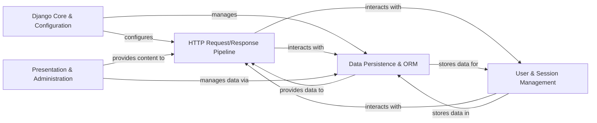

## Details

This analysis consolidates the insights from the Control Flow Graph (CFG) and Source Code Analysis to present a high-level overview of Django's architecture, focusing on its core components and their interactions.

### Django Core & Configuration [[Expand]](./Django_Core_Configuration.md)
This foundational component manages the overall structure, configuration, and utility functions of a Django project. It handles the registration and loading of installed applications, provides a centralized system for project-wide settings, offers general-purpose helper functions, and includes command-line utilities for various administrative tasks, including caching mechanisms.

**Related Classes/Methods**: _None_

### HTTP Request/Response Pipeline [[Expand]](./HTTP_Request_Response_Pipeline.md)
This component is the primary interface for web communication, managing the entire request-response lifecycle. It parses incoming HTTP requests, dispatches them to the appropriate view logic based on URL patterns, handles generic view processing, and constructs HTTP responses, including temporary messages.

**Related Classes/Methods**: _None_

### Data Persistence & ORM [[Expand]](./Data_Persistence_ORM.md)
This crucial component provides Django's Object-Relational Mapper (ORM), enabling Python objects to interact with the database. It includes specific database backend implementations, manages schema changes through migrations, handles data serialization/deserialization, and extends support for geospatial data types and queries.

**Related Classes/Methods**: _None_

### User & Session Management [[Expand]](./User_Session_Management.md)
This component offers a robust framework for user authentication, authorization, and session handling. It manages user accounts, permissions, password hashing, and maintains user-specific state across multiple requests, ensuring secure access to application resources.

**Related Classes/Methods**: _None_

### Presentation & Administration [[Expand]](./Presentation_Administration.md)
This component is responsible for rendering dynamic content using Django's template system and managing static files (CSS, JavaScript, images). It also encompasses the built-in administrative interface, which automatically generates a powerful web-based UI for managing application data, simplifying CRUD operations for registered models.

**Related Classes/Methods**: _None_

### [FAQ](https://github.com/CodeBoarding/GeneratedOnBoardings/tree/main?tab=readme-ov-file#faq)