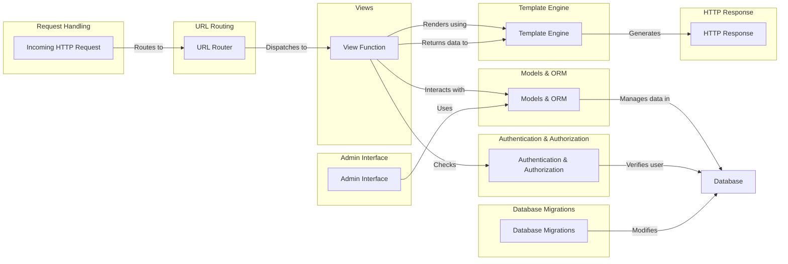

## Django: High-Level Data Flow Overview

Django is a high-level Python web framework that encourages rapid development and clean, pragmatic design. It takes care of much of the hassle of web development, so you can focus on writing your app without needing to reinvent the wheel. It's free and open source.

### Component Descriptions:

**Request Handling:** This component receives incoming HTTP requests and passes them to the URL Router. It is the entry point for all web requests.

**URL Routing:** The URL Router maps incoming URLs to specific view functions. It receives the request from the Request Handling component and dispatches it to the appropriate View function.

**Views:** View functions process requests, interact with models to retrieve or modify data, and render templates to generate responses. It receives the request from the URL Router and interacts with the Models & ORM and Template Engine components.

**Models & ORM:** This component provides an interface for interacting with the database, defining data structures, and performing queries. It interacts with the Views component to provide data for rendering and the Database Migrations component to manage schema changes.

**Template Engine:** The Template Engine renders dynamic content using templates and data from views. It receives data from the Views component and generates the final HTTP response.

**Authentication & Authorization:** This component manages user authentication, authorization, and permissions. It is used by the Views component to check user permissions before processing a request.

**Admin Interface:** The Admin Interface provides a built-in interface for managing the application's data. It uses the Models & ORM component to interact with the database.

**Database Migrations:** This component manages changes to the database schema. It interacts directly with the database and is used to update the database schema as the application evolves.