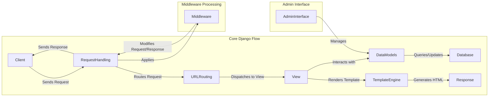

Okay, I will generate an onboarding document for the Django project based on the identified components.

**1. Project Description:**

Django is a high-level Python web framework that encourages rapid development and clean, pragmatic design. It provides a robust set of tools and conventions for building web applications, emphasizing reusability, "pluggability", less code, and rapid development. Django follows the Model-View-Template (MVT) architectural pattern and handles many common web development tasks, such as URL routing, template rendering, database interaction, and user authentication, allowing developers to focus on the unique aspects of their applications.

**2. Data Flow Diagram (Mermaid):**

**3. Component Descriptions:**

*   **Client:** Represents the user or system making a request to the Django application. It initiates the flow by sending an HTTP request and receives the final HTML response.

*   **Request Handling:** This component receives HTTP requests from the client and prepares the request for further processing. It's the entry point for all incoming requests. It applies the middleware stack before routing the request. After the view generates a response, Request Handling applies the middleware stack again before sending the response back to the client.

*   **URL Routing:** This component maps incoming URLs to specific views based on the project's URL configuration. It receives the request from Request Handling and determines which view should handle the request. It then dispatches the request to the appropriate view.

*   **View:** A view function or class-based view that processes the request and interacts with data models to retrieve or update data. It receives the request from URL Routing and uses the Data Models component to interact with the database. It then renders a template using the Template Engine to generate the HTML response.

*   **Data Models:** This component defines the structure and behavior of data, providing an interface for interacting with the database. The View component interacts with Data Models to query, create, update, or delete data. Data Models then translates these operations into database queries.

*   **Database:** The underlying database system where the application's data is stored. Data Models interacts with the Database to persist and retrieve data.

*   **Template Engine:** This component loads, compiles, and renders templates using context data to generate dynamic HTML content. The View component provides the context data to the Template Engine, which then generates the final HTML response.

*   **Response:** The final HTTP response sent back to the client, typically containing HTML content. Request Handling sends the Response back to the Client.

*   **Middleware:** This component processes requests and responses globally, performing tasks such as session management, authentication, and security checks. Request Handling applies the Middleware stack to both incoming requests and outgoing responses, allowing Middleware to modify the request or response before it reaches the view or the client.

*   **Admin Interface:** A built-in interface for managing the application's data models. The Admin Interface interacts with Data Models to allow administrators to create, read, update, and delete data.