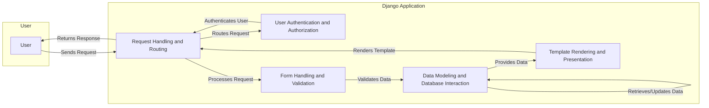

Okay, I will generate an onboarding document for the Django project based on the provided component analysis.

**Project Description**

Django is a high-level Python web framework that encourages rapid development and clean, pragmatic design. It takes care of much of the hassle of web development, so you can focus on writing your app without needing to reinvent the wheel. Django follows the Model-View-Template (MVT) architectural pattern, emphasizing reusability and "pluggability" of components, rapid development, and the principle of don't repeat yourself (DRY). It provides a robust set of tools for building web applications, including an ORM, templating engine, form handling, user authentication, and more.

**Data Flow Diagram**

**Component Descriptions**

*   **Request Handling and Routing:** This component acts as the entry point for all incoming HTTP requests. It receives requests from the user, routes them to the appropriate view based on the URL configuration, and orchestrates the generation of the HTTP response. It interacts with the User Authentication and Authorization component to ensure that only authenticated users can access certain resources. After processing the request and potentially interacting with other components like Form Handling and Validation, it uses the Template Rendering and Presentation component to generate the final HTML response, which is then sent back to the user.

*   **Template Rendering and Presentation:** This component is responsible for rendering dynamic content into HTML templates. It receives data from other components, such as the Data Modeling and Database Interaction component, and uses this data to populate the templates. It then renders the final HTML output, which is sent back to the Request Handling and Routing component for inclusion in the HTTP response.

*   **Data Modeling and Database Interaction:** This component defines the application's data models and manages interactions with the database. It provides an abstraction layer for database operations, including querying, creating, updating, and deleting data. It receives validated data from the Form Handling and Validation component and stores it in the database. It also provides data to the Template Rendering and Presentation component for display in the user interface.

*   **User Authentication and Authorization:** This component manages user accounts, authentication, and authorization. It handles user registration, login, logout, and permission checking, securing access to different parts of the application. It receives authentication requests from the Request Handling and Routing component and verifies the user's credentials against the stored user data. It then informs the Request Handling and Routing component whether the user is authenticated and authorized to access the requested resource.

*   **Form Handling and Validation:** This component provides tools for creating, processing, and validating HTML forms. It simplifies the process of collecting user input, validating it, and converting it into data that can be used by the application. It receives user input from the Request Handling and Routing component and validates it against the defined form fields and validation rules. If the data is valid, it sends it to the Data Modeling and Database Interaction component for storage in the database.