## Details

The `django` framework's architecture can be distilled into four primary, highly interconnected components, each with distinct responsibilities that collectively manage the entire web application lifecycle.

### Core Web Processing [Expand](./Core_Web_Processing.md)
This component is the entry and exit point for all web traffic. It's responsible for receiving HTTP requests, parsing them, routing them to the appropriate application logic (views), and then generating and sending back the HTTP responses. It abstracts away the underlying web server integration (WSGI/ASGI).

**Related Classes/Methods**:

- <a href="https://github.com/django/django/blob/master/django/http/request.py#L52-L480" target="_blank" rel="noopener noreferrer">`django.http.request.HttpRequest` (52:480)</a>
- <a href="https://github.com/django/django/blob/master/django/http/response.py#L364-L434" target="_blank" rel="noopener noreferrer">`django.http.response.HttpResponse` (364:434)</a>
- <a href="https://github.com/django/django/blob/master/django/core/handlers/wsgi.py#L112-L143" target="_blank" rel="noopener noreferrer">`django.core.handlers.wsgi.WSGIHandler` (112:143)</a>
- <a href="https://github.com/django/django/blob/master/django/core/handlers/asgi.py#L138-L378" target="_blank" rel="noopener noreferrer">`django.core.handlers.asgi.ASGIHandler` (138:378)</a>
- <a href="https://github.com/django/django/blob/master/django/urls/resolvers.py#L1-L1" target="_blank" rel="noopener noreferrer">`django.urls.resolvers.URLResolver` (1:1)</a>
- <a href="https://github.com/django/django/blob/master/django/views/generic/base.py#L36-L180" target="_blank" rel="noopener noreferrer">`django.views.generic.base.View` (36:180)</a>

### Data Management [Expand](./Data_Management.md)
This component provides Django's powerful Object-Relational Mapper (ORM), allowing developers to interact with databases using Python objects. It also handles database-specific drivers, manages the evolution of the database schema through migrations, and executes queries.

**Related Classes/Methods**:

- <a href="https://github.com/django/django/blob/master/django/db/models/base.py#L480-L2407" target="_blank" rel="noopener noreferrer">`django.db.models.base.Model` (480:2407)</a>
- <a href="https://github.com/django/django/blob/master/django/db/models/query.py#L1-L1" target="_blank" rel="noopener noreferrer">`django.db.models.query.QuerySet` (1:1)</a>
- <a href="https://github.com/django/django/blob/master/django/db/backends/base/base.py#L29-L791" target="_blank" rel="noopener noreferrer">`django.db.backends.base.base.BaseDatabaseWrapper` (29:791)</a>
- <a href="https://github.com/django/django/blob/master/django/db/migrations/migration.py#L8-L221" target="_blank" rel="noopener noreferrer">`django.db.migrations.migration.Migration` (8:221)</a>
- <a href="https://github.com/django/django/blob/master/django/db/migrations/executor.py#L9-L411" target="_blank" rel="noopener noreferrer">`django.db.migrations.executor.MigrationExecutor` (9:411)</a>

### Application Infrastructure [Expand](./Application_Infrastructure.md)
This component provides the foundational services and configurations for the entire Django application. It includes centralized settings management, the application registry (managing installed apps), user authentication and authorization, session management, the template rendering system, and caching mechanisms to improve performance.

**Related Classes/Methods**:

- <a href="https://github.com/django/django/blob/master/django/apps/registry.py#L12-L433" target="_blank" rel="noopener noreferrer">`django.apps.registry.Apps` (12:433)</a>
- <a href="https://github.com/django/django/blob/master/django/template/backends/django.py#L1-L1" target="_blank" rel="noopener noreferrer">`django.conf.LazySettings` (1:1)</a>
- <a href="https://github.com/django/django/blob/master/django/contrib/auth/models.py#L1-L1" target="_blank" rel="noopener noreferrer">`django.contrib.auth.models.AbstractBaseUser` (1:1)</a>
- <a href="https://github.com/django/django/blob/master/django/contrib/sessions/backends/base.py#L34-L522" target="_blank" rel="noopener noreferrer">`django.contrib.sessions.backends.base.SessionBase` (34:522)</a>
- <a href="https://github.com/django/django/blob/master/django/template/engine.py#L12-L213" target="_blank" rel="noopener noreferrer">`django.template.engine.Engine` (12:213)</a>
- <a href="https://github.com/django/django/blob/master/django/core/cache/backends/base.py#L57-L389" target="_blank" rel="noopener noreferrer">`django.core.cache.backends.base.BaseCache` (57:389)</a>

### Administrative Tools [Expand](./Administrative_Tools.md)
This component offers a suite of utilities for managing the Django project. It includes command-line tools for various tasks (e.g., running the development server, creating and applying migrations) and an automatically generated, customizable web-based interface for site administrators to manage application data.

**Related Classes/Methods**:

- <a href="https://github.com/django/django/blob/master/django/core/management/base.py#L1-L1" target="_blank" rel="noopener noreferrer">`django.core.management.base.BaseCommand` (1:1)</a>
- <a href="https://github.com/django/django/blob/master/django/contrib/admin/sites.py#L29-L605" target="_blank" rel="noopener noreferrer">`django.contrib.admin.sites.AdminSite` (29:605)</a>
- <a href="https://github.com/django/django/blob/master/django/contrib/admin/options.py#L634-L2340" target="_blank" rel="noopener noreferrer">`django.contrib.admin.options.ModelAdmin` (634:2340)</a>

### [FAQ](https://github.com/CodeBoarding/GeneratedOnBoardings/tree/main?tab=readme-ov-file#faq)