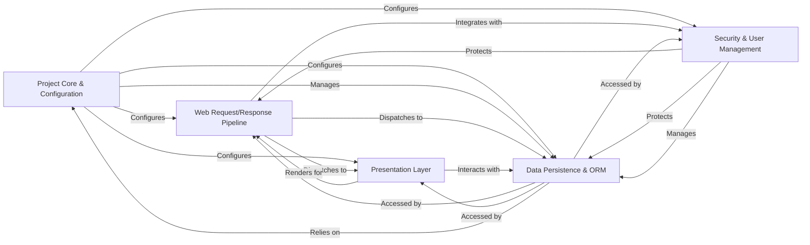

## Component Details

Django's architecture is designed around a "Don't Repeat Yourself" (DRY) philosophy, promoting rapid development and clean, pragmatic design. The framework can be broadly categorized into five core components, each addressing a critical aspect of web application development. These components are highly interconnected, forming a robust and extensible system.

### Project Core & Configuration
This is the foundational layer responsible for initializing the Django project, managing global settings, loading installed applications, and providing command-line utilities for project administration and development. It sets up the environment and defines the operational parameters for all other components.

**Related Classes/Methods**:

- <a href="https://github.com/django/django/blob/master/django/conf/global_settings.py#L1-L1" target="_blank" rel="noopener noreferrer">`django.conf.global_settings` (1:1)</a>
- <a href="https://github.com/django/django/blob/master/django/apps/registry.py#L1-L1" target="_blank" rel="noopener noreferrer">`django.apps.registry` (1:1)</a>
- <a href="https://github.com/django/django/blob/master/django/apps/config.py#L1-L1" target="_blank" rel="noopener noreferrer">`django.apps.config` (1:1)</a>
- <a href="https://github.com/django/django/blob/master/django/core/management/base.py#L1-L1" target="_blank" rel="noopener noreferrer">`django.core.management.base` (1:1)</a>
- `django.core.management.commands` (1:1)

### Web Request/Response Pipeline
This component handles the entire lifecycle of an HTTP request. It encompasses receiving the request, applying middleware (for cross-cutting concerns like sessions, authentication, CSRF protection), routing the request to the appropriate view based on URL patterns, executing the view's business logic, and finally generating and sending the HTTP response back to the client.

**Related Classes/Methods**:

- <a href="https://github.com/django/django/blob/master/django/http/request.py#L1-L1" target="_blank" rel="noopener noreferrer">`django.http.request` (1:1)</a>
- <a href="https://github.com/django/django/blob/master/django/http/response.py#L1-L1" target="_blank" rel="noopener noreferrer">`django.http.response` (1:1)</a>
- <a href="https://github.com/django/django/blob/master/django/template/backends/django.py#L1-L1" target="_blank" rel="noopener noreferrer">`django.middleware` (1:1)</a>
- <a href="https://github.com/django/django/blob/master/django/urls/conf.py#L1-L1" target="_blank" rel="noopener noreferrer">`django.urls.conf` (1:1)</a>
- <a href="https://github.com/django/django/blob/master/django/urls/resolvers.py#L1-L1" target="_blank" rel="noopener noreferrer">`django.urls.resolvers` (1:1)</a>
- <a href="https://github.com/django/django/blob/master/django/template/backends/django.py#L1-L1" target="_blank" rel="noopener noreferrer">`django.views.generic` (1:1)</a>
- <a href="https://github.com/django/django/blob/master/django/shortcuts.py#L1-L1" target="_blank" rel="noopener noreferrer">`django.shortcuts` (1:1)</a>

### Data Persistence & ORM
Django's Object-Relational Mapper (ORM) provides a high-level, Pythonic interface for interacting with databases. It defines models (Python classes representing database tables), offers a powerful QuerySet API for database operations, manages database schema changes through migrations, and abstracts various database backends (e.g., PostgreSQL, SQLite, MySQL). This component is the central point for all data storage and retrieval operations.

**Related Classes/Methods**:

- <a href="https://github.com/django/django/blob/master/django/db/models/base.py#L1-L1" target="_blank" rel="noopener noreferrer">`django.db.models.base` (1:1)</a>
- <a href="https://github.com/django/django/blob/master/django/db/models/query.py#L1-L1" target="_blank" rel="noopener noreferrer">`django.db.models.query` (1:1)</a>
- <a href="https://github.com/django/django/blob/master/django/template/backends/django.py#L1-L1" target="_blank" rel="noopener noreferrer">`django.db.migrations` (1:1)</a>
- `django.db.backends.base` (1:1)
- `django.contrib.gis.db.models` (1:1)

### Presentation Layer
This component is responsible for handling user input and generating dynamic content for display. It includes the Forms framework for robust data validation and HTML rendering, and the Template system for creating flexible and extensible web pages using a domain-specific language. It also manages static files (CSS, JavaScript, images) and provides a messaging framework for displaying one-time notifications to users.

**Related Classes/Methods**:

- <a href="https://github.com/django/django/blob/master/django/forms/forms.py#L1-L1" target="_blank" rel="noopener noreferrer">`django.forms.forms` (1:1)</a>
- <a href="https://github.com/django/django/blob/master/django/forms/fields.py#L1-L1" target="_blank" rel="noopener noreferrer">`django.forms.fields` (1:1)</a>
- <a href="https://github.com/django/django/blob/master/django/forms/widgets.py#L1-L1" target="_blank" rel="noopener noreferrer">`django.forms.widgets` (1:1)</a>
- <a href="https://github.com/django/django/blob/master/django/forms/models.py#L1-L1" target="_blank" rel="noopener noreferrer">`django.forms.models` (1:1)</a>
- <a href="https://github.com/django/django/blob/master/django/template/engine.py#L1-L1" target="_blank" rel="noopener noreferrer">`django.template.engine` (1:1)</a>
- <a href="https://github.com/django/django/blob/master/django/template/base.py#L1-L1" target="_blank" rel="noopener noreferrer">`django.template.base` (1:1)</a>
- <a href="https://github.com/django/django/blob/master/django/template/loader.py#L1-L1" target="_blank" rel="noopener noreferrer">`django.template.loader` (1:1)</a>
- <a href="https://github.com/django/django/blob/master/django/template/defaulttags.py#L1-L1" target="_blank" rel="noopener noreferrer">`django.template.defaulttags` (1:1)</a>
- <a href="https://github.com/django/django/blob/master/django/template/defaultfilters.py#L1-L1" target="_blank" rel="noopener noreferrer">`django.template.defaultfilters` (1:1)</a>
- <a href="https://github.com/django/django/blob/master/django/contrib/staticfiles/finders.py#L1-L1" target="_blank" rel="noopener noreferrer">`django.contrib.staticfiles.finders` (1:1)</a>
- <a href="https://github.com/django/django/blob/master/django/contrib/messages/api.py#L1-L1" target="_blank" rel="noopener noreferrer">`django.contrib.messages.api` (1:1)</a>

### Security & User Management
This critical component encompasses user authentication, authorization, and session management. It provides robust mechanisms for user login/logout, permission checking, password hashing, and storing session-specific data. Additionally, it includes the Django Admin, an automatically generated administrative interface for managing application data, which heavily relies on the authentication and authorization systems to secure access.

**Related Classes/Methods**:

- <a href="https://github.com/django/django/blob/master/django/contrib/auth/models.py#L1-L1" target="_blank" rel="noopener noreferrer">`django.contrib.auth.models` (1:1)</a>
- <a href="https://github.com/django/django/blob/master/django/contrib/auth/backends.py#L1-L1" target="_blank" rel="noopener noreferrer">`django.contrib.auth.backends` (1:1)</a>
- <a href="https://github.com/django/django/blob/master/django/contrib/auth/views.py#L1-L1" target="_blank" rel="noopener noreferrer">`django.contrib.auth.views` (1:1)</a>
- <a href="https://github.com/django/django/blob/master/django/contrib/auth/middleware.py#L1-L1" target="_blank" rel="noopener noreferrer">`django.contrib.auth.middleware` (1:1)</a>
- <a href="https://github.com/django/django/blob/master/django/contrib/auth/hashers.py#L1-L1" target="_blank" rel="noopener noreferrer">`django.contrib.auth.hashers` (1:1)</a>
- <a href="https://github.com/django/django/blob/master/django/contrib/sessions/base_session.py#L1-L1" target="_blank" rel="noopener noreferrer">`django.contrib.sessions.base_session` (1:1)</a>
- `django.contrib.sessions.backends` (1:1)
- <a href="https://github.com/django/django/blob/master/django/contrib/sessions/middleware.py#L1-L1" target="_blank" rel="noopener noreferrer">`django.contrib.sessions.middleware` (1:1)</a>
- <a href="https://github.com/django/django/blob/master/django/contrib/admin/options.py#L1-L1" target="_blank" rel="noopener noreferrer">`django.contrib.admin.options` (1:1)</a>
- <a href="https://github.com/django/django/blob/master/django/contrib/admin/sites.py#L1-L1" target="_blank" rel="noopener noreferrer">`django.contrib.admin.sites` (1:1)</a>
- `django.contrib.admin.views` (1:1)
- <a href="https://github.com/django/django/blob/master/django/contrib/admin/widgets.py#L1-L1" target="_blank" rel="noopener noreferrer">`django.contrib.admin.widgets` (1:1)</a>
- <a href="https://github.com/django/django/blob/master/django/core/cache/__init__.py#L1-L1" target="_blank" rel="noopener noreferrer">`django.core.cache.__init__` (1:1)</a>

### [FAQ](https://github.com/CodeBoarding/GeneratedOnBoardings/tree/main?tab=readme-ov-file#faq)