```mermaid
graph LR
    Request_Response_Handling_Layer["Request/Response Handling Layer"]
    Middleware_System["Middleware System"]
    URL_Routing_View_Layer["URL Routing & View Layer"]
    Model_ORM_Layer["Model/ORM Layer"]
    Template_System["Template System"]
    Forms_Framework["Forms Framework"]
    Admin_Interface["Admin Interface"]
    Authentication_Authorization["Authentication & Authorization"]
    Request_Response_Handling_Layer -- "processes requests through" --> Middleware_System
    Middleware_System -- "routes requests to" --> URL_Routing_View_Layer
    URL_Routing_View_Layer -- "accesses data through" --> Model_ORM_Layer
    URL_Routing_View_Layer -- "renders responses using" --> Template_System
    URL_Routing_View_Layer -- "processes forms using" --> Forms_Framework
    Forms_Framework -- "interacts with" --> Model_ORM_Layer
    Admin_Interface -- "builds interfaces using" --> Forms_Framework
    Admin_Interface -- "manages data through" --> Model_ORM_Layer
    Admin_Interface -- "renders interfaces using" --> Template_System
    Middleware_System -- "integrates with" --> Authentication_Authorization
    Authentication_Authorization -- "controls access to" --> URL_Routing_View_Layer
    Authentication_Authorization -- "secures" --> Admin_Interface
```

## Details

Django follows the Model-View-Template (MVT) architectural pattern, providing a comprehensive web framework with tightly integrated components. The request flow begins at the Request/Response Handling Layer, passes through the Middleware System for global processing, and is routed to appropriate views in the URL Routing & View Layer. Views interact with the Model/ORM Layer for data access and the Template System for rendering responses. The Forms Framework handles form processing and validation, while the Admin Interface provides automatic CRUD operations for models. The Authentication & Authorization system secures access across the application. This architecture emphasizes modularity, separation of concerns, reusability, and convention over configuration, allowing developers to focus on application logic rather than infrastructure.

### Request/Response Handling Layer
Entry point for all HTTP requests, managing the complete request lifecycle. Processes incoming HTTP requests through WSGI/ASGI handlers, coordinates the flow of data through the entire framework, and delivers final responses back to the client.

**Related Classes/Methods**:

- <a href="https://github.com/django/django/blob/main/django/core/handlers/wsgi.py#L112-L143" target="_blank" rel="noopener noreferrer">`django.core.handlers.wsgi.WSGIHandler` (112:143)</a>
- <a href="https://github.com/django/django/blob/main/django/http/request.py#L52-L480" target="_blank" rel="noopener noreferrer">`django.http.request.HttpRequest` (52:480)</a>
- <a href="https://github.com/django/django/blob/main/django/http/response.py#L364-L434" target="_blank" rel="noopener noreferrer">`django.http.response.HttpResponse` (364:434)</a>

### Middleware System
Provides a framework for processing requests/responses globally. Intercepts requests before they reach views, processes responses after they leave views, and implements cross-cutting concerns like security, sessions, and authentication.

**Related Classes/Methods**:

- <a href="https://github.com/django/django/blob/main/django/utils/deprecation.py#L265-L321" target="_blank" rel="noopener noreferrer">`django.utils.deprecation.MiddlewareMixin` (265:321)</a>
- <a href="https://github.com/django/django/blob/main/django/middleware/security.py#L7-L65" target="_blank" rel="noopener noreferrer">`django.middleware.security.SecurityMiddleware` (7:65)</a>
- `django.middleware.csrf.CsrfViewMiddleware`

### URL Routing & View Layer
Maps URLs to view functions and processes business logic. Routes incoming requests to appropriate view functions based on URL patterns, implements business logic through function-based or class-based views, and coordinates with models and templates to generate responses.

**Related Classes/Methods**:

- `django.urls.resolvers.URLResolver`
- <a href="https://github.com/django/django/blob/main/django/views/generic/base.py#L36-L180" target="_blank" rel="noopener noreferrer">`django.views.generic.base.View` (36:180)</a>
- <a href="https://github.com/django/django/blob/main/django/views/generic/list.py#L219-L223" target="_blank" rel="noopener noreferrer">`django.views.generic.list.ListView` (219:223)</a>

### Model/ORM Layer
Provides data access and persistence through an object-relational mapping. Defines data models as Python classes, abstracts database operations through a query API, and manages database schema through migrations.

**Related Classes/Methods**:

- <a href="https://github.com/django/django/blob/main/django/db/models/base.py#L480-L2407" target="_blank" rel="noopener noreferrer">`django.db.models.base.Model` (480:2407)</a>
- `django.db.models.query.QuerySet`
- `django.db.backends.base.BaseDatabaseWrapper`

### Template System
Renders dynamic HTML by combining templates with context data. Provides a template language for creating dynamic HTML, separates presentation logic from business logic, and extends functionality through template tags and filters.

**Related Classes/Methods**:

- <a href="https://github.com/django/django/blob/main/django/template/engine.py#L12-L213" target="_blank" rel="noopener noreferrer">`django.template.engine.Engine` (12:213)</a>
- `django.template.base.Template`
- <a href="https://github.com/django/django/blob/main/django/template/context.py#L137-L172" target="_blank" rel="noopener noreferrer">`django.template.context.Context` (137:172)</a>

### Forms Framework
Handles form rendering, validation, and processing. Generates HTML forms from Python classes, validates user input against defined constraints, and processes form submissions and converts data to Python types.

**Related Classes/Methods**:

- `django.forms.forms.BaseForm`
- `django.forms.models.ModelForm`
- `django.forms.fields.Field`

### Admin Interface
Provides automatic admin interface for models. Generates CRUD interfaces for models with minimal configuration, customizes admin behavior through ModelAdmin classes, and integrates with authentication for secure access.

**Related Classes/Methods**:

- <a href="https://github.com/django/django/blob/main/django/contrib/admin/sites.py#L29-L605" target="_blank" rel="noopener noreferrer">`django.contrib.admin.sites.AdminSite` (29:605)</a>
- <a href="https://github.com/django/django/blob/main/django/contrib/admin/options.py#L634-L2340" target="_blank" rel="noopener noreferrer">`django.contrib.admin.options.ModelAdmin` (634:2340)</a>

### Authentication & Authorization
Manages user authentication, permissions, and session handling. Authenticates users through various backends, controls access to resources based on permissions, and manages user sessions and cookies.

**Related Classes/Methods**:

- <a href="https://github.com/django/django/blob/main/django/contrib/auth/models.py#L516-L525" target="_blank" rel="noopener noreferrer">`django.contrib.auth.models.User` (516:525)</a>
- <a href="https://github.com/django/django/blob/main/django/contrib/auth/backends.py#L53-L241" target="_blank" rel="noopener noreferrer">`django.contrib.auth.backends.ModelBackend` (53:241)</a>
- <a href="https://github.com/django/django/blob/main/django/contrib/auth/middleware.py#L29-L40" target="_blank" rel="noopener noreferrer">`django.contrib.auth.middleware.AuthenticationMiddleware` (29:40)</a>

### [FAQ](https://github.com/CodeBoarding/GeneratedOnBoardings/tree/main?tab=readme-ov-file#faq)