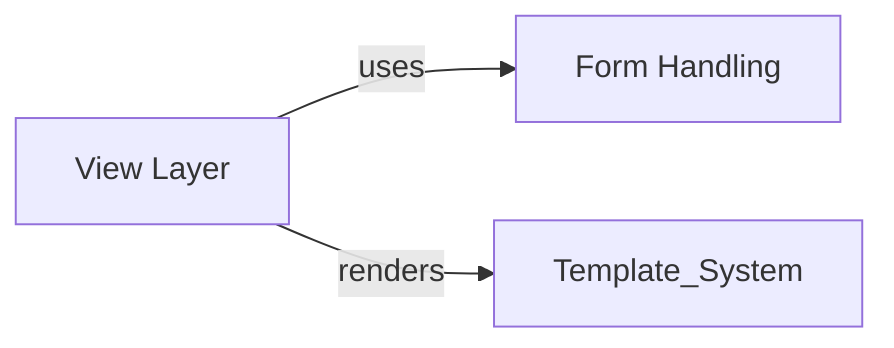

## Details

One paragraph explaining the functionality which is represented by this graph. What the main flow is and what is its purpose.

### Form Handling
Form validation and processing framework

**Related Classes/Methods**:

- <a href="https://github.com/django/django/blob/main/django/forms/forms.py#L150-L200" target="_blank" rel="noopener noreferrer">`django.forms.forms.Form` (150:200)</a>
- <a href="https://github.com/django/django/blob/main/django/forms/models.py#L130-L180" target="_blank" rel="noopener noreferrer">`django.forms.models.ModelForm` (130:180)</a>
- <a href="https://github.com/django/django/blob/main/django/forms/fields.py#L30-L60" target="_blank" rel="noopener noreferrer">`django.forms.fields.CharField` (30:60)</a>

### View Layer [[Expand]](./View_Layer.md)
Request/response processing engine with generic views and form handling

**Related Classes/Methods**:

- <a href="https://github.com/django/django/blob/main/django/views/generic/base.py#L36-L180" target="_blank" rel="noopener noreferrer">`django.views.generic.base.View` (36:180)</a>
- <a href="https://github.com/django/django/blob/main/django/views/generic/edit.py#L12-L72" target="_blank" rel="noopener noreferrer">`django.views.generic.edit.FormMixin` (12:72)</a>
- `django.http.HttpResponse`

### [FAQ](https://github.com/CodeBoarding/GeneratedOnBoardings/tree/main?tab=readme-ov-file#faq)