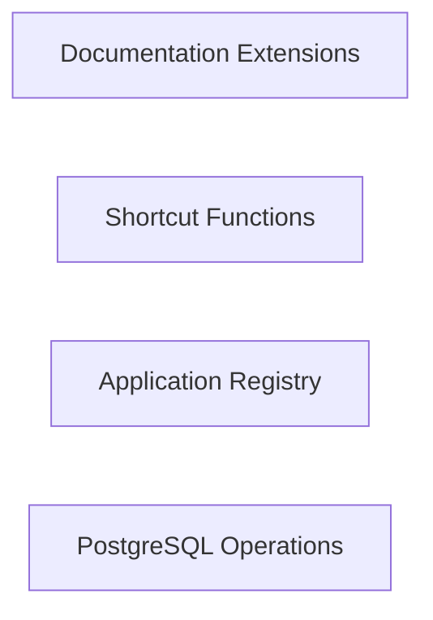

## Component Details

Analysis of the codebase structure and components

### Documentation Extensions
Provides extensions for Django's documentation generation, including features like linking to source code on GitHub and custom directives for console examples.

**Related Classes/Methods**:

- `django.docs._ext.github_links.CodeLocator` (full file reference)
- `django.docs._ext.github_links.get_locator` (full file reference)
- `django.docs._ext.github_links.get_path_and_line` (full file reference)
- `django.docs._ext.github_links.github_linkcode_resolve` (full file reference)
- `django.docs._ext.djangodocs.ConsoleDirective` (full file reference)

### Shortcut Functions
Offers shortcut functions for common Django tasks, such as rendering templates, redirecting to URLs, and retrieving objects with 404 handling.

**Related Classes/Methods**:

- `django.django.shortcuts.render` (full file reference)
- `django.django.shortcuts.redirect` (full file reference)
- `django.django.shortcuts.get_object_or_404` (full file reference)
- `django.django.shortcuts.get_list_or_404` (full file reference)
- `django.django.shortcuts.resolve_url` (full file reference)

### Application Registry
Manages the configuration and lifecycle of Django applications, including loading app configurations, checking application readiness, and providing access to models.

**Related Classes/Methods**:

- `django.django.apps.registry.Apps` (full file reference)
- `django.django.apps.config.AppConfig` (full file reference)

### PostgreSQL Operations
Provides database operations specific to PostgreSQL, such as creating extensions, managing indexes concurrently, and handling collations.

**Related Classes/Methods**:

- `django.django.contrib.postgres.operations.CreateExtension` (full file reference)
- `django.django.contrib.postgres.operations.AddIndexConcurrently` (full file reference)
- `django.django.contrib.postgres.operations.RemoveIndexConcurrently` (full file reference)
- `django.django.contrib.postgres.operations.CreateCollation` (full file reference)
- `django.django.contrib.postgres.operations.RemoveCollation` (full file reference)

### [FAQ](https://github.com/CodeBoarding/GeneratedOnBoardings/tree/main?tab=readme-ov-file#faq)