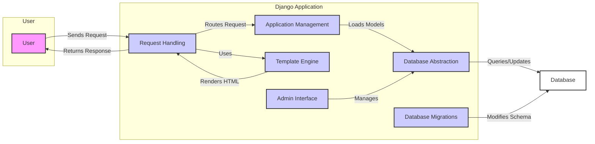

Okay, I will generate a high-level data flow diagram for the Django project based on the identified components and their interactions.

**1. Project Description:**

Django is a high-level Python web framework that encourages rapid development and clean, pragmatic design. It provides a robust set of tools and conventions for building web applications, including an ORM, templating engine, admin interface, and URL routing. Django follows the MTV (Model-Template-View) architectural pattern to separate concerns and promote maintainability.

**2. Data Flow Diagram (Mermaid Format):**

**3. Component Descriptions:**

*   **Request Handling:** This component receives HTTP requests from the user, parses them, and routes them to the appropriate view function based on the URL configuration. It uses the Template Engine to render responses and returns them to the user. It also interacts with Application Management to understand the available applications and their configurations.

*   **Application Management:** This component manages the configuration, loading, and registration of Django applications and their models. It loads models that are used by the Database Abstraction layer. It provides the necessary context for Request Handling to route requests to the correct application components.

*   **Database Abstraction:** This component provides an object-relational mapper (ORM) to interact with the database. It defines models, performs database queries, and manages transactions. It is used by the Application Management to load models and by the Admin Interface to manage data. It interacts directly with the database to persist and retrieve data.

*   **Template Engine:** This component renders dynamic web pages by combining templates with data, producing HTML output. It is used by the Request Handling component to generate responses to user requests. It receives data from the Database Abstraction layer via the Request Handling component.

*   **Admin Interface:** This component provides a built-in admin interface for managing models, including authentication, authorization, and CRUD operations. It manages the data through the Database Abstraction layer.

*   **Database Migrations:** This component manages changes to the database schema over time, allowing for consistent and reproducible database updates. It modifies the database schema directly based on migration files.