```mermaid
graph LR
    Request_Handling_Routing["Request Handling & Routing"]
    View_Logic["View Logic"]
    Model_Data_Persistence_ORM_["Model & Data Persistence (ORM)"]
    Template_Engine["Template Engine"]
    Admin_Interface["Admin Interface"]
    Core_Utilities_CLI["Core Utilities & CLI"]
    Request_Handling_Routing -- "Delegates requests to" --> View_Logic
    Request_Handling_Routing -- "Provides the request/response cycle for" --> Admin_Interface
    View_Logic -- "Interacts with" --> Model_Data_Persistence_ORM_
    View_Logic -- "Uses" --> Template_Engine
    Model_Data_Persistence_ORM_ -- "Provides data access to" --> View_Logic
    Admin_Interface -- "Is managed by" --> Model_Data_Persistence_ORM_
    Template_Engine -- "Renders data provided by" --> View_Logic
    Template_Engine -- "Provides the user interface for" --> Admin_Interface
    Admin_Interface -- "Manages data via" --> Model_Data_Persistence_ORM_
    Request_Handling_Routing -- "Is accessed via" --> Admin_Interface
    Core_Utilities_CLI -- "Manages the schema of" --> Model_Data_Persistence_ORM_
    click Request_Handling_Routing href "https://github.com/CodeBoarding/GeneratedOnBoardings/blob/main/django/Request_Handling_Routing.md" "Details"
    click Template_Engine href "https://github.com/CodeBoarding/GeneratedOnBoardings/blob/main/django/Template_Engine.md" "Details"
    click Admin_Interface href "https://github.com/CodeBoarding/GeneratedOnBoardings/blob/main/django/Admin_Interface.md" "Details"
    click Core_Utilities_CLI href "https://github.com/CodeBoarding/GeneratedOnBoardings/blob/main/django/Core_Utilities_CLI.md" "Details"
```

## Details

One paragraph explaining the functionality which is represented by this graph. What the main flow is and what is its purpose.

### Request Handling & Routing [[Expand]](./Request_Handling_Routing.md)
This component is the main entry point for all incoming HTTP requests. It processes the request through a chain of middleware, resolves the requested URL to determine which view should handle it, and manages the final HTTP response. It acts as the central dispatcher for the entire framework.

**Related Classes/Methods**:

- `django/core/handlers/`
- `django/urls/resolvers.py`
- `django/http/request.py`
- `django/http/response.py`
- `django/middleware/`

### View Logic
This component contains the application's business logic. Views receive the request object from the router, interact with the data layer to fetch or update information, and then use the template engine to render the final output. It orchestrates the core work of responding to a user request.

**Related Classes/Methods**:

- `django/views/generic/`
- `django/contrib/auth/`
- `django/forms/`

### Model & Data Persistence (ORM)
The Object-Relational Mapper (ORM) provides a Python-centric way to interact with the database. It abstracts away raw SQL, allowing developers to define data models as classes and manage database records as objects. This component also includes the migration system for evolving the database schema over time.

**Related Classes/Methods**:

- `django/db/models/`
- `django/db/backends/`
- `django/db/migrations/`

### Template Engine [[Expand]](./Template_Engine.md)
This is the presentation layer of the framework. It is responsible for generating user-facing content, typically HTML. It combines static template files with dynamic context data provided by the view to produce the final rendered output. It also handles the management of static assets like CSS and JavaScript.

**Related Classes/Methods**:

- `django/template/`
- `django/template/backends/`
- `django/contrib/staticfiles/`

### Admin Interface [[Expand]](./Admin_Interface.md)
A key feature of Django, the Admin is a powerful, built-in application that provides a ready-to-use interface for managing application data. It automatically introspects the project's models and creates a comprehensive UI for administrators to perform create, read, update, and delete (CRUD) operations.

**Related Classes/Methods**:

- `django/contrib/admin/`

### Core Utilities & CLI [[Expand]](./Core_Utilities_CLI.md)
This component provides the foundational tools and command-line interface for project management. It includes the `manage.py` script used for tasks like running the development server, creating applications, and managing database migrations. It also contains a wide range of utility modules for internationalization, caching, and other framework-level functions.

**Related Classes/Methods**:

- `django/core/management/`
- `django/apps/`
- `django/utils/`

### [FAQ](https://github.com/CodeBoarding/GeneratedOnBoardings/tree/main?tab=readme-ov-file#faq)