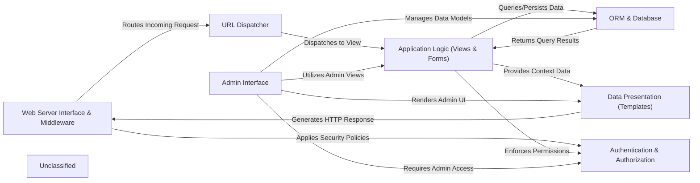

## Details

The Django framework operates on a request-response cycle, starting with the Web Server Interface & Middleware component, which acts as the initial entry point for all incoming HTTP requests. This component is responsible for parsing the request and orchestrating its journey through a configurable middleware stack. Middleware components, such as `CommonMiddleware` and `SessionMiddleware`, perform global processing like session management, authentication, and security checks before the request reaches the core application logic.

Once the request passes through the middleware, the URL Dispatcher takes over. It analyzes the URL path, matching it against predefined patterns to resolve the correct view function or class-based view within the Application Logic (Views & Forms) component. This component encapsulates the core business logic, processing user input (often facilitated by `BaseForm` and `ModelForm`), interacting with the ORM & Database for data retrieval and persistence, and preparing data for presentation.

The ORM & Database component provides an abstraction layer over the underlying database, allowing developers to interact with data models using Python objects rather than raw SQL. This includes defining models (`Model`), executing queries (`QuerySet`), managing database connections (`BaseDatabaseWrapper`), and handling schema migrations (`MigrationExecutor`).

After the application logic processes the request and retrieves necessary data, the Data Presentation (Templates) component is responsible for rendering the final HTTP response. It combines static template files with dynamic context data provided by the views to generate the user interface.

Throughout this process, the Authentication & Authorization component ensures secure access. It manages user accounts (`User`), authenticates users through various backends (`BaseBackend`), and enforces permissions, often integrated into the middleware stack (`AuthenticationMiddleware`) and directly within the application logic.

Finally, the Admin Interface provides an automatically generated administrative site for managing application data. It leverages the ORM for data interaction, the forms API for data input, and the authentication system for secure access, offering a convenient way to interact with the application's models.

### Web Server Interface & Middleware
The entry point for all HTTP requests, responsible for parsing requests, orchestrating their journey through the middleware stack for global processing (e.g., session, auth, CSRF), and sending back responses. Also handles serving static/media files.

**Related Classes/Methods**:

- <a href="https://github.com/django/django//blobdjango/core/handlers/wsgi.py#L11-L35" target="_blank" rel="noopener noreferrer">`django.core.handlers.wsgi.WSGIHandler`:11-35</a>
- <a href="https://github.com/django/django//blobdjango/core/handlers/asgi.py#L11-L35" target="_blank" rel="noopener noreferrer">`django.core.handlers.asgi.ASGIHandler`:11-35</a>
- <a href="https://github.com/django/django//blobdjango/middleware/common.py#L11-L115" target="_blank" rel="noopener noreferrer">`django.middleware.common.CommonMiddleware`:11-115</a>
- <a href="https://github.com/django/django//blobdjango/contrib/sessions/middleware.py#L10-L75" target="_blank" rel="noopener noreferrer">`django.contrib.sessions.middleware.SessionMiddleware`:10-75</a>
- <a href="https://github.com/django/django//blobdjango/contrib/staticfiles/handlers.py#L65-L79" target="_blank" rel="noopener noreferrer">`django.contrib.staticfiles.handlers.StaticFilesHandler`:65-79</a>

### URL Dispatcher
Interprets the incoming URL path, resolves it against defined URL patterns, and maps it to the appropriate view function or class-based view.

**Related Classes/Methods**:

- <a href="https://github.com/django/django//blobdjango/urls/resolvers.py#L501-L840" target="_blank" rel="noopener noreferrer">`django.urls.resolvers.URLResolver`:501-840</a>
- <a href="https://github.com/django/django//blobdjango/urls/base.py#L20-L23" target="_blank" rel="noopener noreferrer">`django.urls.base.resolve`:20-23</a>
- <a href="https://github.com/django/django//blobdjango/urls/base.py#L26-L106" target="_blank" rel="noopener noreferrer">`django.urls.base.reverse`:26-106</a>

### Application Logic (Views & Forms)
Contains the core business logic for handling specific HTTP requests. It processes user input (often via forms), interacts with the ORM, and prepares data for presentation.

**Related Classes/Methods**:

- <a href="https://github.com/django/django//blobdjango/views/generic/base.py#L96-L104" target="_blank" rel="noopener noreferrer">`django.views.generic.base.View`:96-104</a>
- <a href="https://github.com/django/django//blobdjango/shortcuts.py#L17-L25" target="_blank" rel="noopener noreferrer">`django.shortcuts.render`:17-25</a>
- <a href="https://github.com/django/django//blobdjango/forms/forms.py#L50-L427" target="_blank" rel="noopener noreferrer">`django.forms.forms.BaseForm`:50-427</a>
- <a href="https://github.com/django/django//blobdjango/forms/models.py#L583-L584" target="_blank" rel="noopener noreferrer">`django.forms.models.ModelForm`:583-584</a>

### Data Presentation (Templates)
Responsible for generating dynamic output by combining static content with context data provided by the application logic, rendering the final user interface.

**Related Classes/Methods**:

- <a href="https://github.com/django/django//blobdjango/template/engine.py" target="_blank" rel="noopener noreferrer">`django.template.engine.Engine`</a>
- <a href="https://github.com/django/django//blobdjango/template/base.py" target="_blank" rel="noopener noreferrer">`django.template.base.Template`</a>
- <a href="https://github.com/django/django//blobdjango/template/loader.py#L50-L60" target="_blank" rel="noopener noreferrer">`django.template.loader.render_to_string`:50-60</a>

### ORM & Database
Provides a high-level, database-agnostic interface for defining application data models, querying, manipulating, and persisting data. It includes model definitions, the query API, SQL compilation, and schema migration management, interacting with the underlying database backend.

**Related Classes/Methods**:

- <a href="https://github.com/django/django//blobdjango/db/models/base.py" target="_blank" rel="noopener noreferrer">`django.db.models.base.Model`</a>
- <a href="https://github.com/django/django//blobdjango/db/models/query.py" target="_blank" rel="noopener noreferrer">`django.db.models.query.QuerySet`</a>
- <a href="https://github.com/django/django//blobdjango/db/backends/base/base.py#L28-L790" target="_blank" rel="noopener noreferrer">`django.db.backends.base.base.BaseDatabaseWrapper`:28-790</a>
- <a href="https://github.com/django/django//blobdjango/db/migrations/executor.py#L8-L412" target="_blank" rel="noopener noreferrer">`django.db.migrations.executor.MigrationExecutor`:8-412</a>

### Authentication & Authorization
Manages user accounts, authentication processes, and permission checks, integrating with the middleware stack and application logic to control access.

**Related Classes/Methods**:

- <a href="https://github.com/django/django//blobdjango/contrib/auth/models.py#L515-L524" target="_blank" rel="noopener noreferrer">`django.contrib.auth.models.User`:515-524</a>
- <a href="https://github.com/django/django//blobdjango/contrib/auth/backends.py#L8-L49" target="_blank" rel="noopener noreferrer">`django.contrib.auth.backends.BaseBackend`:8-49</a>
- <a href="https://github.com/django/django//blobdjango/contrib/auth/middleware.py#L27-L38" target="_blank" rel="noopener noreferrer">`django.contrib.auth.middleware.AuthenticationMiddleware`:27-38</a>

### Admin Interface
Provides an automatic administrative interface for managing application data, built upon the ORM, forms API, and authentication system.

**Related Classes/Methods**:

- <a href="https://github.com/django/django//blobdjango/contrib/admin/sites.py#L28-L604" target="_blank" rel="noopener noreferrer">`django.contrib.admin.sites.AdminSite`:28-604</a>
- <a href="https://github.com/django/django//blobdjango/contrib/admin/options.py#L632-L2338" target="_blank" rel="noopener noreferrer">`django.contrib.admin.options.ModelAdmin`:632-2338</a>
- <a href="https://github.com/django/django//blobdjango/contrib/admin/forms.py#L4-L25" target="_blank" rel="noopener noreferrer">`django.contrib.admin.forms.AdminAuthenticationForm`:4-25</a>

### Unclassified
Component for all unclassified files and utility functions (Utility functions/External Libraries/Dependencies)

**Related Classes/Methods**: _None_

### [FAQ](https://github.com/CodeBoarding/GeneratedOnBoardings/tree/main?tab=readme-ov-file#faq)