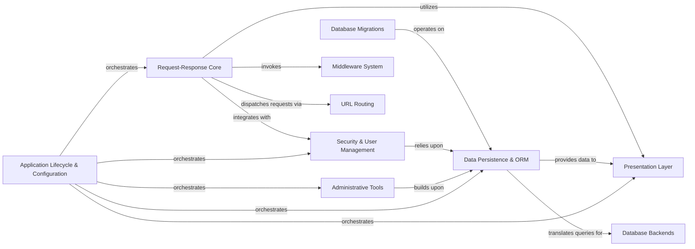

## Details

Django's architecture is centered around a robust request-response pipeline, where the Request-Response Core acts as the entry point, handling incoming HTTP requests, applying global middleware, and routing them to appropriate views. These views primarily interact with the Data Persistence & ORM to manage data, which in turn communicates with specific Database Backends. For presenting information, the Presentation Layer dynamically renders templates. Security is handled by the Security & User Management component, often integrated into the request flow via middleware. The framework also provides powerful Administrative Tools for managing application data and executing command-line tasks, both heavily leveraging the ORM. All these components are orchestrated and configured by the Application Lifecycle & Configuration system, ensuring a modular, scalable, and maintainable web application framework.

### Request-Response Core
Manages the entire HTTP request/response lifecycle, including parsing, middleware application, and URL dispatch.

**Related Classes/Methods**:

- <a href="https://github.com/django/django//blob/django/core/handlers/wsgi.py#L113-L144" target="_blank" rel="noopener noreferrer">`django.core.handlers.wsgi.WSGIHandler`:113-144</a>
- <a href="https://github.com/django/django//blob/django/http/request.py#L53-L488" target="_blank" rel="noopener noreferrer">`django.http.request.HttpRequest`:53-488</a>
- <a href="https://github.com/django/django//blob/django/http/response.py#L366-L436" target="_blank" rel="noopener noreferrer">`django.http.response.HttpResponse`:366-436</a>

### Data Persistence & ORM [[Expand]](./Data_Persistence_ORM.md)
Provides an abstraction layer for database interactions, handling models, queries, and schema migrations across various database backends.

**Related Classes/Methods**:

- <a href="https://github.com/django/django//blob/django/db/models/base.py" target="_blank" rel="noopener noreferrer">`django.db.models.base.Model`</a>
- <a href="https://github.com/django/django//blob/django/db/models/query.py#L279-L2071" target="_blank" rel="noopener noreferrer">`django.db.models.query.QuerySet`:279-2071</a>

### Presentation Layer [[Expand]](./Presentation_Layer.md)
Processes template files to generate dynamic HTML or other text-based output for the user interface.

**Related Classes/Methods**:

- <a href="https://github.com/django/django//blob/django/template/engine.py" target="_blank" rel="noopener noreferrer">`django.template.engine.Engine`</a>
- <a href="https://github.com/django/django//blob/django/template/base.py#L138-L288" target="_blank" rel="noopener noreferrer">`django.template.base.Template`:138-288</a>
- <a href="https://github.com/django/django//blob/django/shortcuts.py#L18-L26" target="_blank" rel="noopener noreferrer">`django.shortcuts.render`:18-26</a>

### Security & User Management [[Expand]](./Security_User_Management.md)
Manages user authentication, authorization, sessions, and permissions for secure access control.

**Related Classes/Methods**:

- <a href="https://github.com/django/django//blob/django/contrib/auth/models.py#L517-L526" target="_blank" rel="noopener noreferrer">`django.contrib.auth.models.User`:517-526</a>
- <a href="https://github.com/django/django//blob/django/contrib/auth/backends.py#L54-L242" target="_blank" rel="noopener noreferrer">`django.contrib.auth.backends.ModelBackend`:54-242</a>
- <a href="https://github.com/django/django//blob/django/contrib/sessions/base_session.py" target="_blank" rel="noopener noreferrer">`django.contrib.sessions.base_session.SessionBase`</a>

### Administrative Tools [[Expand]](./Administrative_Tools.md)
Offers an automated administrative interface and command-line utilities for managing application data and performing system tasks.

**Related Classes/Methods**:

- <a href="https://github.com/django/django//blob/django/contrib/admin/sites.py#L30-L606" target="_blank" rel="noopener noreferrer">`django.contrib.admin.sites.AdminSite`:30-606</a>
- <a href="https://github.com/django/django//blob/django/contrib/admin/options.py#L635-L2341" target="_blank" rel="noopener noreferrer">`django.contrib.admin.options.ModelAdmin`:635-2341</a>
- <a href="https://github.com/django/django//blob/django/core/management/base.py#L187-L619" target="_blank" rel="noopener noreferrer">`django.core.management.base.BaseCommand`:187-619</a>

### Application Lifecycle & Configuration [[Expand]](./Application_Lifecycle_Configuration.md)
Orchestrates the loading, configuration, and overall lifecycle management of all installed Django applications.

**Related Classes/Methods**:

- <a href="https://github.com/django/django//blob/django/apps/registry.py" target="_blank" rel="noopener noreferrer">`django.apps.registry.Apps`</a>
- <a href="https://github.com/django/django//blob/django/apps/config.py#L13-L274" target="_blank" rel="noopener noreferrer">`django.apps.config.AppConfig`:13-274</a>

### Middleware System
Applies global transformations to requests and responses.

**Related Classes/Methods**:

- <a href="https://github.com/django/django//blob/django/middleware/common.py#L13-L115" target="_blank" rel="noopener noreferrer">`django.middleware.common.CommonMiddleware`:13-115</a>

### URL Routing [[Expand]](./URL_Routing.md)
Dispatches requests to appropriate views based on URL patterns.

**Related Classes/Methods**:

- <a href="https://github.com/django/django//blob/django/urls/resolvers.py#L503-L842" target="_blank" rel="noopener noreferrer">`django.urls.resolvers.URLResolver`:503-842</a>

### Database Backends [[Expand]](./Database_Backends.md)
Underlying database systems used for data storage.

**Related Classes/Methods**:

- <a href="https://github.com/django/django//blob/django/db/backends/base/base.py#L30-L792" target="_blank" rel="noopener noreferrer">`django.db.backends.base.base.BaseDatabaseWrapper`:30-792</a>

### Database Migrations [[Expand]](./Database_Migrations.md)
Manages schema changes for the database.

**Related Classes/Methods**:

- <a href="https://github.com/django/django//blob/django/db/migrations/migration.py#L9-L222" target="_blank" rel="noopener noreferrer">`django.db.migrations.migration.Migration`:9-222</a>

### [FAQ](https://github.com/CodeBoarding/GeneratedOnBoardings/tree/main?tab=readme-ov-file#faq)