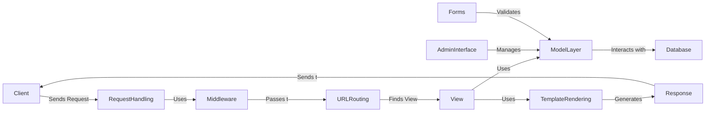

Okay, I will generate an onboarding document for the Django project based on the provided information.

**1. Project Description**

Django is a high-level Python web framework that encourages rapid development and clean, pragmatic design. It provides a robust set of tools and conventions for building web applications, including an ORM, templating engine, form handling, and an admin interface. Django follows the "batteries included" philosophy, offering many built-in features to handle common web development tasks, allowing developers to focus on the unique aspects of their applications.

**2. Flow Diagram (Mermaid)**

**3. Component Descriptions**

*   **Client:** Represents the user or system making requests to the Django application, typically through a web browser or API client.

*   **Request Handling:** This component receives incoming HTTP requests and prepares them for processing. It's responsible for creating `HttpRequest` objects and passing them to the middleware stack.

*   **Middleware:** A chain of components that process the request before it reaches the view and the response after the view has executed. Middleware can perform tasks like session management, authentication, and request/response modification.

*   **URL Routing:** This component maps incoming URLs to specific views based on URL patterns defined in the project's `urls.py` files. It uses URL resolvers to find the appropriate view function or class to handle the request.

*   **View:** A callable (function or class-based view) that receives a request and returns a response. Views contain the application's business logic and interact with the model layer to retrieve or modify data.

*   **Model Layer:** Django's ORM (Object-Relational Mapper) provides an abstraction layer for interacting with the database. It allows developers to define data models in Python and perform database operations using a high-level API.

*   **Database:** The persistent storage for the application's data. Django supports various database backends, including PostgreSQL, MySQL, SQLite, and Oracle.

*   **Template Rendering:** This component uses Django's template engine to generate dynamic HTML content. It combines templates with data from the view to produce the final output that is sent to the client.

*   **Response:** Represents the HTTP response that is sent back to the client. It contains the rendered HTML content, status code, headers, and other information.

*   **Admin Interface:** A built-in interface that allows administrators to manage the application's data models. It provides a user-friendly way to create, read, update, and delete data.

*   **Forms:** Handles form processing, validation, and rendering for user input. Django's form framework simplifies the creation of HTML forms and provides tools for validating user input and displaying errors.