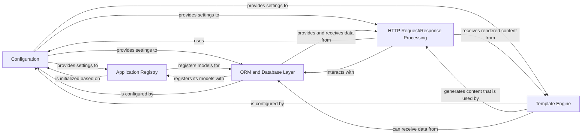

## Component Details

The analysis of the Control Flow Graph (CFG) and the subsequent Source Analysis reveal a clear set of core components that form the backbone of the Django framework. These components are fundamental because they collectively manage the entire lifecycle of a web request, from configuration and application loading to data persistence and response generation.

### Configuration
This component serves as the central repository for all project-specific settings. It dictates how Django behaves, including database connections, installed applications, middleware, and template configurations. Its lazy-loading mechanism ensures settings are only loaded when first accessed, optimizing startup.

**Related Classes/Methods**:

- <a href="https://github.com/django/django/blob/master/django/template/backends/django.py#L0-L0" target="_blank" rel="noopener noreferrer">`django.conf.LazySettings` (0:0)</a>

### Application Registry
The Apps registry is crucial for Django's modular design. It manages the lifecycle and configuration of all installed Django applications, acting as a central hub for registering models, signals, and other app-specific metadata. It ensures that applications and their components are properly loaded and discoverable throughout the project.

**Related Classes/Methods**:

- <a href="https://github.com/django/django/blob/master/django/apps/registry.py#L12-L433" target="_blank" rel="noopener noreferrer">`django.apps.registry.Apps` (12:433)</a>

### HTTP Request/Response Processing
This composite component encapsulates the entire web communication flow. It handles receiving an incoming HttpRequest, applies global logic through Middleware, resolves the URL to the appropriate view using URLResolver, and finally generates and sends an HttpResponse back to the client. It is the core of Django's web-serving capabilities.

**Related Classes/Methods**:

- <a href="https://github.com/django/django/blob/master/django/http/request.py#L52-L469" target="_blank" rel="noopener noreferrer">`django.http.request.HttpRequest` (52:469)</a>
- <a href="https://github.com/django/django/blob/master/django/http/response.py#L364-L434" target="_blank" rel="noopener noreferrer">`django.http.response.HttpResponse` (364:434)</a>
- <a href="https://github.com/django/django/blob/master/django/middleware/common.py#L0-L0" target="_blank" rel="noopener noreferrer">`django.middleware.common.Middleware` (0:0)</a>
- <a href="https://github.com/django/django/blob/master/django/urls/resolvers.py#L0-L0" target="_blank" rel="noopener noreferrer">`django.urls.resolvers.URLResolver` (0:0)</a>

### ORM and Database Layer
This layer provides Django's powerful Object-Relational Mapper (ORM), allowing developers to interact with databases using Python objects rather than raw SQL. It includes the Model base class for defining database schemas, QuerySet for building and executing database queries, and backends for abstracting database-specific interactions (e.g., PostgreSQL, MySQL).

**Related Classes/Methods**:

- <a href="https://github.com/django/django/blob/master/django/db/models/base.py#L480-L2407" target="_blank" rel="noopener noreferrer">`django.db.models.base.Model` (480:2407)</a>
- <a href="https://github.com/django/django/blob/master/django/db/models/query.py#L0-L0" target="_blank" rel="noopener noreferrer">`django.db.models.query.QuerySet` (0:0)</a>
- <a href="https://github.com/django/django/blob/master/django/db/backends/base/base.py#L29-L791" target="_blank" rel="noopener noreferrer">`django.db.backends.base.base.BaseDatabaseWrapper` (29:791)</a>

### Template Engine
The Template Engine is responsible for the presentation layer of Django applications. It manages the loading, parsing, and rendering of Django templates, enabling the generation of dynamic HTML content by combining template files with context data provided by views.

**Related Classes/Methods**:

- <a href="https://github.com/django/django/blob/master/django/template/engine.py#L12-L213" target="_blank" rel="noopener noreferrer">`django.template.engine.Engine` (12:213)</a>

### [FAQ](https://github.com/CodeBoarding/GeneratedOnBoardings/tree/main?tab=readme-ov-file#faq)