```mermaid
graph LR
    Web_Server_Interface["Web Server Interface"]
    Request_Processing_Pipeline["Request Processing Pipeline"]
    Application_Logic_Views_Forms_["Application Logic (Views & Forms)"]
    Data_Layer_ORM_Database_["Data Layer (ORM & Database)"]
    Presentation_Layer_Templates_["Presentation Layer (Templates)"]
    Built_in_Services["Built-in Services"]
    Web_Server_Interface -- "Forwards Request" --> Request_Processing_Pipeline
    Request_Processing_Pipeline -- "Dispatches Processed Request" --> Application_Logic_Views_Forms_
    Application_Logic_Views_Forms_ -- "Performs Data Operations" --> Data_Layer_ORM_Database_
    Data_Layer_ORM_Database_ -- "Returns Data" --> Application_Logic_Views_Forms_
    Application_Logic_Views_Forms_ -- "Passes Context Data" --> Presentation_Layer_Templates_
    Presentation_Layer_Templates_ -- "Generates Rendered Content" --> Request_Processing_Pipeline
    Request_Processing_Pipeline -- "Sends HTTP Response" --> Web_Server_Interface
    Built_in_Services -- "Interacts with" --> Request_Processing_Pipeline
    Request_Processing_Pipeline -- "Interacts with" --> Built_in_Services
    Built_in_Services -- "Manages Data via" --> Data_Layer_ORM_Database_
    Built_in_Services -- "Serves Assets" --> Web_Server_Interface
    click Web_Server_Interface href "https://github.com/CodeBoarding/GeneratedOnBoardings/blob/main/django/Web_Server_Interface.md" "Details"
    click Request_Processing_Pipeline href "https://github.com/CodeBoarding/GeneratedOnBoardings/blob/main/django/Request_Processing_Pipeline.md" "Details"
    click Application_Logic_Views_Forms_ href "https://github.com/CodeBoarding/GeneratedOnBoardings/blob/main/django/Application_Logic_Views_Forms_.md" "Details"
    click Data_Layer_ORM_Database_ href "https://github.com/CodeBoarding/GeneratedOnBoardings/blob/main/django/Data_Layer_ORM_Database_.md" "Details"
    click Presentation_Layer_Templates_ href "https://github.com/CodeBoarding/GeneratedOnBoardings/blob/main/django/Presentation_Layer_Templates_.md" "Details"
    click Built_in_Services href "https://github.com/CodeBoarding/GeneratedOnBoardings/blob/main/django/Built_in_Services.md" "Details"
```

## Details

The Django project architecture is structured around a clear request-response cycle, starting with the **Web Server Interface** which acts as the initial entry point for all HTTP requests. These requests are then forwarded to the **Request Processing Pipeline**, where they undergo middleware processing and URL routing. The pipeline dispatches processed requests to the **Application Logic (Views & Forms)**, which encapsulates the core business logic, handles user input, and prepares data. The **Application Logic** interacts with the **Data Layer (ORM & Database)** to perform data operations, abstracting database interactions through Django's ORM. Once data is retrieved or manipulated, the **Application Logic** passes context data to the **Presentation Layer (Templates)** for rendering dynamic content. The **Presentation Layer** generates the final rendered content, which is then returned to the **Request Processing Pipeline** to form the HTTP response. Finally, the **Request Processing Pipeline** sends the HTTP response back through the **Web Server Interface** to the client. Additionally, **Built-in Services** provide essential functionalities like authentication and session management, interacting with both the **Request Processing Pipeline** for request-specific operations and the **Data Layer (ORM & Database)** for data persistence. These services also directly serve static assets via the **Web Server Interface**. This modular design ensures a clear separation of concerns, facilitating maintainability and scalability.

### Web Server Interface [[Expand]](./Web_Server_Interface.md)
The external entry point for all HTTP requests, bridging between web servers (WSGI/ASGI) and the Django application.

**Related Classes/Methods**:

- <a href="https://github.com/django/django/blob/main/django/core/wsgi.py#L5-L13" target="_blank" rel="noopener noreferrer">`django.core.wsgi`:5-13</a>
- <a href="https://github.com/django/django/blob/main/django/core/asgi.py#L5-L13" target="_blank" rel="noopener noreferrer">`django.core.asgi`:5-13</a>
- <a href="https://github.com/django/django/blob/main/django/core/servers/basehttp.py" target="_blank" rel="noopener noreferrer">`django.core.servers.basehttp`</a>

### Request Processing Pipeline [[Expand]](./Request_Processing_Pipeline.md)
Manages the lifecycle of HTTP requests and responses within Django, including middleware application and URL routing.

**Related Classes/Methods**:

- <a href="https://github.com/django/django/blob/main/django/http/request.py" target="_blank" rel="noopener noreferrer">`django.http.request`</a>
- <a href="https://github.com/django/django/blob/main/django/http/response.py" target="_blank" rel="noopener noreferrer">`django.http.response`</a>
- <a href="https://github.com/django/django/blob/main/django/core/handlers/base.py" target="_blank" rel="noopener noreferrer">`django.core.handlers.base`</a>
- <a href="https://github.com/django/django/blob/main/django/middleware" target="_blank" rel="noopener noreferrer">`django.middleware`</a>
- <a href="https://github.com/django/django/blob/main/django/urls" target="_blank" rel="noopener noreferrer">`django.urls`</a>

### Application Logic (Views & Forms) [[Expand]](./Application_Logic_Views_Forms_.md)
Contains the core business logic of the application, processing user input, interacting with the data layer, and preparing data for presentation.

**Related Classes/Methods**:

- <a href="https://github.com/django/django/blob/main/django/views" target="_blank" rel="noopener noreferrer">`django.views`</a>
- <a href="https://github.com/django/django/blob/main/django/shortcuts.py" target="_blank" rel="noopener noreferrer">`django.shortcuts`</a>
- <a href="https://github.com/django/django/blob/main/django/forms" target="_blank" rel="noopener noreferrer">`django.forms`</a>

### Data Layer (ORM & Database) [[Expand]](./Data_Layer_ORM_Database_.md)
Provides an object-relational mapping (ORM) for interacting with the database, abstracting SQL operations and managing data persistence.

**Related Classes/Methods**:

- <a href="https://github.com/django/django/blob/main/django/db/models" target="_blank" rel="noopener noreferrer">`django.db.models`</a>
- <a href="https://github.com/django/django/blob/main/django/db/backends" target="_blank" rel="noopener noreferrer">`django.db.backends`</a>

### Presentation Layer (Templates) [[Expand]](./Presentation_Layer_Templates_.md)
Responsible for rendering dynamic content into final HTTP responses (e.g., HTML, XML) using Django's template engine.

**Related Classes/Methods**:

- <a href="https://github.com/django/django/blob/main/django/template/backends/django.py" target="_blank" rel="noopener noreferrer">`django.template`</a>

### Built-in Services [[Expand]](./Built_in_Services.md)
Encompasses Django's "batteries-included" features like authentication, administration, static file serving, session management, caching, and internationalization.

**Related Classes/Methods**:

- <a href="https://github.com/django/django/blob/main/django/contrib/auth" target="_blank" rel="noopener noreferrer">`django.contrib.auth`</a>
- <a href="https://github.com/django/django/blob/main/django/contrib/admin" target="_blank" rel="noopener noreferrer">`django.contrib.admin`</a>
- <a href="https://github.com/django/django/blob/main/django/contrib/staticfiles" target="_blank" rel="noopener noreferrer">`django.contrib.staticfiles`</a>
- <a href="https://github.com/django/django/blob/main/django/contrib/sessions" target="_blank" rel="noopener noreferrer">`django.contrib.sessions`</a>
- <a href="https://github.com/django/django/blob/main/django/core/cache" target="_blank" rel="noopener noreferrer">`django.core.cache`</a>
- <a href="https://github.com/django/django/blob/main/django/utils/translation" target="_blank" rel="noopener noreferrer">`django.utils.translation`</a>

### [FAQ](https://github.com/CodeBoarding/GeneratedOnBoardings/tree/main?tab=readme-ov-file#faq)