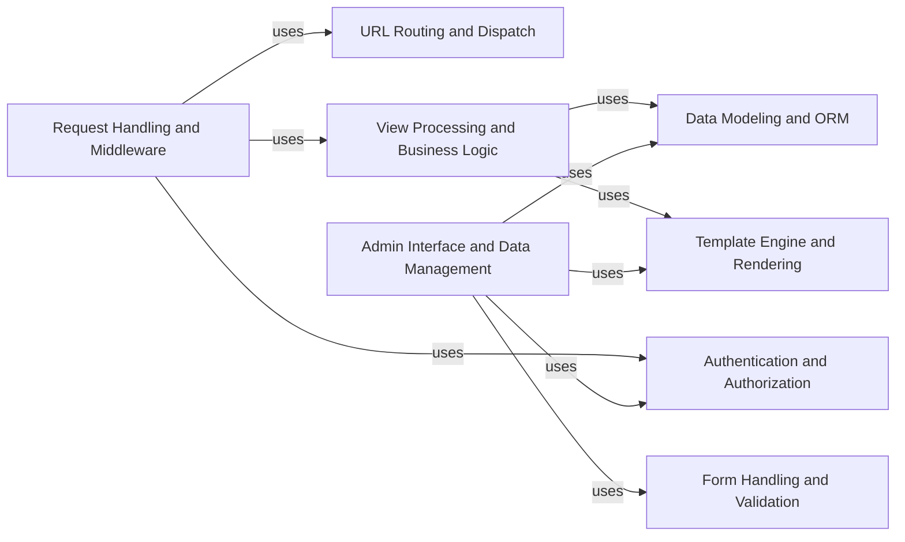

## Component Details

### Request Handling and Middleware
This component manages the entire lifecycle of an HTTP request, from initial reception to final response. It incorporates middleware processing for tasks like security checks, session management, and request modification. It orchestrates interactions between URL routing, view execution, and template rendering, ensuring a consistent and secure request-response flow.
- **Related Classes/Methods**: `django.core.handlers.asgi`, `django.core.handlers.wsgi`, `django.core.handlers.base`, `django.core.handlers.exception`, `django.http.request`, `django.http.response`, `django.middleware.csrf`, `django.middleware.gzip`, `django.middleware.http`, `django.middleware.locale`, `django.middleware.security`

### URL Routing and Dispatch
This component is responsible for mapping incoming URLs to the appropriate view functions. It parses the URL, extracts relevant parameters, and dispatches the request to the corresponding view for processing. It provides a flexible mechanism for defining URL patterns and handling complex routing scenarios, including support for namespaces and parameterized URLs.
- **Related Classes/Methods**: `django.urls`, `django.urls.conf`, `django.urls.resolvers`, `django.urls.utils`, `django.conf.urls`, `django.conf.urls.i18n`, `django.conf.urls.static`

### View Processing and Business Logic
This component executes the core application logic, handling user requests and generating responses. It interacts with data models, performs necessary calculations, and orchestrates the rendering of templates. Views encapsulate the specific functionality of each application endpoint, providing a clear separation of concerns between request handling and business logic.
- **Related Classes/Methods**: `django.views.generic.base`

### Template Engine and Rendering
This component is responsible for rendering dynamic content using templates. It loads templates, populates them with data from the context, and generates the final HTML output. It supports various template engines and provides features like template inheritance, tags, and filters, enabling developers to create reusable and maintainable templates.
- **Related Classes/Methods**: `django.template`, `django.template.backends.django`, `django.template.backends.jinja2`, `django.template.backends.base`, `django.template.context`, `django.template.context_processors`, `django.template.defaultfilters`, `django.template.defaulttags`, `django.template.engine`, `django.template.library`, `django.template.loader`, `django.template.loader_tags`, `django.templatetags.static`, `django.utils.html`, `django.utils.safestring`

### Data Modeling and ORM
This component provides an Object-Relational Mapper (ORM) for interacting with databases. It defines model classes that represent database tables, and provides a high-level API for querying, creating, updating, and deleting data. It supports various database backends and includes features like migrations and schema management, simplifying database interactions and promoting code reusability.
- **Related Classes/Methods**: `django.db`, `django.db.models`, `django.db.models.fields`, `django.db.models.lookups`, `django.db.models.query`, `django.db.backends.base`, `django.db.backends.postgresql`, `django.db.backends.sqlite3`, `django.db.backends.oracle`, `django.db.backends.mysql`, `django.db.migrations`, `django.db.migrations.autodetector`, `django.db.migrations.operations`, `django.db.migrations.state`, `django.db.migrations.writer`

### Authentication and Authorization
This component manages user authentication and authorization, controlling access to resources based on user roles and permissions. It includes user models, authentication backends, password hashing, and permission management, providing a secure and flexible framework for managing user identities and access control.
- **Related Classes/Methods**: `django.contrib.auth`, `django.contrib.auth.models`, `django.contrib.auth.backends`, `django.contrib.auth.forms`, `django.contrib.auth.hashers`, `django.contrib.auth.middleware`, `django.contrib.auth.decorators`, `django.contrib.auth.views`

### Form Handling and Validation
This component handles form processing, validation, and rendering. It includes form fields, widgets, model forms, and formsets, providing a comprehensive set of tools for creating forms, validating user input, and displaying forms in templates. It simplifies the process of collecting and validating user data, ensuring data integrity and a smooth user experience.
- **Related Classes/Methods**: `django.forms`, `django.forms.fields`, `django.forms.widgets`, `django.forms.models`, `django.forms.formsets`, `django.forms.utils`

### Admin Interface and Data Management
This component provides a built-in admin interface for managing models. It includes admin sites, model admins, widgets, and related utilities, allowing administrators to easily create, update, and delete data through a web-based interface. It simplifies data management tasks and provides a centralized interface for managing application data.
- **Related Classes/Methods**: `django.contrib.admin`, `django.contrib.admin.apps`, `django.contrib.admin.options`, `django.contrib.admin.sites`, `django.contrib.admin.widgets`, `django.contrib.admin.helpers`, `django.contrib.admin.filters`, `django.contrib.admin.forms`, `django.contrib.admin.templatetags`, `django.contrib.admin.utils`, `django.contrib.admin.views`