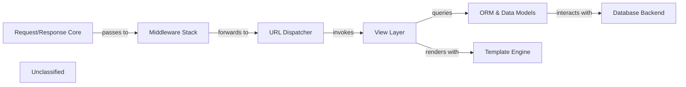

## Details

The Django framework operates on a request-response cycle, starting with the Request/Response Core which handles incoming HTTP requests (WSGI/ASGI). These requests then flow through the Middleware Stack for global processing such as security and authentication. The URL Dispatcher maps the request to the appropriate view, which resides in the View Layer. The View Layer encapsulates the application's business logic, interacting with the ORM & Data Models to access and manipulate data. The ORM, in turn, communicates with the Database Backend to perform actual database operations. Finally, the View Layer utilizes the Template Engine to render dynamic content before the response is sent back through the Middleware Stack and the Request/Response Core to the client.

### Request/Response Core
The primary entry point for all incoming HTTP requests (WSGI/ASGI). It orchestrates the request-response lifecycle, including middleware processing and sending the final HTTP response.

**Related Classes/Methods**:

- <a href="https://github.com/django/django//blobdjango/core/handlers/wsgi.py#L10-L36" target="_blank" rel="noopener noreferrer">`django.core.handlers.wsgi.WSGIHandler.__call__`:10-36</a>
- <a href="https://github.com/django/django//blobdjango/core/handlers/asgi.py#L15-L40" target="_blank" rel="noopener noreferrer">`django.core.handlers.asgi.ASGIHandler.__call__`:15-40</a>

### Middleware Stack
A stack of components that process requests and responses globally, handling cross-cutting concerns like security (CSRF, authentication), session management, and messaging.

**Related Classes/Methods**:

- <a href="https://github.com/django/django//blobdjango/middleware/csrf.py" target="_blank" rel="noopener noreferrer">`django.middleware.csrf.CsrfViewMiddleware.process_view`</a>
- <a href="https://github.com/django/django//blobdjango/contrib/auth/middleware.py" target="_blank" rel="noopener noreferrer">`django.contrib.auth.middleware.AuthenticationMiddleware.process_request`</a>

### URL Dispatcher
Responsible for mapping incoming URLs to the appropriate view functions or class-based views based on defined URL patterns.

**Related Classes/Methods**:

- <a href="https://github.com/django/django//blobdjango/urls/__init__.py#L10-L13" target="_blank" rel="noopener noreferrer">`django.urls.resolve`:10-13</a>

### View Layer
Contains the application's core business logic. It receives requests, processes user input (often via forms), interacts with the ORM for data access, and prepares context for template rendering.

**Related Classes/Methods**:

- <a href="https://github.com/django/django//blobdjango/views/generic/base.py" target="_blank" rel="noopener noreferrer">`django.views.generic.base.View.dispatch`</a>
- <a href="https://github.com/django/django//blobdjango/forms/forms.py" target="_blank" rel="noopener noreferrer">`django.forms.forms.BaseForm.is_valid`</a>

### ORM & Data Models
Provides an Object-Relational Mapping layer, allowing Python objects to interact with the database. It manages data models and handles queries.

**Related Classes/Methods**:

- <a href="https://github.com/django/django//blobdjango/db/models/query.py" target="_blank" rel="noopener noreferrer">`django.db.models.query.QuerySet.filter`</a>
- <a href="https://github.com/django/django//blobdjango/db/models/base.py" target="_blank" rel="noopener noreferrer">`django.db.models.base.Model.save`</a>

### Database Backend
Manages actual database connections, translates ORM queries into SQL, executes them, and returns raw results. It also handles database migrations.

**Related Classes/Methods**:

- <a href="https://github.com/django/django//blobdjango/db/backends/postgresql/base.py#L269-L307" target="_blank" rel="noopener noreferrer">`django.db.backends.postgresql.base.DatabaseWrapper.get_new_connection`:269-307</a>
- <a href="https://github.com/django/django//blobdjango/db/transaction.py#L315-L322" target="_blank" rel="noopener noreferrer">`django.db.transaction.atomic`:315-322</a>

### Template Engine
Renders dynamic content into HTML or other text formats using context data provided by the View Layer.

**Related Classes/Methods**:

- <a href="https://github.com/django/django//blobdjango/template/engine.py" target="_blank" rel="noopener noreferrer">`django.template.engine.Engine.get_template`</a>

### Unclassified
Component for all unclassified files and utility functions (Utility functions/External Libraries/Dependencies)

**Related Classes/Methods**: _None_

### [FAQ](https://github.com/CodeBoarding/GeneratedOnBoardings/tree/main?tab=readme-ov-file#faq)