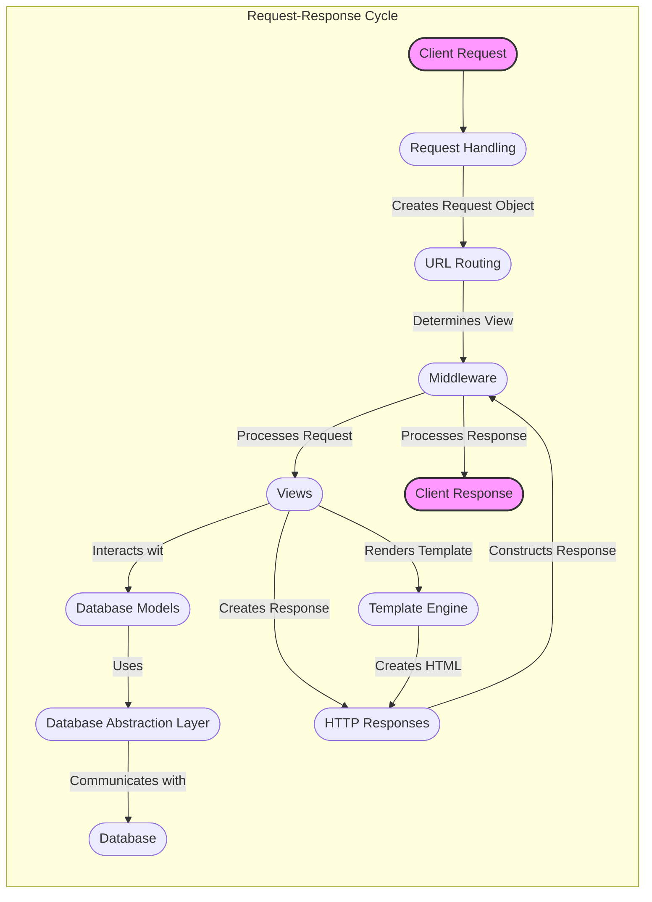

## Django High-Level Data Flow Overview

Django is a high-level Python web framework that encourages rapid development and clean, pragmatic design. It provides a robust set of tools and conventions for building web applications, including features for URL routing, template rendering, database management, and user authentication.

## Component Descriptions

**1. Request Handling:** This component receives incoming HTTP requests from clients (via WSGI/ASGI), parses them, and creates a `HttpRequest` object. It is the entry point for all web requests and passes the request object to the URL routing component.

**2. URL Routing:** This component examines the URL of the incoming request and matches it against a set of URL patterns defined in the project's `urls.py` files. It determines which view function or class should handle the request and passes control to the appropriate view.

**3. Middleware:** Middleware components sit between the request handling and the view, and between the view and the response. They can modify the request before it reaches the view, process the response after the view has executed, or perform other tasks such as authentication, session management, or caching. It processes both the request and the response, modifying them as needed.

**4. Views:** Views contain the core application logic. They receive the `HttpRequest` object, process the request data, interact with models to retrieve or update data, and generate a response. Views often render templates using the Template Engine or directly construct `HttpResponse` objects.

**5. Template Engine:** This component is responsible for rendering dynamic content into HTML or other formats. It takes a template (which contains placeholders for dynamic data) and a context (which provides the data to fill those placeholders) and produces a fully rendered output, which is then included in the HTTP response. The view uses the template engine to generate the HTML content of the response.

**6. Database Models:** Models define the structure and behavior of the data stored in the database. They provide an object-oriented interface for interacting with the database, allowing developers to perform CRUD (Create, Read, Update, Delete) operations on data without writing raw SQL queries. The view interacts with the database models to retrieve or update data.

**7. Database Abstraction Layer:** This component provides an abstract interface for interacting with different database backends (e.g., PostgreSQL, MySQL, SQLite). It translates Django's model operations into database-specific SQL queries, ensuring that the application can work with different databases without requiring code changes. The Database Models use the abstraction layer to communicate with the database.

**8. HTTP Responses:** This component creates and manages HTTP responses that are sent back to the client. It sets the response status code, headers, and content, and can handle different types of responses, such as HTML pages, JSON data, redirects, or errors. The view creates the HTTP response, and the middleware can further process it before sending it to the client.
