```mermaid
graph LR
    Core_Web_Processing["Core Web Processing"]
    Data_Persistence_ORM["Data Persistence & ORM"]
    User_Session_Management["User & Session Management"]
    Presentation_Layer["Presentation Layer"]
    Admin_Management["Admin & Management"]
    File_Media_Handling["File & Media Handling"]
    Caching_Email_Services["Caching & Email Services"]
    System_Health_Utilities["System Health & Utilities"]
    Geographic_Information_Systems_GIS_["Geographic Information Systems (GIS)"]
    Core_Web_Processing -- "routes to" --> Presentation_Layer
    Core_Web_Processing -- "interacts with" --> Data_Persistence_ORM
    Core_Web_Processing -- "integrates with" --> User_Session_Management
    Core_Web_Processing -- "serves" --> File_Media_Handling
    Core_Web_Processing -- "uses" --> System_Health_Utilities
    Core_Web_Processing -- "uses" --> Caching_Email_Services
    Core_Web_Processing -- "renders via" --> Presentation_Layer
    Core_Web_Processing -- "receives input from" --> Presentation_Layer
    Data_Persistence_ORM -- "stores data for" --> User_Session_Management
    Data_Persistence_ORM -- "used as backend by" --> Caching_Email_Services
    Data_Persistence_ORM -- "extended by" --> Geographic_Information_Systems_GIS_
    Data_Persistence_ORM -- "interacted with by" --> Admin_Management
    Data_Persistence_ORM -- "provides models for" --> Presentation_Layer
    Data_Persistence_ORM -- "checked by" --> System_Health_Utilities
    User_Session_Management -- "integrates with" --> Core_Web_Processing
    User_Session_Management -- "stores data in" --> Data_Persistence_ORM
    User_Session_Management -- "provides forms for" --> Presentation_Layer
    User_Session_Management -- "managed by" --> Admin_Management
    User_Session_Management -- "uses" --> System_Health_Utilities
    Presentation_Layer -- "uses" --> Data_Persistence_ORM
    Presentation_Layer -- "used by" --> Admin_Management
    Presentation_Layer -- "used by" --> User_Session_Management
    Presentation_Layer -- "integrates with" --> Geographic_Information_Systems_GIS_
    Presentation_Layer -- "uses" --> System_Health_Utilities
    Admin_Management -- "manages" --> Data_Persistence_ORM
    Admin_Management -- "manages" --> User_Session_Management
    Admin_Management -- "uses" --> Presentation_Layer
    Admin_Management -- "manages" --> File_Media_Handling
    Admin_Management -- "sends via" --> Caching_Email_Services
    Admin_Management -- "runs" --> System_Health_Utilities
    File_Media_Handling -- "served by" --> Core_Web_Processing
    File_Media_Handling -- "managed by" --> Admin_Management
    File_Media_Handling -- "uses" --> System_Health_Utilities
    Caching_Email_Services -- "uses" --> Data_Persistence_ORM
    Caching_Email_Services -- "used by" --> Core_Web_Processing
    Caching_Email_Services -- "used by" --> Admin_Management
    Caching_Email_Services -- "uses" --> System_Health_Utilities
    System_Health_Utilities -- "provides services to" --> Core_Web_Processing
    System_Health_Utilities -- "provides services to" --> Data_Persistence_ORM
    System_Health_Utilities -- "provides services to" --> User_Session_Management
    System_Health_Utilities -- "provides services to" --> Presentation_Layer
    System_Health_Utilities -- "provides services to" --> Admin_Management
    System_Health_Utilities -- "provides services to" --> File_Media_Handling
    System_Health_Utilities -- "provides services to" --> Caching_Email_Services
    System_Health_Utilities -- "provides services to" --> Geographic_Information_Systems_GIS_
    Geographic_Information_Systems_GIS_ -- "extends" --> Data_Persistence_ORM
    Geographic_Information_Systems_GIS_ -- "integrates with" --> Presentation_Layer
    click Core_Web_Processing href "https://github.com/CodeBoarding/GeneratedOnBoardings/blob/main/django/Core Web Processing.md" "Details"
    click Data_Persistence_ORM href "https://github.com/CodeBoarding/GeneratedOnBoardings/blob/main/django/Data Persistence & ORM.md" "Details"
    click User_Session_Management href "https://github.com/CodeBoarding/GeneratedOnBoardings/blob/main/django/User & Session Management.md" "Details"
    click Presentation_Layer href "https://github.com/CodeBoarding/GeneratedOnBoardings/blob/main/django/Presentation Layer.md" "Details"
    click Admin_Management href "https://github.com/CodeBoarding/GeneratedOnBoardings/blob/main/django/Admin & Management.md" "Details"
    click File_Media_Handling href "https://github.com/CodeBoarding/GeneratedOnBoardings/blob/main/django/File & Media Handling.md" "Details"
    click Caching_Email_Services href "https://github.com/CodeBoarding/GeneratedOnBoardings/blob/main/django/Caching & Email Services.md" "Details"
    click System_Health_Utilities href "https://github.com/CodeBoarding/GeneratedOnBoardings/blob/main/django/System Health & Utilities.md" "Details"
    click Geographic_Information_Systems_GIS_ href "https://github.com/CodeBoarding/GeneratedOnBoardings/blob/main/django/Geographic Information Systems (GIS).md" "Details"
```

## Component Details

The Django framework provides a comprehensive set of components for building web applications following the Model-View-Template (MVT) architectural pattern. The core flow involves the `Core Web Processing` component handling incoming HTTP requests, routing them to appropriate views, and processing them through middleware. These views often interact with the `Data Persistence & ORM` layer to manage database operations and retrieve/store data. The `Presentation Layer` is responsible for rendering dynamic content using templates and handling user input through forms. User authentication and session management are handled by the `User & Session Management` component. For administrative tasks and command-line operations, the `Admin & Management` component provides an interface. Static and media files are managed by `File & Media Handling`. Performance and communication utilities like caching and email are encapsulated in `Caching & Email Services`. `System Health & Utilities` provides foundational services and checks across the framework, while `Geographic Information Systems (GIS)` extends the ORM for spatial data.

### Core Web Processing
Manages the fundamental request-response cycle, including parsing HTTP requests, resolving URLs to views, processing requests through middleware, and generating HTTP responses. It also encompasses the application's global settings and entry points for web servers.

**Related Classes/Methods**:

- <a href="https://github.com/django/django/blob/master/django/http/request.py#L53-L470" target="_blank" rel="noopener noreferrer">`django.http.request.HttpRequest` (53:470)</a>
- <a href="https://github.com/django/django/blob/master/django/http/response.py#L365-L435" target="_blank" rel="noopener noreferrer">`django.http.response.HttpResponse` (365:435)</a>
- <a href="https://github.com/django/django/blob/master/django/urls/resolvers.py#L501-L839" target="_blank" rel="noopener noreferrer">`django.urls.resolvers.URLResolver` (501:839)</a>
- <a href="https://github.com/django/django/blob/master/django/core/handlers/base.py#L20-L365" target="_blank" rel="noopener noreferrer">`django.core.handlers.base.BaseHandler` (20:365)</a>
- `django.conf.LazySettings` (full file reference)
- <a href="https://github.com/django/django/blob/master/django/middleware/csrf.py#L165-L483" target="_blank" rel="noopener noreferrer">`django.middleware.csrf.CsrfViewMiddleware` (165:483)</a>
- <a href="https://github.com/django/django/blob/master/django/views/generic/base.py#L37-L181" target="_blank" rel="noopener noreferrer">`django.views.generic.base.View` (37:181)</a>

### Data Persistence & ORM
Handles all database interactions, including object-relational mapping (ORM) for defining and querying models, managing database schema changes through migrations, and providing an abstraction layer for various database backends.

**Related Classes/Methods**:

- `django.db.models.base.Model` (full file reference)
- <a href="https://github.com/django/django/blob/master/django/db/models/query.py#L279-L1000" target="_blank" rel="noopener noreferrer">`django.db.models.query.QuerySet` (279:1000)</a>
- <a href="https://github.com/django/django/blob/master/django/db/backends/base/base.py#L30-L792" target="_blank" rel="noopener noreferrer">`django.db.backends.base.base.BaseDatabaseWrapper` (30:792)</a>
- `django.db.migrations.autodetector.MigrationAutodetector` (full file reference)
- <a href="https://github.com/django/django/blob/master/django/db/migrations/executor.py#L10-L412" target="_blank" rel="noopener noreferrer">`django.db.migrations.executor.MigrationExecutor` (10:412)</a>

### User & Session Management
Manages user authentication, authorization, and session handling. This includes user models, login/logout views, password hashing, and various session storage backends to maintain user state across requests.

**Related Classes/Methods**:

- <a href="https://github.com/django/django/blob/master/django/contrib/auth/models.py#L446-L514" target="_blank" rel="noopener noreferrer">`django.contrib.auth.models.AbstractUser` (446:514)</a>
- <a href="https://github.com/django/django/blob/master/django/contrib/auth/views.py#L66-L122" target="_blank" rel="noopener noreferrer">`django.contrib.auth.views.LoginView` (66:122)</a>
- <a href="https://github.com/django/django/blob/master/django/contrib/auth/hashers.py#L94-L113" target="_blank" rel="noopener noreferrer">`django.contrib.auth.hashers.make_password` (94:113)</a>
- <a href="https://github.com/django/django/blob/master/django/contrib/sessions/middleware.py#L12-L77" target="_blank" rel="noopener noreferrer">`django.contrib.sessions.middleware.SessionMiddleware` (12:77)</a>
- <a href="https://github.com/django/django/blob/master/django/contrib/sessions/backends/db.py#L12-L198" target="_blank" rel="noopener noreferrer">`django.contrib.sessions.backends.db.SessionStore` (12:198)</a>

### Presentation Layer
Provides tools for rendering dynamic content and handling user input. This includes Django's templating system for generating HTML and a robust forms framework for creating, validating, and rendering HTML forms.

**Related Classes/Methods**:

- <a href="https://github.com/django/django/blob/master/django/template/engine.py#L13-L214" target="_blank" rel="noopener noreferrer">`django.template.engine.Engine` (13:214)</a>
- <a href="https://github.com/django/django/blob/master/django/template/base.py#L138-L288" target="_blank" rel="noopener noreferrer">`django.template.base.Template` (138:288)</a>
- <a href="https://github.com/django/django/blob/master/django/forms/forms.py#L52-L429" target="_blank" rel="noopener noreferrer">`django.forms.forms.BaseForm` (52:429)</a>
- <a href="https://github.com/django/django/blob/master/django/forms/fields.py#L83-L270" target="_blank" rel="noopener noreferrer">`django.forms.fields.Field` (83:270)</a>
- `django.forms.widgets.Widget` (full file reference)

### Admin & Management
Offers an automatic administrative interface for managing models and provides a command-line interface for various project operations, such as running servers, managing migrations, and creating users.

**Related Classes/Methods**:

- <a href="https://github.com/django/django/blob/master/django/contrib/admin/sites.py#L30-L606" target="_blank" rel="noopener noreferrer">`django.contrib.admin.sites.AdminSite` (30:606)</a>
- <a href="https://github.com/django/django/blob/master/django/contrib/admin/options.py#L635-L1000" target="_blank" rel="noopener noreferrer">`django.contrib.admin.options.ModelAdmin` (635:1000)</a>
- <a href="https://github.com/django/django/blob/master/django/core/management/base.py#L187-L619" target="_blank" rel="noopener noreferrer">`django.core.management.base.BaseCommand` (187:619)</a>
- `django.core.management.ManagementUtility` (full file reference)

### File & Media Handling
Manages the serving and collection of static assets (CSS, JavaScript, images) and user-uploaded media files, providing storage backends and utilities for file operations.

**Related Classes/Methods**:

- <a href="https://github.com/django/django/blob/master/django/contrib/staticfiles/views.py#L16-L40" target="_blank" rel="noopener noreferrer">`django.contrib.staticfiles.views.serve` (16:40)</a>
- <a href="https://github.com/django/django/blob/master/django/contrib/staticfiles/finders.py#L86-L195" target="_blank" rel="noopener noreferrer">`django.contrib.staticfiles.finders.FileSystemFinder` (86:195)</a>
- <a href="https://github.com/django/django/blob/master/django/core/files/storage/base.py#L11-L206" target="_blank" rel="noopener noreferrer">`django.core.files.storage.base.Storage` (11:206)</a>
- <a href="https://github.com/django/django/blob/master/django/core/files/uploadedfile.py#L21-L67" target="_blank" rel="noopener noreferrer">`django.core.files.uploadedfile.UploadedFile` (21:67)</a>

### Caching & Email Services
Provides mechanisms for improving application performance through caching with various backend options and an API for sending emails, supporting different email backends and message formatting.

**Related Classes/Methods**:

- <a href="https://github.com/django/django/blob/master/django/core/cache/backends/base.py#L58-L390" target="_blank" rel="noopener noreferrer">`django.core.cache.backends.base.BaseCache` (58:390)</a>
- <a href="https://github.com/django/django/blob/master/django/core/cache/backends/db.py#L43-L294" target="_blank" rel="noopener noreferrer">`django.core.cache.backends.db.DatabaseCache` (43:294)</a>
- `django.core.mail.send_mail` (full file reference)
- <a href="https://github.com/django/django/blob/master/django/core/mail/message.py#L198-L437" target="_blank" rel="noopener noreferrer">`django.core.mail.message.EmailMessage` (198:437)</a>

### System Health & Utilities
Encompasses a framework for performing system-wide checks to identify common problems and misconfigurations, including security checks, and a collection of general-purpose utility functions used throughout Django for tasks like timezones, internationalization, and module loading.

**Related Classes/Methods**:

- <a href="https://github.com/django/django/blob/master/django/core/checks/registry.py#L29-L112" target="_blank" rel="noopener noreferrer">`django.core.checks.registry.CheckRegistry` (29:112)</a>
- <a href="https://github.com/django/django/blob/master/django/core/checks/security/base.py#L216-L223" target="_blank" rel="noopener noreferrer">`django.core.checks.security.base.check_secret_key` (216:223)</a>
- <a href="https://github.com/django/django/blob/master/django/utils/timezone.py#L200-L204" target="_blank" rel="noopener noreferrer">`django.utils.timezone.now` (200:204)</a>
- `django.utils.translation.gettext` (full file reference)
- <a href="https://github.com/django/django/blob/master/django/utils/module_loading.py#L19-L35" target="_blank" rel="noopener noreferrer">`django.utils.module_loading.import_string` (19:35)</a>

### Geographic Information Systems (GIS)
Extends Django's ORM and administrative interface with support for geographic data types, spatial queries, and integration with GIS libraries like GDAL and GEOS.

**Related Classes/Methods**:

- <a href="https://github.com/django/django/blob/master/django/contrib/gis/db/models/fields.py#L225-L322" target="_blank" rel="noopener noreferrer">`django.contrib.gis.db.models.fields.GeometryField` (225:322)</a>
- <a href="https://github.com/django/django/blob/master/django/contrib/gis/geos/geometry.py#L727-L787" target="_blank" rel="noopener noreferrer">`django.contrib.gis.geos.geometry.GEOSGeometry` (727:787)</a>
- <a href="https://github.com/django/django/blob/master/django/contrib/gis/gdal/datasource.py#L51-L129" target="_blank" rel="noopener noreferrer">`django.contrib.gis.gdal.datasource.DataSource` (51:129)</a>

### [FAQ](https://github.com/CodeBoarding/GeneratedOnBoardings/tree/main?tab=readme-ov-file#faq)