```mermaid
graph LR
    Core_Framework["Core Framework"]
    Data_Management["Data Management"]
    Presentation_Layer["Presentation Layer"]
    Request_Response_Processing["Request-Response Processing"]
    Administrative_Contrib_Applications["Administrative & Contrib Applications"]
    Testing_Utilities["Testing Utilities"]
    Core_Framework -- "integrates with" --> Data_Management
    Data_Management -- "provides data to" --> Core_Framework
    Core_Framework -- "utilizes" --> Presentation_Layer
    Presentation_Layer -- "renders output for" --> Core_Framework
    Core_Framework -- "processes via" --> Request_Response_Processing
    Request_Response_Processing -- "secures" --> Core_Framework
    Core_Framework -- "integrates with" --> Administrative_Contrib_Applications
    Administrative_Contrib_Applications -- "provides services to" --> Core_Framework
    Core_Framework -- "is tested by" --> Testing_Utilities
    Testing_Utilities -- "validates functionality of" --> Core_Framework
    Data_Management -- "generates forms for" --> Presentation_Layer
    Administrative_Contrib_Applications -- "manages data through" --> Data_Management
    Data_Management -- "stores data for" --> Administrative_Contrib_Applications
    Request_Response_Processing -- "stores user data for" --> Data_Management
    Administrative_Contrib_Applications -- "displays data using" --> Presentation_Layer
    Presentation_Layer -- "enhances" --> Administrative_Contrib_Applications
    Administrative_Contrib_Applications -- "utilizes" --> Request_Response_Processing
    Testing_Utilities -- "interacts with" --> Data_Management
    click Core_Framework href "https://github.com/CodeBoarding/GeneratedOnBoardings/blob/main/django/Core Framework.md" "Details"
    click Data_Management href "https://github.com/CodeBoarding/GeneratedOnBoardings/blob/main/django/Data Management.md" "Details"
    click Presentation_Layer href "https://github.com/CodeBoarding/GeneratedOnBoardings/blob/main/django/Presentation Layer.md" "Details"
    click Request_Response_Processing href "https://github.com/CodeBoarding/GeneratedOnBoardings/blob/main/django/Request-Response Processing.md" "Details"
    click Administrative_Contrib_Applications href "https://github.com/CodeBoarding/GeneratedOnBoardings/blob/main/django/Administrative & Contrib Applications.md" "Details"
    click Testing_Utilities href "https://github.com/CodeBoarding/GeneratedOnBoardings/blob/main/django/Testing Utilities.md" "Details"
```

## Component Details

The Django framework is a high-level Python web framework that encourages rapid development and clean, pragmatic design. It follows the Model-View-Template (MVT) architectural pattern, providing a robust set of components for building web applications, including an ORM for database interaction, a powerful template engine for rendering, and a comprehensive set of utilities for handling requests, authentication, and administrative tasks. The main flow involves the Core Framework receiving HTTP requests, which are then processed by the Request/Response Processing layer (middleware, authentication), routed to appropriate views, which interact with the Data Management layer (ORM) to retrieve or store data. The Presentation Layer (forms and templates) is used to render responses back to the user. Various administrative and utility applications extend the core functionality.

### Core Framework
The foundational components of Django, responsible for handling HTTP requests and responses, URL routing, managing application settings, and providing essential utilities. It acts as the central orchestrator for Django applications.

**Related Classes/Methods**:

- `django.core.handlers.wsgi.WsgiHandler` (full file reference)
- `django.conf.global_settings` (full file reference)
- `django.urls.resolvers.path` (full file reference)

### Data Management
Django's Object-Relational Mapper and associated database utilities, enabling Python object-oriented interaction with various database systems. It handles data modeling, migrations, and transaction management, including specialized extensions for GIS and PostgreSQL.

**Related Classes/Methods**:

- `django.db.models.Model` (128:130)
- <a href="https://github.com/django/django/blob/master/django/contrib/gis/db/models/fields.py#L224-L321" target="_blank" rel="noopener noreferrer">`django.contrib.gis.db.models.fields.GeometryField` (224:321)</a>
- `django.contrib.postgres.fields.JSONField` (10:12)

### Presentation Layer
Provides systems for handling HTML forms, including data validation and rendering, and a powerful template engine for generating dynamic HTML content, separating presentation from logic.

**Related Classes/Methods**:

- <a href="https://github.com/django/django/blob/master/django/template/backends/django.py#L10-L12" target="_blank" rel="noopener noreferrer">`django.forms.Form` (10:12)</a>
- <a href="https://github.com/django/django/blob/master/django/template/backends/django.py#L92-L108" target="_blank" rel="noopener noreferrer">`django.template.Template` (92:108)</a>

### Request-Response Processing
A pluggable framework of hooks that process requests and responses globally, allowing for cross-cutting concerns like session management, CSRF protection, and URL rewriting, along with managing user authentication, authorization, and session persistence.

**Related Classes/Methods**:

- <a href="https://github.com/django/django/blob/master/django/middleware/common.py#L12-L114" target="_blank" rel="noopener noreferrer">`django.middleware.common.CommonMiddleware` (12:114)</a>
- <a href="https://github.com/django/django/blob/master/django/contrib/auth/models.py#L516-L525" target="_blank" rel="noopener noreferrer">`django.contrib.auth.models.User` (516:525)</a>
- <a href="https://github.com/django/django/blob/master/django/contrib/sessions/backends/db.py#L11-L197" target="_blank" rel="noopener noreferrer">`django.contrib.sessions.backends.db.SessionStore` (11:197)</a>

### Administrative & Contrib Applications
A collection of built-in applications providing an administrative interface for managing application data, along with various utility functions and content management features like generic content types, messaging, site management, static file handling, syndication feeds, flatpages, humanization, redirects, and sitemaps.

**Related Classes/Methods**:

- `django.contrib.admin.ModelAdmin` (63:65)
- <a href="https://github.com/django/django/blob/master/django/contrib/contenttypes/models.py#L133-L187" target="_blank" rel="noopener noreferrer">`django.contrib.contenttypes.models.ContentType` (133:187)</a>
- <a href="https://github.com/django/django/blob/master/django/contrib/messages/api.py#L21-L39" target="_blank" rel="noopener noreferrer">`django.contrib.messages.api.add_message` (21:39)</a>
- <a href="https://github.com/django/django/blob/master/django/contrib/sites/models.py#L78-L99" target="_blank" rel="noopener noreferrer">`django.contrib.sites.models.Site` (78:99)</a>
- <a href="https://github.com/django/django/blob/master/django/contrib/staticfiles/storage.py#L15-L43" target="_blank" rel="noopener noreferrer">`django.contrib.staticfiles.storage.StaticFilesStorage` (15:43)</a>
- <a href="https://github.com/django/django/blob/master/django/contrib/syndication/views.py#L28-L234" target="_blank" rel="noopener noreferrer">`django.contrib.syndication.views.Feed` (28:234)</a>
- <a href="https://github.com/django/django/blob/master/django/contrib/flatpages/models.py#L7-L48" target="_blank" rel="noopener noreferrer">`django.contrib.flatpages.models.FlatPage` (7:48)</a>
- <a href="https://github.com/django/django/blob/master/django/contrib/humanize/templatetags/humanize.py#L204-L209" target="_blank" rel="noopener noreferrer">`django.contrib.humanize.templatetags.humanize.naturaltime` (204:209)</a>
- <a href="https://github.com/django/django/blob/master/django/contrib/redirects/models.py#L5-L34" target="_blank" rel="noopener noreferrer">`django.contrib.redirects.models.Redirect` (5:34)</a>
- <a href="https://github.com/django/django/blob/master/django/contrib/sitemaps/views.py#L91-L139" target="_blank" rel="noopener noreferrer">`django.contrib.sitemaps.views.sitemap` (91:139)</a>

### Testing Utilities
Provides a comprehensive set of tools and utilities for writing and running tests for Django applications, including a client to simulate HTTP requests and various assertion helpers.

**Related Classes/Methods**:

- <a href="https://github.com/django/django/blob/master/django/test/client.py#L1027-L1393" target="_blank" rel="noopener noreferrer">`django.test.client.Client` (1027:1393)</a>

### [FAQ](https://github.com/CodeBoarding/GeneratedOnBoardings/tree/main?tab=readme-ov-file#faq)

### [FAQ](https://github.com/CodeBoarding/GeneratedOnBoardings/tree/main?tab=readme-ov-file#faq)