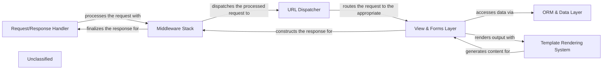

## Details

The Django application architecture is structured around a request-response cycle, starting with an `External Client` initiating an HTTP request. This request is first handled by the `Request/Response Handler`, which acts as the application's entry point, managing the initial parsing of the request and the final construction of the response. The request then passes through the `Middleware Stack`, a series of configurable components that apply cross-cutting concerns such as security, session management, and caching.

Following middleware processing, the `URL Dispatcher` interprets the request's URL, mapping it to the appropriate view function or class. The `View & Forms Layer` then takes over, executing the core business logic, processing user input via forms, and interacting with the `ORM & Data Layer`. The `ORM & Data Layer` defines the application's data models and provides an interface for querying the `External Database`. Once data is retrieved and processed, the `View & Forms Layer` utilizes the `Template Rendering System` to combine dynamic data with static markup, generating the final output (e.g., HTML). This rendered content is then passed back through the `Middleware Stack` and the `Request/Response Handler` before being sent as an HTTP response to the `External Client`.

This architecture ensures a clear separation of concerns, allowing for modular development and maintainable code, with each component playing a distinct role in processing client requests and generating responses.

### Request/Response Handler
The primary entry and exit point for all HTTP communication, handling initial request parsing and final response construction.

**Related Classes/Methods**:

- <a href="https://github.com/django/django/blob/maindjango/core/handlers/wsgi.py#L113-L144" target="_blank" rel="noopener noreferrer">`django.core.handlers.wsgi.WSGIHandler`:113-144</a>
- <a href="https://github.com/django/django/blob/maindjango/core/handlers/asgi.py#L143-L384" target="_blank" rel="noopener noreferrer">`django.core.handlers.asgi.ASGIHandler`:143-384</a>
- <a href="https://github.com/django/django/blob/maindjango/http/request.py#L53-L488" target="_blank" rel="noopener noreferrer">`django.http.request.HttpRequest`:53-488</a>
- <a href="https://github.com/django/django/blob/maindjango/http/response.py#L366-L436" target="_blank" rel="noopener noreferrer">`django.http.response.HttpResponse`:366-436</a>

### Middleware Stack
A configurable chain of components that process requests and responses globally, applying cross-cutting concerns like security, session management, and caching.

**Related Classes/Methods**:

- <a href="https://github.com/django/django/blob/maindjango/middleware/common.py#L13-L117" target="_blank" rel="noopener noreferrer">`django.middleware.common.CommonMiddleware`:13-117</a>
- <a href="https://github.com/django/django/blob/maindjango/middleware/csrf.py#L165-L484" target="_blank" rel="noopener noreferrer">`django.middleware.csrf.CsrfViewMiddleware`:165-484</a>
- <a href="https://github.com/django/django/blob/maindjango/contrib/sessions/middleware.py#L12-L77" target="_blank" rel="noopener noreferrer">`django.contrib.sessions.middleware.SessionMiddleware`:12-77</a>

### URL Dispatcher
Responsible for interpreting the incoming URL and mapping it to the appropriate view function or class based on defined URL patterns.

**Related Classes/Methods**:

- <a href="https://github.com/django/django/blob/maindjango/urls/resolvers.py#L503-L842" target="_blank" rel="noopener noreferrer">`django.urls.resolvers.URLResolver`:503-842</a>
- <a href="https://github.com/django/django/blob/maindjango/urls/resolvers.py#L422-L500" target="_blank" rel="noopener noreferrer">`django.urls.resolvers.URLPattern`:422-500</a>
- <a href="https://github.com/django/django/blob/maindjango/urls/__init__.py" target="_blank" rel="noopener noreferrer">`django.urls.path`</a>
- <a href="https://github.com/django/django/blob/maindjango/urls/__init__.py" target="_blank" rel="noopener noreferrer">`django.urls.re_path`</a>

### View & Forms Layer
Contains the application's core business logic, handles user input via forms, interacts with models, and prepares data for template rendering.

**Related Classes/Methods**:

- <a href="https://github.com/django/django/blob/maindjango/views/generic/base.py" target="_blank" rel="noopener noreferrer">`django.views.View`</a>
- <a href="https://github.com/django/django/blob/maindjango/views/generic/detail.py#L184-L191" target="_blank" rel="noopener noreferrer">`django.views.generic.detail.DetailView`:184-191</a>
- <a href="https://github.com/django/django/blob/maindjango/views/generic/list.py#L220-L224" target="_blank" rel="noopener noreferrer">`django.views.generic.list.ListView`:220-224</a>
- <a href="https://github.com/django/django/blob/maindjango/forms/forms.py" target="_blank" rel="noopener noreferrer">`django.forms.Form`</a>
- <a href="https://github.com/django/django/blob/maindjango/forms/models.py#L585-L586" target="_blank" rel="noopener noreferrer">`django.forms.models.ModelForm`:585-586</a>

### ORM & Data Layer
Defines the application's data structure through models and provides an Object-Relational Mapper for interacting with the database.

**Related Classes/Methods**:

- <a href="https://github.com/django/django/blob/maindjango/db/models/base.py" target="_blank" rel="noopener noreferrer">`django.db.models.Model`</a>
- <a href="https://github.com/django/django/blob/maindjango/db/models/manager.py" target="_blank" rel="noopener noreferrer">`django.db.models.Manager`</a>
- <a href="https://github.com/django/django/blob/maindjango/db/models/query.py" target="_blank" rel="noopener noreferrer">`django.db.models.query.QuerySet`</a>
- <a href="https://github.com/django/django/blob/maindjango/db/backends/base/base.py#L30-L792" target="_blank" rel="noopener noreferrer">`django.db.backends.base.base.BaseDatabaseWrapper`:30-792</a>

### Template Rendering System
Processes template files, combining static markup with dynamic data from views to generate the final output (e.g., HTML, XML).

**Related Classes/Methods**:

- <a href="https://github.com/django/django/blob/maindjango/template/engine.py" target="_blank" rel="noopener noreferrer">`django.template.engine.Engine`</a>
- <a href="https://github.com/django/django/blob/maindjango/template/loader.py#L52-L62" target="_blank" rel="noopener noreferrer">`django.template.loader.render_to_string`:52-62</a>
- <a href="https://github.com/django/django/blob/maindjango/template/backends/django.py#L16-L90" target="_blank" rel="noopener noreferrer">`django.template.backends.django.DjangoTemplates`:16-90</a>

### Unclassified
Component for all unclassified files and utility functions (Utility functions/External Libraries/Dependencies)

**Related Classes/Methods**: _None_

### [FAQ](https://github.com/CodeBoarding/GeneratedOnBoardings/tree/main?tab=readme-ov-file#faq)