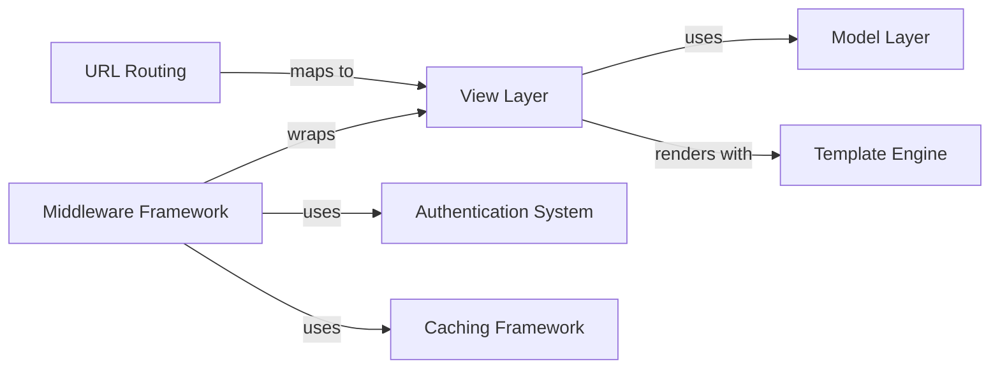

## Details

One paragraph explaining the functionality which is represented by this graph. What the main flow is and what is its purpose.

### Model Layer
Central data abstraction layer handling schema definition, query execution, and database persistence.

**Related Classes/Methods**:

- <a href="https://github.com/django/django/blob/main/django/contrib/gis/gdal/field.py#L13-L130" target="_blank" rel="noopener noreferrer">`Field` (13:130)</a>

### View Layer
Request processing and business logic execution layer.

**Related Classes/Methods**:

- <a href="https://github.com/django/django/blob/main/tests/admin_scripts/custom_templates/project_template/.hidden/render.py#L10-L50" target="_blank" rel="noopener noreferrer">`render` (10:50)</a>

### Template Engine
Dynamic HTML generation through variable resolution and template inheritance.

**Related Classes/Methods**:

- `Template`

### URL Routing
Request dispatching based on URL patterns.

**Related Classes/Methods**:

### Middleware Framework
Cross-cutting concerns implementation (security, sessions, caching).

**Related Classes/Methods**:

### Authentication System
User authentication and permission management.

**Related Classes/Methods**:

- `AuthMiddleware`
- `UserManager`

### Caching Framework
Response and data caching infrastructure.

**Related Classes/Methods**:

- `CacheHandler`
- `MemcachedBackend`

### [FAQ](https://github.com/CodeBoarding/GeneratedOnBoardings/tree/main?tab=readme-ov-file#faq)