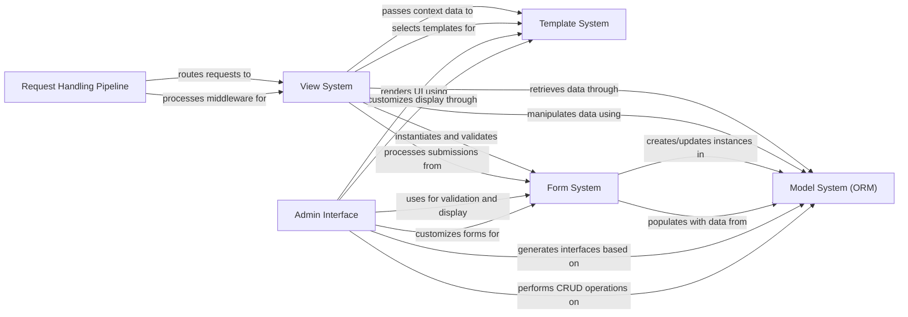

## Details

Django follows the Model-View-Template (MVT) architectural pattern, a variation of MVC. The framework processes web requests through a pipeline that begins with HTTP handlers receiving requests, middleware processing them, and URL dispatchers routing to appropriate views. Views handle business logic by interacting with the Model system (ORM) for data operations and the Template system for rendering HTML responses. The Form system facilitates user input handling with validation and processing capabilities. Django's Admin interface provides automatic CRUD operations by leveraging models, forms, and templates. This architecture emphasizes separation of concerns while maintaining tight integration between components, enabling rapid development of maintainable web applications through its "batteries-included" philosophy and DRY principles.

### Request Handling Pipeline [[Expand]](./Request_Handling_Pipeline.md)
Manages the complete HTTP request lifecycle from initial receipt to final response delivery, serving as the entry point for all requests and processing them through middleware before routing to views.

**Related Classes/Methods**:

- <a href="https://github.com/django/django/blob/main/django/core/handlers/base.py#L19-L364" target="_blank" rel="noopener noreferrer">`django.core.handlers.base.BaseHandler` (19:364)</a>
- <a href="https://github.com/django/django/blob/main/django/core/handlers/wsgi.py#L112-L143" target="_blank" rel="noopener noreferrer">`django.core.handlers.wsgi.WSGIHandler` (112:143)</a>
- <a href="https://github.com/django/django/blob/main/django/core/handlers/asgi.py#L138-L378" target="_blank" rel="noopener noreferrer">`django.core.handlers.asgi.ASGIHandler` (138:378)</a>
- `django.urls.resolvers.URLResolver`
- `django.urls.resolvers.URLPattern`
- <a href="https://github.com/django/django/blob/main/django/utils/deprecation.py#L265-L321" target="_blank" rel="noopener noreferrer">`django.utils.deprecation.MiddlewareMixin` (265:321)</a>

### View System [[Expand]](./View_System.md)
Processes HTTP requests and returns responses, implementing the 'V' in MVT. Handles business logic, processes user input, and prepares data for presentation.

**Related Classes/Methods**:

- <a href="https://github.com/django/django/blob/main/django/views/generic/base.py#L36-L180" target="_blank" rel="noopener noreferrer">`django.views.generic.base.View` (36:180)</a>
- <a href="https://github.com/django/django/blob/main/django/views/generic/base.py#L221-L228" target="_blank" rel="noopener noreferrer">`django.views.generic.base.TemplateView` (221:228)</a>
- <a href="https://github.com/django/django/blob/main/django/views/generic/list.py#L219-L223" target="_blank" rel="noopener noreferrer">`django.views.generic.list.ListView` (219:223)</a>
- <a href="https://github.com/django/django/blob/main/django/views/generic/detail.py#L182-L188" target="_blank" rel="noopener noreferrer">`django.views.generic.detail.DetailView` (182:188)</a>
- <a href="https://github.com/django/django/blob/main/django/views/generic/edit.py#L164-L165" target="_blank" rel="noopener noreferrer">`django.views.generic.edit.FormView` (164:165)</a>

### Model System (ORM) [[Expand]](./Model_System_ORM_.md)
Provides database abstraction and object-relational mapping, implementing the 'M' in MVT. Enables working with databases using Python objects rather than SQL.

**Related Classes/Methods**:

- <a href="https://github.com/django/django/blob/main/django/db/models/base.py#L480-L2407" target="_blank" rel="noopener noreferrer">`django.db.models.base.Model` (480:2407)</a>
- `django.db.models.query.QuerySet`
- <a href="https://github.com/django/django/blob/main/django/db/models/manager.py#L175-L176" target="_blank" rel="noopener noreferrer">`django.db.models.manager.Manager` (175:176)</a>
- `django.db.models.fields.Field`
- <a href="https://github.com/django/django/blob/main/django/db/migrations/migration.py#L8-L221" target="_blank" rel="noopener noreferrer">`django.db.migrations.migration.Migration` (8:221)</a>
- <a href="https://github.com/django/django/blob/main/django/db/migrations/executor.py#L9-L411" target="_blank" rel="noopener noreferrer">`django.db.migrations.executor.MigrationExecutor` (9:411)</a>

### Template System [[Expand]](./Template_System.md)
Renders dynamic HTML using templates and context data, implementing the 'T' in MVT. Separates presentation from business logic with support for template inheritance and dynamic content.

**Related Classes/Methods**:

- <a href="https://github.com/django/django/blob/main/django/template/engine.py#L12-L213" target="_blank" rel="noopener noreferrer">`django.template.engine.Engine` (12:213)</a>
- `django.template.base.Template`
- <a href="https://github.com/django/django/blob/main/django/template/context.py#L137-L172" target="_blank" rel="noopener noreferrer">`django.template.context.Context` (137:172)</a>
- `django.template.base.Node`
- <a href="https://github.com/django/django/blob/main/django/template/library.py#L15-L287" target="_blank" rel="noopener noreferrer">`django.template.library.Library` (15:287)</a>

### Form System [[Expand]](./Form_System.md)
Handles form rendering, validation, and processing. Streamlines user input handling by generating HTML forms, validating submitted data, and processing cleaned data for use in views.

**Related Classes/Methods**:

- `django.forms.forms.Form`
- `django.forms.models.ModelForm`
- <a href="https://github.com/django/django/blob/main/django/forms/formsets.py#L51-L530" target="_blank" rel="noopener noreferrer">`django.forms.formsets.BaseFormSet` (51:530)</a>
- `django.forms.fields.Field`
- `django.forms.widgets.Widget`

### Admin Interface [[Expand]](./Admin_Interface.md)
Provides an automatic admin UI for managing application data. Offers a ready-to-use administration panel that auto-generates CRUD interfaces based on registered models.

**Related Classes/Methods**:

- <a href="https://github.com/django/django/blob/main/django/contrib/admin/sites.py#L29-L605" target="_blank" rel="noopener noreferrer">`django.contrib.admin.sites.AdminSite` (29:605)</a>
- <a href="https://github.com/django/django/blob/main/django/contrib/admin/options.py#L634-L2340" target="_blank" rel="noopener noreferrer">`django.contrib.admin.options.ModelAdmin` (634:2340)</a>
- <a href="https://github.com/django/django/blob/main/django/contrib/admin/options.py#L2343-L2549" target="_blank" rel="noopener noreferrer">`django.contrib.admin.options.InlineModelAdmin` (2343:2549)</a>

### [FAQ](https://github.com/CodeBoarding/GeneratedOnBoardings/tree/main?tab=readme-ov-file#faq)