```mermaid
graph LR
    Core_Web_Framework["Core Web Framework"]
    ORM_Database_Layer["ORM & Database Layer"]
    Forms_Admin_Interface["Forms & Admin Interface"]
    Authentication_User_Management["Authentication & User Management"]
    Template_Static_Media_Handling["Template & Static-Media Handling"]
    System_Utilities_Management["System Utilities & Management"]
    Core_Web_Framework -- "Orchestrates" --> ORM_Database_Layer
    Core_Web_Framework -- "Processes Requests for" --> Forms_Admin_Interface
    Core_Web_Framework -- "Utilizes" --> Template_Static_Media_Handling
    Core_Web_Framework -- "Manages" --> Authentication_User_Management
    ORM_Database_Layer -- "Provides Data Persistence to" --> Core_Web_Framework
    ORM_Database_Layer -- "Manages Schema for" --> System_Utilities_Management
    Forms_Admin_Interface -- "Handles User Interaction for" --> Core_Web_Framework
    Forms_Admin_Interface -- "Manages Data via" --> ORM_Database_Layer
    Authentication_User_Management -- "Secures Access to" --> Core_Web_Framework
    Authentication_User_Management -- "Integrates with" --> Forms_Admin_Interface
    Template_Static_Media_Handling -- "Renders UI for" --> Core_Web_Framework
    Template_Static_Media_Handling -- "Serves Assets for" --> Forms_Admin_Interface
    System_Utilities_Management -- "Executes Commands on" --> ORM_Database_Layer
    System_Utilities_Management -- "Provides Services to" --> Core_Web_Framework
    click Core_Web_Framework href "https://github.com/CodeBoarding/GeneratedOnBoardings/blob/main/django/Core Web Framework.md" "Details"
    click ORM_Database_Layer href "https://github.com/CodeBoarding/GeneratedOnBoardings/blob/main/django/ORM & Database Layer.md" "Details"
    click Forms_Admin_Interface href "https://github.com/CodeBoarding/GeneratedOnBoardings/blob/main/django/Forms & Admin Interface.md" "Details"
    click Authentication_User_Management href "https://github.com/CodeBoarding/GeneratedOnBoardings/blob/main/django/Authentication & User Management.md" "Details"
    click Template_Static_Media_Handling href "https://github.com/CodeBoarding/GeneratedOnBoardings/blob/main/django/Template & Static-Media Handling.md" "Details"
    click System_Utilities_Management href "https://github.com/CodeBoarding/GeneratedOnBoardings/blob/main/django/System Utilities & Management.md" "Details"
```

## Component Details

This architecture analysis of Django reveals a highly modular and interconnected framework designed for rapid web development. The core flow revolves around the **Core Web Framework** handling HTTP requests and responses, routing them to appropriate views. These views often interact with the **ORM & Database Layer** for data persistence and retrieval. User interaction is managed by the **Forms & Admin Interface**, which leverages the ORM for data manipulation and the **Template & Static/Media Handling** for rendering. Authentication and authorization are handled by the **Authentication & User Management** component, securing access across the framework. Finally, the **System Utilities & Management** component provides essential command-line tools, caching, and messaging services that support the entire application lifecycle, including database migrations and static file collection.

### Core Web Framework
The foundational components of Django that handle the web request-response cycle, application initialization, global settings, URL routing, and provide essential utilities for common web development tasks. It acts as the central orchestrator for Django applications, including site management, flatpages, syndication, and sitemaps.

**Related Classes/Methods**:

- <a href="https://github.com/django/django/blob/master/django/template/backends/django.py#L8-L24" target="_blank" rel="noopener noreferrer">`django.setup` (8:24)</a>
- <a href="https://github.com/django/django/blob/master/django/template/backends/django.py#L10-L26" target="_blank" rel="noopener noreferrer">`django.conf.LazySettings` (10:26)</a>
- <a href="https://github.com/django/django/blob/master/django/http/request.py#L52-L469" target="_blank" rel="noopener noreferrer">`django.http.request.HttpRequest` (52:469)</a>
- <a href="https://github.com/django/django/blob/master/django/http/response.py#L364-L434" target="_blank" rel="noopener noreferrer">`django.http.response.HttpResponse` (364:434)</a>
- <a href="https://github.com/django/django/blob/master/django/views/generic/base.py#L36-L180" target="_blank" rel="noopener noreferrer">`django.views.generic.base.View` (36:180)</a>
- <a href="https://github.com/django/django/blob/master/django/shortcuts.py#L18-L26" target="_blank" rel="noopener noreferrer">`django.shortcuts.render` (18:26)</a>
- `django.contrib.sites.models` (full file reference)
- `django.contrib.flatpages.models` (full file reference)
- `django.contrib.syndication.views` (full file reference)
- `django.contrib.sitemaps.views` (full file reference)

### ORM & Database Layer
Django's powerful ORM provides an abstraction layer over the database, allowing developers to interact with database records as Python objects. It includes models for defining data structures, querysets for building complex database queries, and mechanisms for saving, updating, and deleting objects. This component also encompasses database backends, migration management, geospatial extensions, and content types framework.

**Related Classes/Methods**:

- <a href="https://github.com/django/django/blob/master/django/db/models/base.py#L480-L2406" target="_blank" rel="noopener noreferrer">`django.db.models.base.Model` (480:2406)</a>
- <a href="https://github.com/django/django/blob/master/django/db/models/query.py#L279-L2069" target="_blank" rel="noopener noreferrer">`django.db.models.query.QuerySet` (279:2069)</a>
- `django.db.models.fields` (1:1)
- `django.db.backends.base` (1:1)
- <a href="https://github.com/django/django/blob/master/django/db/transaction.py#L1-L1" target="_blank" rel="noopener noreferrer">`django.db.transaction` (1:1)</a>
- <a href="https://github.com/django/django/blob/master/django/db/migrations/migration.py#L1-L1" target="_blank" rel="noopener noreferrer">`django.db.migrations.migration` (1:1)</a>
- <a href="https://github.com/django/django/blob/master/django/db/migrations/autodetector.py#L1-L1" target="_blank" rel="noopener noreferrer">`django.db.migrations.autodetector` (1:1)</a>
- `django.contrib.gis.db.models` (full file reference)
- `django.contrib.contenttypes.models` (full file reference)

### Forms & Admin Interface
A comprehensive framework for handling HTML forms, including form definition, data validation, error handling, and rendering. It simplifies the process of processing user input and integrating it with database models. This component also includes Django's automatically generated administrative interface, providing a powerful and flexible way to manage application data.

**Related Classes/Methods**:

- <a href="https://github.com/django/django/blob/master/django/forms/forms.py#L432-L433" target="_blank" rel="noopener noreferrer">`django.forms.forms.Form` (432:433)</a>
- <a href="https://github.com/django/django/blob/master/django/forms/models.py#L1-L1" target="_blank" rel="noopener noreferrer">`django.forms.models` (1:1)</a>
- <a href="https://github.com/django/django/blob/master/django/forms/widgets.py#L1-L1" target="_blank" rel="noopener noreferrer">`django.forms.widgets` (1:1)</a>
- <a href="https://github.com/django/django/blob/master/django/forms/fields.py#L1-L1" target="_blank" rel="noopener noreferrer">`django.forms.fields` (1:1)</a>
- <a href="https://github.com/django/django/blob/master/django/contrib/admin/sites.py#L29-L605" target="_blank" rel="noopener noreferrer">`django.contrib.admin.sites.AdminSite` (29:605)</a>
- <a href="https://github.com/django/django/blob/master/django/contrib/admin/options.py#L634-L2340" target="_blank" rel="noopener noreferrer">`django.contrib.admin.options.ModelAdmin` (634:2340)</a>
- `django.contrib.admin.views` (1:1)

### Authentication & User Management
Provides a robust system for user authentication, authorization, and session management. It includes models for users and groups, views for login/logout, password management, and middleware for handling user sessions and permissions across requests.

**Related Classes/Methods**:

- <a href="https://github.com/django/django/blob/master/django/contrib/auth/models.py#L516-L525" target="_blank" rel="noopener noreferrer">`django.contrib.auth.models.User` (516:525)</a>
- <a href="https://github.com/django/django/blob/master/django/contrib/auth/views.py#L1-L1" target="_blank" rel="noopener noreferrer">`django.contrib.auth.views` (1:1)</a>
- <a href="https://github.com/django/django/blob/master/django/contrib/auth/middleware.py#L1-L1" target="_blank" rel="noopener noreferrer">`django.contrib.auth.middleware` (1:1)</a>
- <a href="https://github.com/django/django/blob/master/django/contrib/sessions/middleware.py#L1-L1" target="_blank" rel="noopener noreferrer">`django.contrib.sessions.middleware` (1:1)</a>
- `django.contrib.sessions.backends` (1:1)

### Template & Static-Media Handling
Django's built-in templating system for generating dynamic HTML, XML, or other text-based content. It provides a syntax for embedding Python-like logic within templates, including variables, tags, and filters, and supports various template loaders and context processors. This component also manages the storage, retrieval, and serving of user-uploaded files (media files) and static assets (CSS, JavaScript, images).

**Related Classes/Methods**:

- <a href="https://github.com/django/django/blob/master/django/template/engine.py#L12-L213" target="_blank" rel="noopener noreferrer">`django.template.engine.Engine` (12:213)</a>
- <a href="https://github.com/django/django/blob/master/django/template/loader.py#L1-L1" target="_blank" rel="noopener noreferrer">`django.template.loader` (1:1)</a>
- <a href="https://github.com/django/django/blob/master/django/template/defaulttags.py#L1-L1" target="_blank" rel="noopener noreferrer">`django.template.defaulttags` (1:1)</a>
- <a href="https://github.com/django/django/blob/master/django/template/defaultfilters.py#L1-L1" target="_blank" rel="noopener noreferrer">`django.template.defaultfilters` (1:1)</a>
- <a href="https://github.com/django/django/blob/master/django/core/files/storage/base.py#L1-L1" target="_blank" rel="noopener noreferrer">`django.core.files.storage.base` (1:1)</a>
- <a href="https://github.com/django/django/blob/master/django/core/files/storage/filesystem.py#L1-L1" target="_blank" rel="noopener noreferrer">`django.core.files.storage.filesystem` (1:1)</a>
- <a href="https://github.com/django/django/blob/master/django/contrib/staticfiles/storage.py#L1-L1" target="_blank" rel="noopener noreferrer">`django.contrib.staticfiles.storage` (1:1)</a>
- <a href="https://github.com/django/django/blob/master/django/contrib/staticfiles/views.py#L1-L1" target="_blank" rel="noopener noreferrer">`django.contrib.staticfiles.views` (1:1)</a>

### System Utilities & Management
A set of command-line utilities that allow developers to perform various administrative tasks for a Django project, such as running the development server, managing database migrations, creating superusers, and performing system checks. This component also includes the flexible caching framework, the messaging framework for user notifications, and documentation generation tools.

**Related Classes/Methods**:

- <a href="https://github.com/django/django/blob/master/django/core/management/base.py#L187-L619" target="_blank" rel="noopener noreferrer">`django.core.management.base.BaseCommand` (187:619)</a>
- `django.core.management.commands` (1:1)
- <a href="https://github.com/django/django/blob/master/django/template/backends/django.py#L1-L1" target="_blank" rel="noopener noreferrer">`django.core.checks` (1:1)</a>
- <a href="https://github.com/django/django/blob/master/django/core/cache/backends/base.py#L1-L1" target="_blank" rel="noopener noreferrer">`django.core.cache.backends.base` (1:1)</a>
- <a href="https://github.com/django/django/blob/master/django/contrib/messages/api.py#L1-L1" target="_blank" rel="noopener noreferrer">`django.contrib.messages.api` (1:1)</a>
- <a href="https://github.com/django/django/blob/master/django/contrib/messages/middleware.py#L1-L1" target="_blank" rel="noopener noreferrer">`django.contrib.messages.middleware` (1:1)</a>
- `django.contrib.admindocs` (full file reference)

### [FAQ](https://github.com/CodeBoarding/GeneratedOnBoardings/tree/main?tab=readme-ov-file#faq)

### [FAQ](https://github.com/CodeBoarding/GeneratedOnBoardings/tree/main?tab=readme-ov-file#faq)