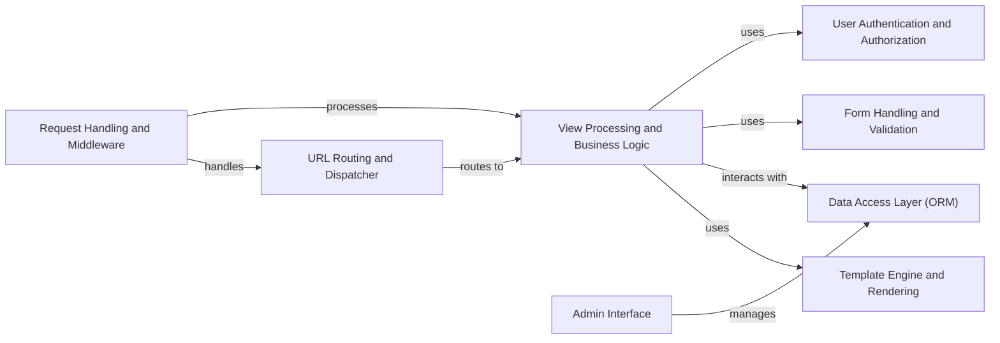

## Component Details

Django is a high-level Python web framework that encourages rapid development and clean, pragmatic design. It follows the Model-View-Template (MVT) architectural pattern. The framework provides tools for handling HTTP requests, routing URLs, rendering templates, interacting with databases, managing user authentication, and more. Django's architecture promotes code reusability, maintainability, and scalability, making it suitable for building a wide range of web applications.

### Request Handling and Middleware
This component is responsible for receiving HTTP requests, processing them through a series of middleware components, and generating HTTP responses. Middleware components handle tasks such as session management, authentication, CSRF protection, and request logging. This component forms the entry and exit point for all requests to the Django application.
- **Related Classes/Methods**: `django.django.http.request`, `django.django.http.response`, `django.django.core.handlers.wsgi`, `django.django.core.handlers.asgi`, `django.django.middleware.common`, `django.django.middleware.csrf`, `django.django.middleware.security`

### URL Routing and Dispatcher
This component maps incoming URLs to specific view functions or class-based views. It uses URL patterns defined in `urls.py` files to match URLs and extract parameters. The dispatcher then invokes the corresponding view to handle the request. This component acts as the central traffic controller, directing requests to the appropriate handler.
- **Related Classes/Methods**: `django.django.urls.base`, `django.django.urls.conf`, `django.django.urls.resolvers`

### View Processing and Business Logic
This component contains the core application logic. It consists of view functions and class-based views that receive requests, process data, interact with models, and render templates. This is where the application's specific functionality is implemented, orchestrating the interaction between the data access layer, form handling, and template rendering components.
- **Related Classes/Methods**: `django.django.views.generic.base`, `django.django.views.generic.list`, `django.django.views.generic.edit`, `django.django.views.defaults`, `django.django.views.decorators`

### Template Engine and Rendering
This component is responsible for rendering dynamic content using templates. It supports Django's built-in template language and can be extended to support other template engines like Jinja2. It provides template tags and filters for common tasks such as formatting data and including static files. This component transforms data into presentable HTML for the user.
- **Related Classes/Methods**: `django.django.template.base`, `django.django.template.engine`, `django.django.template.loader`, `django.django.template.defaultfilters`, `django.django.template.defaulttags`, `django.django.template.context`, `django.django.template.response`, `django.django.templatetags`

### Data Access Layer (ORM)
This component provides an Object-Relational Mapper (ORM) for interacting with databases. It allows developers to define data models using Python classes and provides a high-level API for querying, creating, updating, and deleting data. This component abstracts away the complexities of database interactions, allowing developers to work with data using Python objects.
- **Related Classes/Methods**: `django.django.db.models.base`, `django.django.db.models.fields`, `django.django.db.models.query`, `django.django.db.models.manager`, `django.django.db.backends.base`, `django.django.db.backends`

### User Authentication and Authorization
This component provides tools for managing user accounts, including authentication, authorization, and password management. It includes built-in user models, authentication backends, forms for user creation and login, and decorators for restricting access to views based on user permissions. This component secures the application by managing user identities and controlling access to resources.
- **Related Classes/Methods**: `django.django.contrib.auth.backends`, `django.django.contrib.auth.forms`, `django.django.contrib.auth.models`, `django.django.contrib.auth.views`, `django.django.contrib.auth.middleware`, `django.django.contrib.auth.decorators`, `django.django.contrib.auth.hashers`

### Form Handling and Validation
This component provides tools for creating and processing HTML forms. It includes form classes for defining form fields, widgets for rendering form fields, and validation logic for ensuring data integrity. It also supports model forms, which automatically generate forms from data models. This component simplifies the creation, rendering, and validation of HTML forms.
- **Related Classes/Methods**: `django.django.forms.forms`, `django.django.forms.fields`, `django.django.forms.widgets`, `django.django.forms.models`, `django.django.forms.formsets`, `django.django.forms.boundfield`, `django.django.forms.renderers`

### Admin Interface
This component provides a web-based interface for managing data models. It allows administrators to create, read, update, and delete objects, as well as perform other administrative tasks. It is highly customizable and can be extended with custom actions and views. This component provides a user-friendly interface for managing the application's data and configuration.
- **Related Classes/Methods**: `django.django.contrib.admin.sites`, `django.django.contrib.admin.options`, `django.django.contrib.admin.helpers`, `django.django.contrib.admin.widgets`, `django.django.contrib.admin.views`, `django.django.contrib.admin.models`, `django.django.contrib.admin.forms`, `django.django.contrib.admin.templatetags`