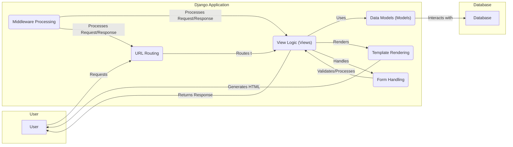

Okay, I'm ready to generate the high-level data flow diagram for the Django project.

**1. Project Description:**

Django is a high-level Python web framework that encourages rapid development and clean, pragmatic design. It provides a robust set of tools and conventions for building web applications, emphasizing reusability and "pluggability" of components, rapid development, and the principle of don't repeat yourself (DRY). Django handles much of the hassle of web development, so you can focus on writing your app without needing to reinvent the wheel.

**2. Data Flow Diagram (Mermaid Format):**

**3. Component Descriptions:**

*   **URL Routing:** This component receives incoming requests from the user and maps them to the appropriate view logic based on the defined URL patterns. It `routes to` the View Logic component. Middleware Processing also `processes request/response` to this component.

*   **View Logic (Views):** This component handles the core application logic. It receives requests from the URL Routing component, interacts with the Data Models to retrieve or update data, handles form submissions via the Form Handling component, and renders templates using the Template Rendering component. Finally, it `returns response` to the User. Middleware Processing also `processes request/response` to this component.

*   **Data Models (Models):** This component defines the structure and relationships of the application's data. It `interacts with` the Database to store and retrieve data, and it `uses` by the View Logic component to perform database operations.

*   **Template Rendering:** This component takes data from the View Logic component and combines it with HTML templates to generate the final user interface. It `generates HTML` that is sent back to the user.

*   **Form Handling:** This component processes user input through forms, including validation and data cleaning. It `validates/processes` data and sends it to the View Logic component for further processing.

*   **Middleware Processing:** This component processes requests and responses globally, performing tasks such as authentication, session management, and security checks. It `processes request/response` to both URL Routing and View Logic components, acting as a pipeline for request and response modification.
