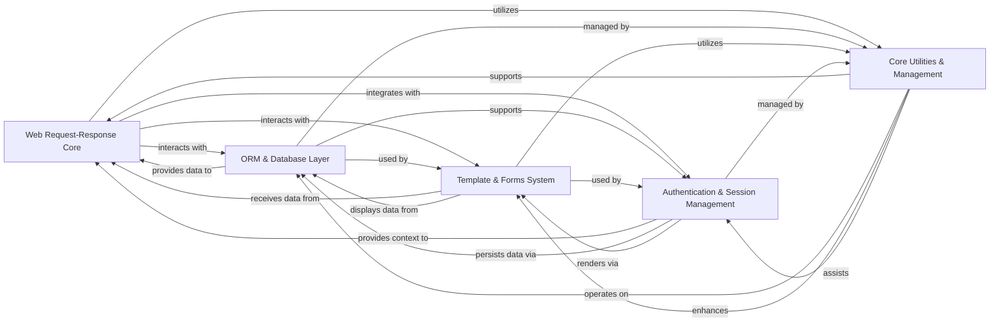

## Component Details

The architecture of Django can be distilled into five fundamental components, each playing a critical role in the framework's operation and enabling rapid web development. These components are chosen because they represent distinct, high-level responsibilities that are essential for any modern web application, from handling requests to managing data and user interactions.

### Web Request-Response Core
This is the central orchestrator of the web request lifecycle. It receives incoming HTTP requests (via WSGI/ASGI handlers), parses them into `HttpRequest` objects, dispatches them through middleware, resolves URLs to the appropriate view functions, executes the view, and finally constructs and sends `HttpResponse` objects back to the client. It also manages the loading and configuration of all installed Django applications and provides access to project-wide settings.

**Related Classes/Methods**:

- <a href="https://github.com/django/django/blob/master/django/core/handlers/base.py#L0-L0" target="_blank" rel="noopener noreferrer">`django.core.handlers.base` (0:0)</a>
- <a href="https://github.com/django/django/blob/master/django/core/handlers/wsgi.py#L0-L0" target="_blank" rel="noopener noreferrer">`django.core.handlers.wsgi` (0:0)</a>
- <a href="https://github.com/django/django/blob/master/django/http/request.py#L0-L0" target="_blank" rel="noopener noreferrer">`django.http.request` (0:0)</a>
- <a href="https://github.com/django/django/blob/master/django/http/response.py#L0-L0" target="_blank" rel="noopener noreferrer">`django.http.response` (0:0)</a>
- <a href="https://github.com/django/django/blob/master/django/urls/resolvers.py#L0-L0" target="_blank" rel="noopener noreferrer">`django.urls.resolvers` (0:0)</a>
- <a href="https://github.com/django/django/blob/master/django/apps/registry.py#L0-L0" target="_blank" rel="noopener noreferrer">`django.apps.registry` (0:0)</a>
- <a href="https://github.com/django/django/blob/master/django/template/backends/django.py#L0-L0" target="_blank" rel="noopener noreferrer">`django.conf` (0:0)</a>

### ORM & Database Layer
This component provides Django's powerful Object-Relational Mapper (ORM), allowing developers to interact with database data using Python objects (models) instead of raw SQL. It includes the underlying database backends that handle database-specific communication and SQL generation, as well as the migration system for managing and applying schema changes in a version-controlled manner.

**Related Classes/Methods**:

- <a href="https://github.com/django/django/blob/master/django/db/models/base.py#L0-L0" target="_blank" rel="noopener noreferrer">`django.db.models.base` (0:0)</a>
- <a href="https://github.com/django/django/blob/master/django/db/models/query.py#L0-L0" target="_blank" rel="noopener noreferrer">`django.db.models.query` (0:0)</a>
- <a href="https://github.com/django/django/blob/master/django/db/backends/base/base.py#L0-L0" target="_blank" rel="noopener noreferrer">`django.db.backends.base.base` (0:0)</a>
- <a href="https://github.com/django/django/blob/master/django/db/migrations/loader.py#L0-L0" target="_blank" rel="noopener noreferrer">`django.db.migrations.loader` (0:0)</a>
- <a href="https://github.com/django/django/blob/master/django/db/migrations/executor.py#L0-L0" target="_blank" rel="noopener noreferrer">`django.db.migrations.executor` (0:0)</a>

### Template & Forms System
This component is responsible for the presentation and user input aspects of a web application. The Template Engine allows for the dynamic generation of HTML (or other text-based formats) by combining static templates with dynamic data. The Forms system provides a robust way to define, validate, and render HTML forms, handling user input cleaning and error reporting.

**Related Classes/Methods**:

- <a href="https://github.com/django/django/blob/master/django/template/engine.py#L0-L0" target="_blank" rel="noopener noreferrer">`django.template.engine` (0:0)</a>
- <a href="https://github.com/django/django/blob/master/django/template/base.py#L0-L0" target="_blank" rel="noopener noreferrer">`django.template.base` (0:0)</a>
- <a href="https://github.com/django/django/blob/master/django/forms/forms.py#L0-L0" target="_blank" rel="noopener noreferrer">`django.forms.forms` (0:0)</a>
- <a href="https://github.com/django/django/blob/master/django/forms/fields.py#L0-L0" target="_blank" rel="noopener noreferrer">`django.forms.fields` (0:0)</a>
- <a href="https://github.com/django/django/blob/master/django/forms/widgets.py#L0-L0" target="_blank" rel="noopener noreferrer">`django.forms.widgets` (0:0)</a>

### Authentication & Session Management
This component provides a comprehensive system for user authentication (verifying user identity), authorization (managing permissions), and maintaining user-specific state across multiple HTTP requests (sessions). It includes pluggable backends for various authentication methods and session storage mechanisms.

**Related Classes/Methods**:

- <a href="https://github.com/django/django/blob/master/django/contrib/auth/models.py#L0-L0" target="_blank" rel="noopener noreferrer">`django.contrib.auth.models` (0:0)</a>
- <a href="https://github.com/django/django/blob/master/django/contrib/auth/backends.py#L0-L0" target="_blank" rel="noopener noreferrer">`django.contrib.auth.backends` (0:0)</a>
- <a href="https://github.com/django/django/blob/master/django/contrib/sessions/backends/base.py#L0-L0" target="_blank" rel="noopener noreferrer">`django.contrib.sessions.backends.base` (0:0)</a>
- <a href="https://github.com/django/django/blob/master/django/contrib/sessions/middleware.py#L0-L0" target="_blank" rel="noopener noreferrer">`django.contrib.sessions.middleware` (0:0)</a>

### Core Utilities & Management
This broad component encompasses a collection of essential helper functions, command-line tools, and foundational infrastructure that support the entire Django framework and application development. It includes utilities for common programming tasks, a system for managing static files, a flexible caching framework, a powerful signals (event dispatcher) system for decoupled communication between components, and built-in "contrib" applications like the Admin interface and messaging framework.

**Related Classes/Methods**:

- <a href="https://github.com/django/django/blob/master/django/core/management/base.py#L0-L0" target="_blank" rel="noopener noreferrer">`django.core.management.base` (0:0)</a>
- <a href="https://github.com/django/django/blob/master/django/utils/module_loading.py#L0-L0" target="_blank" rel="noopener noreferrer">`django.utils.module_loading` (0:0)</a>
- <a href="https://github.com/django/django/blob/master/django/contrib/admin/sites.py#L0-L0" target="_blank" rel="noopener noreferrer">`django.contrib.admin.sites` (0:0)</a>
- <a href="https://github.com/django/django/blob/master/django/contrib/staticfiles/finders.py#L0-L0" target="_blank" rel="noopener noreferrer">`django.contrib.staticfiles.finders` (0:0)</a>
- <a href="https://github.com/django/django/blob/master/django/template/backends/django.py#L0-L0" target="_blank" rel="noopener noreferrer">`django.core.cache` (0:0)</a>
- <a href="https://github.com/django/django/blob/master/django/dispatch/dispatcher.py#L0-L0" target="_blank" rel="noopener noreferrer">`django.dispatch.dispatcher` (0:0)</a>
- <a href="https://github.com/django/django/blob/master/django/contrib/messages/api.py#L0-L0" target="_blank" rel="noopener noreferrer">`django.contrib.messages.api` (0:0)</a>
- <a href="https://github.com/django/django/blob/master/django/utils/translation/trans_real.py#L0-L0" target="_blank" rel="noopener noreferrer">`django.utils.translation.trans_real` (0:0)</a>

### [FAQ](https://github.com/CodeBoarding/GeneratedOnBoardings/tree/main?tab=readme-ov-file#faq)