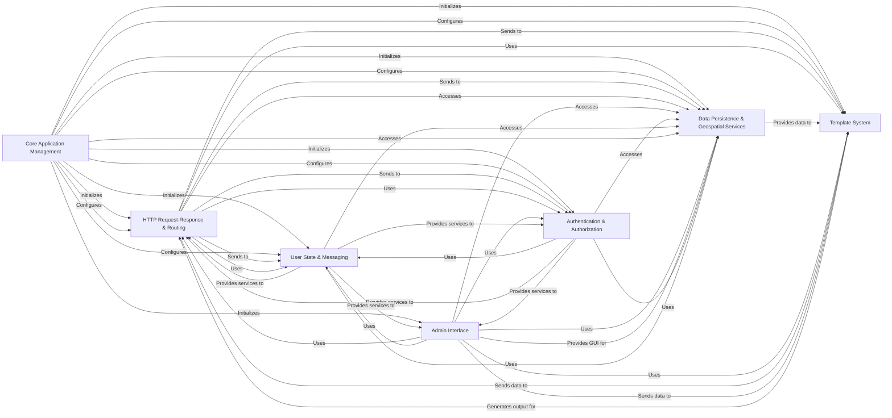

## Component Details

The analysis of the Control Flow Graph (CFG) and the Source Analysis for Django reveals a highly modular and interconnected architecture, designed for rapid web development. By consolidating overlapping components and focusing on core functionalities, the following seven fundamental components are identified.

### Core Application Management
This foundational component is responsible for initializing the entire Django environment, managing the lifecycle of installed applications, loading project settings, and providing the infrastructure for command-line utilities. It ensures that all application configurations and models are properly loaded and accessible throughout the project. It acts as the central orchestrator for the framework's startup and administrative tasks.

**Related Classes/Methods**:

- <a href="https://github.com/django/django/blob/master/django/template/backends/django.py#L0-L0" target="_blank" rel="noopener noreferrer">`django.setup` (0:0)</a>
- <a href="https://github.com/django/django/blob/master/django/apps/registry.py#L12-L433" target="_blank" rel="noopener noreferrer">`django.apps.registry.Apps` (12:433)</a>
- <a href="https://github.com/django/django/blob/master/django/template/backends/django.py#L0-L0" target="_blank" rel="noopener noreferrer">`django.conf.LazySettings` (0:0)</a>
- <a href="https://github.com/django/django/blob/master/django/template/backends/django.py#L0-L0" target="_blank" rel="noopener noreferrer">`django.conf.settings` (0:0)</a>
- `django.core.management.execute_from_command_line` (0:0)
- <a href="https://github.com/django/django/blob/master/django/core/management/base.py#L0-L0" target="_blank" rel="noopener noreferrer">`django.core.management.base.BaseCommand` (0:0)</a>

### HTTP Request-Response & Routing
This is the primary entry and exit point for web communication. It receives raw HTTP requests, processes them through a configurable chain of middleware, resolves the URL path to the appropriate view function or class, and constructs the HTTP response to be sent back to the client. It also provides convenient helper functions for common web development patterns.

**Related Classes/Methods**:

- <a href="https://github.com/django/django/blob/master/django/core/handlers/wsgi.py#L112-L143" target="_blank" rel="noopener noreferrer">`django.core.handlers.wsgi.WSGIHandler` (112:143)</a>
- <a href="https://github.com/django/django/blob/master/django/http/request.py#L52-L469" target="_blank" rel="noopener noreferrer">`django.http.request.HttpRequest` (52:469)</a>
- <a href="https://github.com/django/django/blob/master/django/http/response.py#L364-L434" target="_blank" rel="noopener noreferrer">`django.http.response.HttpResponse` (364:434)</a>
- <a href="https://github.com/django/django/blob/master/django/urls/base.py#L27-L107" target="_blank" rel="noopener noreferrer">`django.urls.base.reverse` (27:107)</a>
- <a href="https://github.com/django/django/blob/master/django/urls/resolvers.py#L0-L0" target="_blank" rel="noopener noreferrer">`django.urls.resolvers.URLResolver` (0:0)</a>
- <a href="https://github.com/django/django/blob/master/django/shortcuts.py#L0-L0" target="_blank" rel="noopener noreferrer">`django.shortcuts` (0:0)</a>

### Data Persistence & Geospatial Services
This component provides Django's powerful Object-Relational Mapper (ORM), enabling developers to interact with relational databases using Python objects instead of raw SQL. It also includes specialized extensions for handling and querying complex geospatial data, abstracting underlying GIS libraries. It manages database connections, transactions, and schema migrations.

**Related Classes/Methods**:

- <a href="https://github.com/django/django/blob/master/django/db/models/base.py#L480-L2407" target="_blank" rel="noopener noreferrer">`django.db.models.base.Model` (480:2407)</a>
- <a href="https://github.com/django/django/blob/master/django/db/models/query.py#L0-L0" target="_blank" rel="noopener noreferrer">`django.db.models.query.QuerySet` (0:0)</a>
- <a href="https://github.com/django/django/blob/master/django/db/models/manager.py#L9-L172" target="_blank" rel="noopener noreferrer">`django.db.models.manager.BaseManager` (9:172)</a>
- <a href="https://github.com/django/django/blob/master/django/db/backends/base/base.py#L29-L791" target="_blank" rel="noopener noreferrer">`django.db.backends.base.base.BaseDatabaseWrapper` (29:791)</a>
- <a href="https://github.com/django/django/blob/master/django/db/transaction.py#L0-L0" target="_blank" rel="noopener noreferrer">`django.db.transaction` (0:0)</a>
- <a href="https://github.com/django/django/blob/master/django/db/migrations/executor.py#L9-L411" target="_blank" rel="noopener noreferrer">`django.db.migrations.executor.MigrationExecutor` (9:411)</a>
- <a href="https://github.com/django/django/blob/master/django/contrib/gis/gdal/geometries.py#L0-L0" target="_blank" rel="noopener noreferrer">`django.contrib.gis.gdal.geometries.OGRGeometry` (0:0)</a>
- <a href="https://github.com/django/django/blob/master/django/contrib/gis/geos/geometry.py#L0-L0" target="_blank" rel="noopener noreferrer">`django.contrib.gis.geos.geometry.GEOSGeometry` (0:0)</a>
- <a href="https://github.com/django/django/blob/master/django/contrib/gis/db/backends/postgis/operations.py#L114-L422" target="_blank" rel="noopener noreferrer">`django.contrib.gis.db.backends.postgis.operations.PostGISOperations` (114:422)</a>

### Admin Interface
A "batteries-included" feature of Django, providing a powerful, automatically generated administrative interface. It allows authorized users to easily manage application data (CRUD operations) through a web-based GUI, significantly reducing development time for backend administration. It leverages the ORM and authentication system.

**Related Classes/Methods**:

- <a href="https://github.com/django/django/blob/master/django/contrib/admin/sites.py#L29-L605" target="_blank" rel="noopener noreferrer">`django.contrib.admin.sites.AdminSite` (29:605)</a>
- <a href="https://github.com/django/django/blob/master/django/contrib/admin/options.py#L634-L2340" target="_blank" rel="noopener noreferrer">`django.contrib.admin.options.ModelAdmin` (634:2340)</a>

### Authentication & Authorization
This component provides a robust and extensible framework for managing user accounts, authenticating users (verifying identities), and controlling their access to resources (authorization) based on permissions and groups. It integrates with the session management and ORM.

**Related Classes/Methods**:

- <a href="https://github.com/django/django/blob/master/django/contrib/auth/models.py#L139-L238" target="_blank" rel="noopener noreferrer">`django.contrib.auth.models.UserManager` (139:238)</a>
- <a href="https://github.com/django/django/blob/master/django/contrib/auth/hashers.py#L0-L0" target="_blank" rel="noopener noreferrer">`django.contrib.auth.hashers` (0:0)</a>
- <a href="https://github.com/django/django/blob/master/django/contrib/auth/middleware.py#L29-L40" target="_blank" rel="noopener noreferrer">`django.contrib.auth.middleware.AuthenticationMiddleware` (29:40)</a>

### Template System
This component is responsible for rendering dynamic content by combining template files with data provided by views. It promotes a clean separation between presentation logic and business logic, making it easier to design and maintain user interfaces.

**Related Classes/Methods**:

- <a href="https://github.com/django/django/blob/master/django/template/engine.py#L12-L213" target="_blank" rel="noopener noreferrer">`django.template.engine.Engine` (12:213)</a>
- <a href="https://github.com/django/django/blob/master/django/template/loader.py#L51-L61" target="_blank" rel="noopener noreferrer">`django.template.loader.render_to_string` (51:61)</a>

### User State & Messaging
This component provides mechanisms for managing transient, user-specific data across multiple HTTP requests (sessions) and for displaying one-time notification messages to users (e.g., success messages after an action). It typically uses cookies and a backend storage (database, file, cache).

**Related Classes/Methods**:

- <a href="https://github.com/django/django/blob/master/django/contrib/sessions/middleware.py#L11-L76" target="_blank" rel="noopener noreferrer">`django.contrib.sessions.middleware.SessionMiddleware` (11:76)</a>
- <a href="https://github.com/django/django/blob/master/django/contrib/sessions/backends/db.py#L11-L197" target="_blank" rel="noopener noreferrer">`django.contrib.sessions.backends.db.SessionStore` (11:197)</a>
- <a href="https://github.com/django/django/blob/master/django/contrib/messages/middleware.py#L5-L25" target="_blank" rel="noopener noreferrer">`django.contrib.messages.middleware.MessageMiddleware` (5:25)</a>
- <a href="https://github.com/django/django/blob/master/django/contrib/messages/api.py#L0-L0" target="_blank" rel="noopener noreferrer">`django.contrib.messages.api` (0:0)</a>

### [FAQ](https://github.com/CodeBoarding/GeneratedOnBoardings/tree/main?tab=readme-ov-file#faq)