```mermaid
graph LR
    Web_Interface_HTTP_Core_["Web Interface (HTTP Core)"]
    Request_Response_Pipeline["Request/Response Pipeline"]
    Application_Logic_Views_["Application Logic (Views)"]
    Data_Persistence_ORM_DB_["Data Persistence (ORM & DB)"]
    Presentation_Layer_Templates_Forms_["Presentation Layer (Templates & Forms)"]
    Static_Media_Assets["Static & Media Assets"]
    System_Management_Extensions["System Management & Extensions"]
    Web_Interface_HTTP_Core_ -- "sends requests to" --> Request_Response_Pipeline
    Request_Response_Pipeline -- "sends responses to" --> Web_Interface_HTTP_Core_
    Request_Response_Pipeline -- "dispatches requests to" --> Application_Logic_Views_
    Application_Logic_Views_ -- "interacts with" --> Data_Persistence_ORM_DB_
    Data_Persistence_ORM_DB_ -- "interacts with" --> Application_Logic_Views_
    Application_Logic_Views_ -- "prepares content for" --> Presentation_Layer_Templates_Forms_
    Presentation_Layer_Templates_Forms_ -- "processes forms from" --> Application_Logic_Views_
    Presentation_Layer_Templates_Forms_ -- "references" --> Static_Media_Assets
    Web_Interface_HTTP_Core_ -- "serves" --> Static_Media_Assets
    System_Management_Extensions -- "manages data via" --> Data_Persistence_ORM_DB_
    System_Management_Extensions -- "integrates with" --> Request_Response_Pipeline
    System_Management_Extensions -- "provides services to" --> Application_Logic_Views_
    click Web_Interface_HTTP_Core_ href "https://github.com/CodeBoarding/GeneratedOnBoardings/blob/main/django/Web_Interface_HTTP_Core_.md" "Details"
    click Request_Response_Pipeline href "https://github.com/CodeBoarding/GeneratedOnBoardings/blob/main/django/Request_Response_Pipeline.md" "Details"
    click Application_Logic_Views_ href "https://github.com/CodeBoarding/GeneratedOnBoardings/blob/main/django/Application_Logic_Views_.md" "Details"
    click Data_Persistence_ORM_DB_ href "https://github.com/CodeBoarding/GeneratedOnBoardings/blob/main/django/Data_Persistence_ORM_DB_.md" "Details"
    click Presentation_Layer_Templates_Forms_ href "https://github.com/CodeBoarding/GeneratedOnBoardings/blob/main/django/Presentation_Layer_Templates_Forms_.md" "Details"
    click Static_Media_Assets href "https://github.com/CodeBoarding/GeneratedOnBoardings/blob/main/django/Static_Media_Assets.md" "Details"
    click System_Management_Extensions href "https://github.com/CodeBoarding/GeneratedOnBoardings/blob/main/django/System_Management_Extensions.md" "Details"
```

## Details

Django's architecture is a highly modular, request-response driven system designed for rapid web development. At its core, the Web Interface (HTTP Core) handles raw HTTP communication, passing requests to the Request/Response Pipeline for global processing by middleware and URL routing. Once a request is routed, the Application Logic (Views) executes the specific business logic, often interacting with the Data Persistence (ORM & DB) layer for database operations. The results are then passed to the Presentation Layer (Templates & Forms) to generate the final response, which may include references to Static & Media Assets. This response then travels back through the pipeline to the HTTP Core. Surrounding these core components, the System Management & Extensions provide essential services like authentication, caching, and administrative tools, ensuring a comprehensive and extensible framework. This structure allows for clear separation of concerns, making it suitable for managing complex web applications, including those that might serve or manage frontend assets like an icon toolkit.

### Web Interface (HTTP Core) [[Expand]](./Web_Interface_HTTP_Core_.md)
The foundational layer for handling raw HTTP requests and responses, acting as the primary entry and exit point for web traffic.

**Related Classes/Methods**:

- <a href="https://github.com/django/django/blob/main/django/core/handlers/wsgi.py" target="_blank" rel="noopener noreferrer">`django.core.handlers.wsgi`</a>
- <a href="https://github.com/django/django/blob/main/django/core/handlers/asgi.py" target="_blank" rel="noopener noreferrer">`django.core.handlers.asgi`</a>
- <a href="https://github.com/django/django/blob/main/django/http/request.py" target="_blank" rel="noopener noreferrer">`django.http.request`</a>
- <a href="https://github.com/django/django/blob/main/django/http/response.py" target="_blank" rel="noopener noreferrer">`django.http.response`</a>

### Request/Response Pipeline [[Expand]](./Request_Response_Pipeline.md)
A series of components that process requests and responses globally, including middleware for cross-cutting concerns and URL routing for dispatching.

**Related Classes/Methods**:

- <a href="https://github.com/django/django/blob/main/django/middleware/" target="_blank" rel="noopener noreferrer">`django.middleware`</a>
- <a href="https://github.com/django/django/blob/main/django/urls/resolvers.py" target="_blank" rel="noopener noreferrer">`django.urls.resolvers`</a>
- <a href="https://github.com/django/django/blob/main/django/urls/conf.py" target="_blank" rel="noopener noreferrer">`django.urls.conf`</a>

### Application Logic (Views) [[Expand]](./Application_Logic_Views_.md)
Contains the core business logic of the application, processing requests, interacting with data, and preparing responses.

**Related Classes/Methods**:

- <a href="https://github.com/django/django/blob/main/django/views/generic/" target="_blank" rel="noopener noreferrer">`django.views.generic`</a>
- <a href="https://github.com/django/django/blob/main/django/shortcuts.py" target="_blank" rel="noopener noreferrer">`django.shortcuts`</a>

### Data Persistence (ORM & DB) [[Expand]](./Data_Persistence_ORM_DB_.md)
Django's Object-Relational Mapper (ORM) and underlying database backends, providing an abstraction layer for database interactions.

**Related Classes/Methods**:

- <a href="https://github.com/django/django/blob/main/django/db/models/" target="_blank" rel="noopener noreferrer">`django.db.models`</a>
- <a href="https://github.com/django/django/blob/main/django/db/backends/" target="_blank" rel="noopener noreferrer">`django.db.backends`</a>
- <a href="https://github.com/django/django/blob/main/django/db/migrations/" target="_blank" rel="noopener noreferrer">`django.db.migrations`</a>

### Presentation Layer (Templates & Forms) [[Expand]](./Presentation_Layer_Templates_Forms_.md)
Responsible for rendering dynamic content (e.g., HTML) using template files and handling user input through robust form processing.

**Related Classes/Methods**:

- <a href="https://github.com/django/django/blob/main/django/template/backends/django.py" target="_blank" rel="noopener noreferrer">`django.template`</a>
- <a href="https://github.com/django/django/blob/main/django/forms/" target="_blank" rel="noopener noreferrer">`django.forms`</a>

### Static & Media Assets [[Expand]](./Static_Media_Assets.md)
Manages the serving of static files (CSS, JavaScript, images, including potentially SVG icons for an Icon Toolkit) and handling user-uploaded media files.

**Related Classes/Methods**:

- <a href="https://github.com/django/django/blob/main/django/core/files/" target="_blank" rel="noopener noreferrer">`django.core.files`</a>
- <a href="https://github.com/django/django/blob/main/django/contrib/staticfiles/" target="_blank" rel="noopener noreferrer">`django.contrib.staticfiles`</a>

### System Management & Extensions [[Expand]](./System_Management_Extensions.md)
A collection of cross-cutting concerns and administrative functionalities, including authentication, caching, internationalization, and command-line utilities.

**Related Classes/Methods**:

- <a href="https://github.com/django/django/blob/main/django/core/management/" target="_blank" rel="noopener noreferrer">`django.core.management`</a>
- <a href="https://github.com/django/django/blob/main/django/contrib/admin/" target="_blank" rel="noopener noreferrer">`django.contrib.admin`</a>
- <a href="https://github.com/django/django/blob/main/django/contrib/auth/" target="_blank" rel="noopener noreferrer">`django.contrib.auth`</a>
- <a href="https://github.com/django/django/blob/main/django/core/cache/" target="_blank" rel="noopener noreferrer">`django.core.cache`</a>
- <a href="https://github.com/django/django/blob/main/django/utils/translation/" target="_blank" rel="noopener noreferrer">`django.utils.translation`</a>
- <a href="https://github.com/django/django/blob/main/django/dispatch/" target="_blank" rel="noopener noreferrer">`django.dispatch`</a>

### [FAQ](https://github.com/CodeBoarding/GeneratedOnBoardings/tree/main?tab=readme-ov-file#faq)