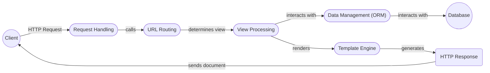

# Django High-Level Data Flow Overview

Django is a high-level Python web framework that encourages rapid development and clean, pragmatic design. It takes care of much of the hassle of web development, so you can focus on writing your app without needing to reinvent the wheel. It is free and open source.

## Component Descriptions

**1. Request Handling:**
   - *Description*: This component receives HTTP requests from the client, parses them, and orchestrates the request processing pipeline. It uses URL routing to determine the appropriate view to execute.
   - *Interaction*: Receives requests from the client and passes control to the URL Resolver. Sends the final HTTP response back to the client.

**2. URL Routing:**
   - *Description*: This component maps incoming URLs to specific views based on the project's URL configuration.
   - *Interaction*: Receives the request from the Request Handler and determines which view should handle the request. Passes control to the View Processing component.

**3. View Processing:**
   - *Description*: This component executes the application logic associated with a specific URL. It interacts with the ORM to retrieve or modify data and renders the appropriate template.
   - *Interaction*: Receives control from the URL Resolver. Interacts with the Data Management (ORM) component to access data. Passes data to the Template Engine for rendering.

**4. Data Management (ORM):**
   - *Description*: This component provides an Object-Relational Mapper (ORM) that allows developers to interact with the database using Python objects rather than raw SQL queries.
   - *Interaction*: Interacts with the View Processing component to retrieve or modify data in the database. Interacts directly with the Database.

**5. Template Engine:**
   - *Description*: This component renders dynamic web pages by combining templates with data provided by the view.
   - *Interaction*: Receives data from the View Processing component and uses it to render the final HTML output. Passes the rendered output to the HTTP Response component.