```mermaid
graph LR
    WSGI_Handler["WSGI Handler"]
    Middleware["Middleware"]
    URL_Dispatcher["URL Dispatcher"]
    View_Layer["View Layer"]
    Template_Engine["Template Engine"]
    Model_Layer_ORM_["Model Layer (ORM)"]
    Database_Backend["Database Backend"]
    Unclassified["Unclassified"]
    WSGI_Handler -- "Passes incoming request for processing" --> Middleware
    Middleware -- "Routes processed request to the URL dispatcher" --> URL_Dispatcher
    URL_Dispatcher -- "Dispatches request to the appropriate view" --> View_Layer
    View_Layer -- "Interacts with models to fetch or save data" --> Model_Layer_ORM_
    View_Layer -- "Renders a template with context data" --> Template_Engine
    Model_Layer_ORM_ -- "Sends queries for database execution" --> Database_Backend
    Database_Backend -- "Returns data from the database" --> Model_Layer_ORM_
    View_Layer -- "Returns HTTP response for post-processing" --> Middleware
    Middleware -- "Returns the final response to be sent to the client" --> WSGI_Handler
    click WSGI_Handler href "https://github.com/CodeBoarding/GeneratedOnBoardings/blob/main/django/WSGI_Handler.md" "Details"
    click Middleware href "https://github.com/CodeBoarding/GeneratedOnBoardings/blob/main/django/Middleware.md" "Details"
    click URL_Dispatcher href "https://github.com/CodeBoarding/GeneratedOnBoardings/blob/main/django/URL_Dispatcher.md" "Details"
    click View_Layer href "https://github.com/CodeBoarding/GeneratedOnBoardings/blob/main/django/View_Layer.md" "Details"
    click Template_Engine href "https://github.com/CodeBoarding/GeneratedOnBoardings/blob/main/django/Template_Engine.md" "Details"
    click Model_Layer_ORM_ href "https://github.com/CodeBoarding/GeneratedOnBoardings/blob/main/django/Model_Layer_ORM_.md" "Details"
    click Database_Backend href "https://github.com/CodeBoarding/GeneratedOnBoardings/blob/main/django/Database_Backend.md" "Details"
```

## Details

An analysis of the Django framework's request-response cycle reveals a layered architecture where each component has a distinct responsibility. The process begins with the `WSGI Handler`, which serves as the main entry point for an incoming HTTP request. The request is then passed through a chain of `Middleware` for preprocessing, handling tasks like session management and authentication. Once processed, the `URL Dispatcher` routes the request to the appropriate `View` based on the URL configuration. The `View Layer` contains the core application logic, interacting with the `Model Layer (ORM)` to perform database operations via the `Database Backend`. For rendering HTML, the View utilizes the `Template Engine`. Finally, the generated `HttpResponse` from the View is passed back through the `Middleware` for post-processing before being sent to the client by the `WSGI Handler`.

### WSGI Handler [[Expand]](./WSGI_Handler.md)
Acts as the primary entry point for web requests, interfacing with the web server and orchestrating the request-response cycle.

**Related Classes/Methods**:

- <a href="https://github.com/django/django/blob/main/django/core/handlers/wsgi.py#L113-L144" target="_blank" rel="noopener noreferrer">`django.core.handlers.wsgi.WSGIHandler`:113-144</a>

### Middleware [[Expand]](./Middleware.md)
A framework of hooks into Django's request/response processing. It's a light, low-level plugin system for globally altering Django's input or output.

**Related Classes/Methods**:

- <a href="https://github.com/django/django/blob/main/django/core/handlers/base.py#L20-L366" target="_blank" rel="noopener noreferrer">`django.core.handlers.base.BaseHandler`:20-366</a>

### URL Dispatcher [[Expand]](./URL_Dispatcher.md)
Routes incoming HTTP requests to the appropriate view function or class based on the URL pattern.

**Related Classes/Methods**:

- <a href="https://github.com/django/django/blob/main/django/urls/resolvers.py" target="_blank" rel="noopener noreferrer">`django.urls.URLResolver`</a>

### View Layer [[Expand]](./View_Layer.md)
Contains the application's core logic. It processes the user request, interacts with the database through the Model Layer, and renders the final response using the Template Engine.

**Related Classes/Methods**:

- <a href="https://github.com/django/django/blob/main/django/views/generic/base.py#L98-L106" target="_blank" rel="noopener noreferrer">`django.views.generic.base.View`:98-106</a>

### Template Engine [[Expand]](./Template_Engine.md)
Renders data into a presentation format, typically HTML, by processing templates and context data provided by the View Layer.

**Related Classes/Methods**:

- <a href="https://github.com/django/django/blob/main/django/template/backends/django.py#L16-L90" target="_blank" rel="noopener noreferrer">`django.template.backends.django.DjangoTemplates`:16-90</a>

### Model Layer (ORM) [[Expand]](./Model_Layer_ORM_.md)
Provides an object-relational mapping (ORM) to the database, allowing developers to interact with database tables as Python objects.

**Related Classes/Methods**:

- <a href="https://github.com/django/django/blob/main/django/db/models/base.py" target="_blank" rel="noopener noreferrer">`django.db.models.Model`</a>

### Database Backend [[Expand]](./Database_Backend.md)
A low-level component that translates ORM queries into database-specific SQL and manages the connection with the database.

**Related Classes/Methods**:

- <a href="https://github.com/django/django/blob/main/django/db/backends/base/base.py#L30-L792" target="_blank" rel="noopener noreferrer">`django.db.backends.base.base.BaseDatabaseWrapper`:30-792</a>

### Unclassified
Component for all unclassified files and utility functions (Utility functions/External Libraries/Dependencies)

**Related Classes/Methods**: _None_

### [FAQ](https://github.com/CodeBoarding/GeneratedOnBoardings/tree/main?tab=readme-ov-file#faq)