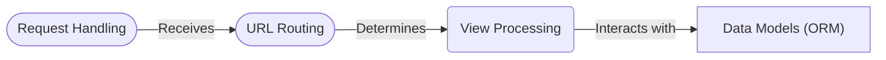

```markdown
# Django High-Level Data Flow Overview

Django is a high-level Python web framework that encourages rapid development and clean, pragmatic design. It takes care of much of the hassle of web development, so you can focus on writing your app without needing to reinvent the wheel. It is a full-featured framework that includes an ORM, templating engine, form handling, and more.


## Component Descriptions

**Request Handling:** This component is the entry point for all incoming HTTP requests. It receives the request, parses it, and creates `HttpRequest` and `HttpResponse` objects. It then passes the request to the URL Routing component and receives the rendered HTML from the Template Rendering component to send back as a response.

**URL Routing:** This component is responsible for mapping incoming URLs to specific view functions. It receives the request from the Request Handling component and uses the URL patterns defined in the project's `urls.py` files to determine which view should handle the request. It then directs the request to the appropriate View Processing component.

**View Processing:** This component contains the application's business logic. It receives the request from the URL Routing component, processes it, interacts with the Data Models component to retrieve or update data, and prepares the data to be rendered by the Template Rendering component. It also interacts with the Authentication and Authorization component to ensure that the user has the necessary permissions to access the requested resource.

**Template Rendering:** This component is responsible for generating the HTML output that is sent back to the client. It receives the data from the View Processing component and combines it with templates to produce the final HTML. It then sends the rendered HTML back to the Request Handling component.

**Data Models:** This component defines the structure and behavior of the data stored in the database. It provides an abstraction layer over the database, allowing the application to interact with the data without needing to write raw SQL queries. The View Processing component interacts with this component to retrieve and update data. The Authentication and Authorization component uses the Data Models component to store user accounts and permissions.

**Authentication and Authorization:** This component handles user authentication, authorization, and session management. It verifies user credentials, manages user sessions, and ensures that users only have access to the resources they are authorized to access. The View Processing component interacts with this component to authenticate users and authorize access to resources. The Data Models component stores the user information.

For each component in the **mermaid diagram**, make it a clickable link like: **click A href "https://github.com/CodeBoarding/GeneratedOnBoardings/blob/main/django//RelevantFile.md"**.

Example of valid mermaid:


The available files are: ['packages_django.dot', 'static_analyzer', '.venv', 'repos', '.gitignore', 'abstract.py', 'call_graph.dot', '.env', 'django_structure.dot', 'Template Rendering.md', 'Data Models.md', 'Authentication and Authorization.md', 'Request Handling.md', 'agents', 'resources', 'URL Routing.md', 'on_boarding.md', 'View Processing.md', '__pycache__', 'main.py', '.idea', 'LICENSE', '.git', 'README.md', 'utils.py']. DON'T change anything else, just add the links. Return the full markdown string.
For the links use the full links, not relative links.
```