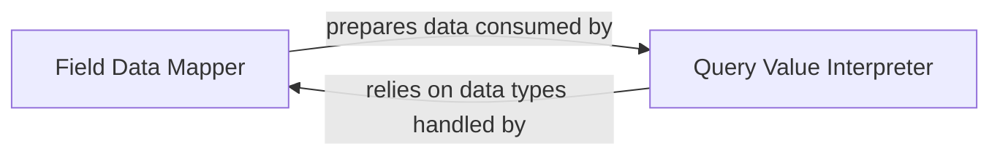

## Details

Based on the provided analysis, the `Data Type & Value Converter` subsystem is best represented by two distinct, yet highly interdependent, core components that align with the "Database Connector / ORM Extension" architectural patterns. These components are crucial for bridging the type and value differences between Django's ORM and MongoDB's document model.

### Field Data Mapper
This component is responsible for the precise, bidirectional conversion of individual Django model field values. It translates Python/Django native data types into MongoDB's BSON format for storage and re-hydrates BSON values back into Python types upon retrieval. It handles the specific logic for custom Djongo field types, ensuring data integrity and correct representation at the field level. This acts as a specialized Data Mapper for atomic field values.

**Related Classes/Methods**:

- <a href="https://github.com/doableware/djongo/blob/master/djongo/models/fields.py" target="_blank" rel="noopener noreferrer">`djongo.models.fields:get_prep_value`</a>
- <a href="https://github.com/doableware/djongo/blob/master/djongo/models/fields.py" target="_blank" rel="noopener noreferrer">`djongo.models.fields:to_python`</a>
- <a href="https://github.com/doableware/djongo/blob/master/djongo/models/fields.py" target="_blank" rel="noopener noreferrer">`djongo.models.fields:from_db_value`</a>
- <a href="https://github.com/doableware/djongo/blob/master/djongo/models/fields.py" target="_blank" rel="noopener noreferrer">`djongo.models.fields:get_db_prep_save`</a>

### Query Value Interpreter
This component focuses on translating values and expressions embedded within SQL-like query clauses (e.g., `WHERE` conditions, `ORDER BY` values, aggregation parameters) into their equivalent MongoDB-compatible BSON structures. It interprets the intent of SQL query components related to values and ensures they are correctly formatted for MongoDB's query language. This is a vital part of the overall Query Translator/Compiler, specifically handling the value-level interpretation.

**Related Classes/Methods**:

- <a href="https://github.com/doableware/djongo/blob/master/djongo/sql2mongo/converters.py" target="_blank" rel="noopener noreferrer">`djongo.sql2mongo.converters:parse`</a>
- <a href="https://github.com/doableware/djongo/blob/master/djongo/sql2mongo/converters.py" target="_blank" rel="noopener noreferrer">`djongo.sql2mongo.converters:to_mongo`</a>
- <a href="https://github.com/doableware/djongo/blob/master/djongo/sql2mongo/converters.py" target="_blank" rel="noopener noreferrer">`djongo.sql2mongo.converters:DistinctConverter`</a>

### [FAQ](https://github.com/CodeBoarding/GeneratedOnBoardings/tree/main?tab=readme-ov-file#faq)