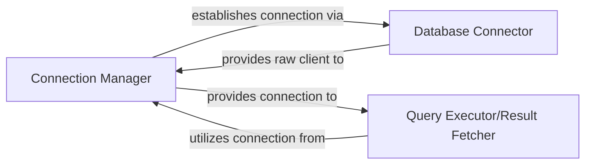

## Details

The Djongo subsystem acts as a crucial intermediary, translating Django ORM operations into MongoDB-compatible queries. At its core, the `Connection Manager` (primarily `DatabaseWrapper`) orchestrates the lifecycle of database connections, leveraging the `Database Connector` to establish and maintain the physical link to MongoDB. Once a connection is active, the `Query Executor/Result Fetcher` takes over, translating Django's SQL-like queries into MongoDB operations and efficiently retrieving the results. This layered architecture ensures a clear separation of concerns, from connection handling to query execution, providing a robust and adaptable bridge between Django and MongoDB.

### Connection Manager
This component is responsible for managing the foundational aspects of the Djongo connection, including client initialization and connection pooling. It serves as the initial entry point for establishing database connections from the Django ORM. It orchestrates the creation and closing of the underlying MongoDB client connection.

**Related Classes/Methods**:

- <a href="https://github.com/doableware/djongo/blob/master/djongo/base.py#L35-L39" target="_blank" rel="noopener noreferrer">`djongo.base.DjongoClient`:35-39</a>

### Database Connector
This component handles the direct, low-level interaction with the MongoDB database. Its primary responsibility is establishing and maintaining the physical connection to the MongoDB instance, providing the raw database client object.

**Related Classes/Methods**:

- <a href="https://github.com/doableware/djongo/blob/master/djongo/database.py#L8-L14" target="_blank" rel="noopener noreferrer">`djongo.database.connect`:8-14</a>

### Query Executor/Result Fetcher
This component provides the interface for executing SQL-like queries (translated from Django's ORM) and fetching results from MongoDB. It acts as the crucial bridge between Django's ORM and MongoDB's native operations, managing the lifecycle of query execution and result retrieval.

**Related Classes/Methods**:

- <a href="https://github.com/doableware/djongo/blob/master/djongo/base.py#L160-L162" target="_blank" rel="noopener noreferrer">`djongo.base.DatabaseWrapper.create_cursor`:160-162</a>
- <a href="https://github.com/doableware/djongo/blob/master/djongo/cursor.py#L9-L84" target="_blank" rel="noopener noreferrer">`djongo.cursor.Cursor`:9-84</a>

### [FAQ](https://github.com/CodeBoarding/GeneratedOnBoardings/tree/main?tab=readme-ov-file#faq)