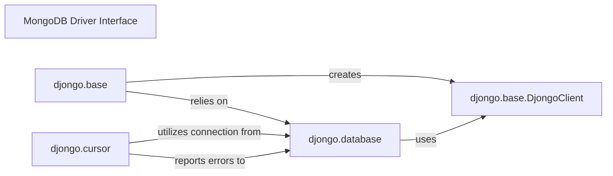

## Details

The `MongoDB Driver Interface` subsystem is the foundational layer for direct interaction with the MongoDB database within Djongo. It encapsulates the complexities of low-level database communication, query execution, and result retrieval, leveraging the `pymongo` driver.

### MongoDB Driver Interface [[Expand]](./MongoDB_Driver_Interface.md)
The overarching component responsible for establishing and managing direct communication with the MongoDB database using the `pymongo` driver. It orchestrates query execution, retrieves raw results, and handles the underlying connection lifecycle and error propagation. This component acts as the primary entry point for higher-level Djongo components needing to interact with MongoDB.

**Related Classes/Methods**:

- <a href="https://github.com/doableware/djongo/blob/master/djongo/base.py" target="_blank" rel="noopener noreferrer">`djongo.base`</a>
- <a href="https://github.com/doableware/djongo/blob/master/djongo/database.py" target="_blank" rel="noopener noreferrer">`djongo.database`</a>
- <a href="https://github.com/doableware/djongo/blob/master/djongo/cursor.py" target="_blank" rel="noopener noreferrer">`djongo.cursor`</a>

### djongo.base
This component is responsible for the initial establishment of new MongoDB connections and the initialization of the `DjongoClient`. It also manages connection-related caching to optimize performance and resource utilization. It acts as the factory for database connections.

**Related Classes/Methods**:

- <a href="https://github.com/doableware/djongo/blob/master/djongo/base.py" target="_blank" rel="noopener noreferrer">`djongo.base`</a>

### djongo.database
Serves as the core low-level interface for direct communication with MongoDB. It manages the connection lifecycle (e.g., opening, closing connections) and is crucial for propagating database-level errors back to higher-level components, ensuring robust error handling.

**Related Classes/Methods**:

- <a href="https://github.com/doableware/djongo/blob/master/djongo/database.py" target="_blank" rel="noopener noreferrer">`djongo.database`</a>

### djongo.cursor
This component is responsible for executing the translated database queries against the MongoDB instance and retrieving the raw results. It also handles resource cleanup after query execution, ensuring efficient use of database connections and preventing resource leaks.

**Related Classes/Methods**:

- <a href="https://github.com/doableware/djongo/blob/master/djongo/cursor.py" target="_blank" rel="noopener noreferrer">`djongo.cursor`</a>

### djongo.base.DjongoClient
This is the direct wrapper around the `pymongo` client instance. It provides the actual, lowest-level methods for interacting with MongoDB, abstracting the raw `pymongo` calls. It's the direct interface to the MongoDB wire protocol.

**Related Classes/Methods**:

- <a href="https://github.com/doableware/djongo/blob/master/djongo/base.py#L35-L39" target="_blank" rel="noopener noreferrer">`djongo.base.DjongoClient`:35-39</a>

### [FAQ](https://github.com/CodeBoarding/GeneratedOnBoardings/tree/main?tab=readme-ov-file#faq)