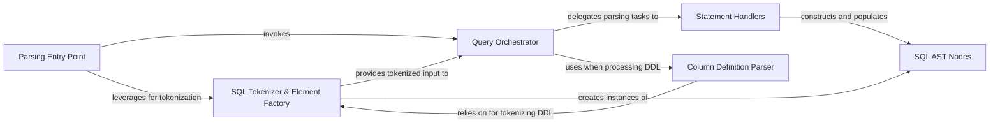

## Details

Parses incoming SQL queries from the Django ORM, tokenizes them, and generates an Abstract Syntax Tree (AST) for subsequent translation into MongoDB queries.

### SQL Tokenizer & Element Factory
Performs the initial lexical analysis, breaking down raw SQL queries into fundamental tokens (e.g., keywords, operators, identifiers). It also provides structured representations (e.g., `SQLStatement`, `SQLIdentifier`) for these tokens and helper methods to extract specific SQL elements, forming the basis for AST construction.

**Related Classes/Methods**:

- <a href="https://github.com/doableware/djongo/blob/master/djongo/sql2mongo/sql_tokens.py#L225-L274" target="_blank" rel="noopener noreferrer">`djongo.sql2mongo.sql_tokens.SQLStatement`:225-274</a>
- <a href="https://github.com/doableware/djongo/blob/master/djongo/sql2mongo/sql_tokens.py#L102-L152" target="_blank" rel="noopener noreferrer">`djongo.sql2mongo.sql_tokens.SQLIdentifier`:102-152</a>

### SQL AST Nodes
These classes represent the fundamental lexical and syntactic units (tokens) extracted from the SQL query, forming the nodes of the Abstract Syntax Tree. They are the core data structures for the intermediate representation of the parsed SQL query.

**Related Classes/Methods**:

- <a href="https://github.com/doableware/djongo/blob/master/djongo/sql2mongo/sql_tokens.py#L225-L274" target="_blank" rel="noopener noreferrer">`djongo.sql2mongo.sql_tokens.SQLStatement`:225-274</a>
- <a href="https://github.com/doableware/djongo/blob/master/djongo/sql2mongo/sql_tokens.py#L102-L152" target="_blank" rel="noopener noreferrer">`djongo.sql2mongo.sql_tokens.SQLIdentifier`:102-152</a>
- <a href="https://github.com/doableware/djongo/blob/master/djongo/sql2mongo/sql_tokens.py#L201-L222" target="_blank" rel="noopener noreferrer">`djongo.sql2mongo.sql_tokens.SQLPlaceholder`:201-222</a>

### Query Orchestrator
This is the central class that orchestrates the entire SQL parsing and AST generation process. It consumes the tokenized input, identifies the type of SQL statement, and delegates the detailed parsing and AST construction to specialized internal methods.

**Related Classes/Methods**:

- <a href="https://github.com/doableware/djongo/blob/master/djongo/sql2mongo/query.py" target="_blank" rel="noopener noreferrer">`djongo.sql2mongo.query.Query`</a>

### Parsing Entry Point
The primary method within the `Query` class that initiates the parsing of an incoming SQL string. It serves as the public interface for the SQL Query Parsing & AST Generation subsystem, directing the flow to the appropriate statement-specific handlers.

**Related Classes/Methods**:

- <a href="https://github.com/doableware/djongo/blob/master/djongo/sql2mongo/query.py#L833-L882" target="_blank" rel="noopener noreferrer">`djongo.sql2mongo.query.parse`:833-882</a>

### Statement Handlers
These are specialized internal methods within the `Query` class, each dedicated to processing a specific type of SQL statement (e.g., SELECT, INSERT, UPDATE, DELETE) and constructing its specific AST representation. They embody the concrete parsing logic for different SQL grammar rules.

**Related Classes/Methods**:

- <a href="https://github.com/doableware/djongo/blob/master/djongo/sql2mongo/query.py#L929-L930" target="_blank" rel="noopener noreferrer">`djongo.sql2mongo.query._select`:929-930</a>
- <a href="https://github.com/doableware/djongo/blob/master/djongo/sql2mongo/query.py#L924-L927" target="_blank" rel="noopener noreferrer">`djongo.sql2mongo.query._insert`:924-927</a>
- <a href="https://github.com/doableware/djongo/blob/master/djongo/sql2mongo/query.py#L914-L917" target="_blank" rel="noopener noreferrer">`djongo.sql2mongo.query._update`:914-917</a>
- <a href="https://github.com/doableware/djongo/blob/master/djongo/sql2mongo/query.py#L919-L922" target="_blank" rel="noopener noreferrer">`djongo.sql2mongo.query._delete`:919-922</a>

### Column Definition Parser
A specialized method for parsing and interpreting column definitions and constraints from SQL DDL (Data Definition Language) statements. While not directly involved in DML query parsing, it's crucial for schema-related operations that are part of the overall SQL interpretation within the `sql_tokens` module.

**Related Classes/Methods**:

- <a href="https://github.com/doableware/djongo/blob/master/djongo/sql2mongo/sql_tokens.py#L327-L359" target="_blank" rel="noopener noreferrer">`djongo.sql2mongo.sql_tokens.sql2col_defs`:327-359</a>

### [FAQ](https://github.com/CodeBoarding/GeneratedOnBoardings/tree/main?tab=readme-ov-file#faq)