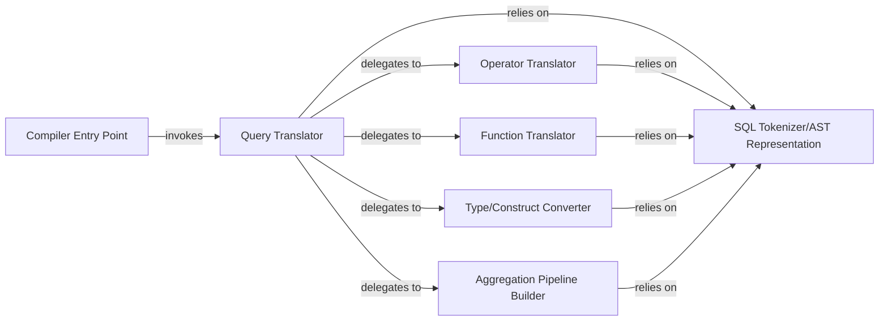

## Details

The `SQL to MongoDB Query Compiler` subsystem is the core translation engine within Djongo, responsible for converting SQL Abstract Syntax Trees (ASTs) into native MongoDB queries or aggregation pipelines. It embodies the Interpreter and Data Mapper patterns, translating high-level SQL constructs into low-level MongoDB operations.

### Compiler Entry Point
Acts as the high-level interface for the Django ORM, receiving SQL query representations and initiating the compilation process. It orchestrates the overall translation by delegating to the core query translation logic.

**Related Classes/Methods**:

- <a href="https://github.com/doableware/djongo/blob/master/djongo/compiler.py" target="_blank" rel="noopener noreferrer">`djongo/compiler.py`</a>

### Query Translator
The central orchestrator of the SQL to MongoDB conversion. It parses incoming SQL statements, manages the overall query structure (including collection and field mapping), and dispatches specific translation tasks for different SQL operations (DML/DDL) to specialized sub-components. It constructs the final MongoDB query or aggregation pipeline.

**Related Classes/Methods**:

- <a href="https://github.com/doableware/djongo/blob/master/djongo/sql2mongo/query.py" target="_blank" rel="noopener noreferrer">`djongo/sql2mongo/query.py`</a>

### Operator Translator
Translates SQL comparison and logical operators (e.g., `=`, `LIKE`, `AND`, `OR`) into their corresponding MongoDB query operators (`$eq`, `$regex`, `$and`, `$or`), handling precedence and negation.

**Related Classes/Methods**:

- <a href="https://github.com/doableware/djongo/blob/master/djongo/sql2mongo/operators.py" target="_blank" rel="noopener noreferrer">`djongo/sql2mongo/operators.py`</a>

### Function Translator
Converts SQL functions (e.g., `COUNT`, `SUM`, `DateTrunc`) into MongoDB aggregation expressions or query components, managing function aliases and field references.

**Related Classes/Methods**:

- <a href="https://github.com/doableware/djongo/blob/master/djongo/sql2mongo/functions.py" target="_blank" rel="noopener noreferrer">`djongo/sql2mongo/functions.py`</a>

### Type/Construct Converter
Handles specific data type conversions between SQL/Django and MongoDB types. It also translates certain SQL constructs (e.g., `DISTINCT`, `LIMIT`, `OFFSET`) into their MongoDB equivalents (e.g., `$group`, `$limit`, `$skip`), managing field lookups and `_id` conversions.

**Related Classes/Methods**:

- <a href="https://github.com/doableware/djongo/blob/master/djongo/sql2mongo/converters.py" target="_blank" rel="noopener noreferrer">`djongo/sql2mongo/converters.py`</a>

### SQL Tokenizer/AST Representation
Provides foundational classes and utilities for representing SQL tokens, statements, identifiers, and constants. This component is crucial for parsing SQL fragments and maintaining a structured representation of the SQL query during the translation process.

**Related Classes/Methods**:

- <a href="https://github.com/doableware/djongo/blob/master/djongo/sql2mongo/sql_tokens.py" target="_blank" rel="noopener noreferrer">`djongo/sql2mongo/sql_tokens.py`</a>

### Aggregation Pipeline Builder
Specializes in constructing complex MongoDB aggregation pipelines from SQL queries that require operations like `GROUP BY`, `JOIN` (simulated), or advanced data transformations.

**Related Classes/Methods**:

- <a href="https://github.com/doableware/djongo/blob/master/djongo/sql2mongo/aggregation.py" target="_blank" rel="noopener noreferrer">`djongo/sql2mongo/aggregation.py`</a>

### [FAQ](https://github.com/CodeBoarding/GeneratedOnBoardings/tree/main?tab=readme-ov-file#faq)