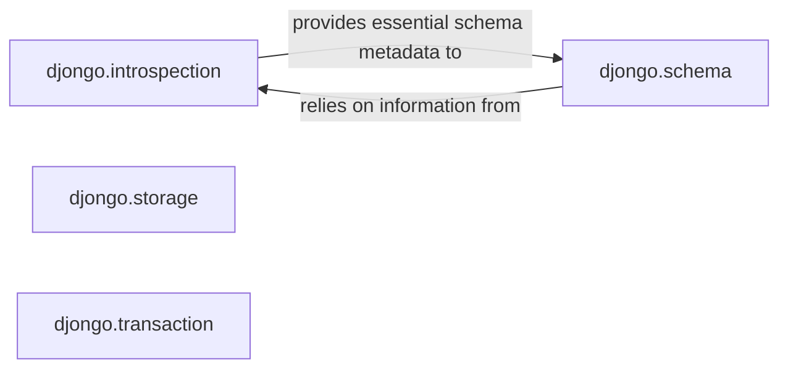

## Details

The `Schema & Storage Services` subsystem in Djongo is crucial for bridging the relational paradigm of Django with the document-oriented nature of MongoDB, specifically focusing on schema understanding, data persistence beyond standard ORM operations (files), and transaction management. This subsystem encompasses Database Introspection, Schema Mapping, File Storage, and Transaction Management.

### djongo.introspection
Acts as the database introspection layer for MongoDB. It enables Django's ORM to understand and interact with MongoDB's schema by discovering indexes and constraints and translating them into a Django-compatible format for schema management and migrations.

**Related Classes/Methods**:

- <a href="https://github.com/doableware/djongo/blob/master/djongo/introspection.py" target="_blank" rel="noopener noreferrer">`djongo.introspection`</a>

### djongo.schema
This component is the core of the ORM extension, defining and managing the intricate mapping between Django models (relational concepts) and MongoDB collections/documents. It ensures data integrity and structural consistency by translating Django field types, relationships, and constraints into appropriate MongoDB structures.

**Related Classes/Methods**:

- <a href="https://github.com/doableware/djongo/blob/master/djongo/schema.py" target="_blank" rel="noopener noreferrer">`djongo.schema`</a>

### djongo.storage
Implements Django's standard file storage API by leveraging MongoDB's GridFS. This component abstracts the complexities of storing and retrieving large binary files (e.g., user uploads) within MongoDB, providing a seamless file system interface to Django applications.

**Related Classes/Methods**:

- <a href="https://github.com/doableware/djongo/blob/master/djongo/storage.py" target="_blank" rel="noopener noreferrer">`djongo.storage`</a>

### djongo.transaction
Adapts Django's transaction management concepts to MongoDB's capabilities. For MongoDB versions supporting multi-document transactions, this component orchestrates atomic operations across multiple documents or collections. For older versions, it ensures atomicity for single-document operations where possible, aligning with Django's expectations for data consistency.

**Related Classes/Methods**:

- <a href="https://github.com/doableware/djongo/blob/master/djongo/transaction.py" target="_blank" rel="noopener noreferrer">`djongo.transaction`</a>

### [FAQ](https://github.com/CodeBoarding/GeneratedOnBoardings/tree/main?tab=readme-ov-file#faq)