```mermaid
graph LR
    Django_ORM_Integration_Layer["Django ORM Integration Layer"]
    SQL_Query_Parsing_AST_Generation["SQL Query Parsing & AST Generation"]
    SQL_to_MongoDB_Query_Compiler["SQL to MongoDB Query Compiler"]
    Data_Type_Value_Converter["Data Type & Value Converter"]
    MongoDB_Driver_Interface["MongoDB Driver Interface"]
    Schema_Storage_Services["Schema & Storage Services"]
    Django_ORM_Integration_Layer -- "passes SQL statements to" --> SQL_Query_Parsing_AST_Generation
    SQL_Query_Parsing_AST_Generation -- "provides AST to" --> SQL_to_MongoDB_Query_Compiler
    SQL_to_MongoDB_Query_Compiler -- "requests transformations from" --> Data_Type_Value_Converter
    SQL_to_MongoDB_Query_Compiler -- "sends query to" --> MongoDB_Driver_Interface
    MongoDB_Driver_Interface -- "returns results to" --> SQL_to_MongoDB_Query_Compiler
    Data_Type_Value_Converter -- "returns converted results to" --> Django_ORM_Integration_Layer
    Django_ORM_Integration_Layer -- "delegates tasks to" --> Schema_Storage_Services
    click Django_ORM_Integration_Layer href "https://github.com/CodeBoarding/GeneratedOnBoardings/blob/main/djongo/Django_ORM_Integration_Layer.md" "Details"
    click SQL_Query_Parsing_AST_Generation href "https://github.com/CodeBoarding/GeneratedOnBoardings/blob/main/djongo/SQL_Query_Parsing_AST_Generation.md" "Details"
    click SQL_to_MongoDB_Query_Compiler href "https://github.com/CodeBoarding/GeneratedOnBoardings/blob/main/djongo/SQL_to_MongoDB_Query_Compiler.md" "Details"
    click Data_Type_Value_Converter href "https://github.com/CodeBoarding/GeneratedOnBoardings/blob/main/djongo/Data_Type_Value_Converter.md" "Details"
    click MongoDB_Driver_Interface href "https://github.com/CodeBoarding/GeneratedOnBoardings/blob/main/djongo/MongoDB_Driver_Interface.md" "Details"
    click Schema_Storage_Services href "https://github.com/CodeBoarding/GeneratedOnBoardings/blob/main/djongo/Schema_Storage_Services.md" "Details"
```

## Details

The `djongo` architecture is centered around an **Adapter Pattern** that allows Django's relational ORM to interact seamlessly with a NoSQL MongoDB backend. The system's core is a sophisticated **Query Translation Pipeline** that begins with the **Django ORM Integration Layer** intercepting standard database calls. These calls are then processed by the **SQL Query Parsing & AST Generation** component, which feeds into the **SQL to MongoDB Query Compiler**. This compiler, leveraging specialized **Operator & Function Translators** and a **Data Type & Value Converter**, transforms SQL constructs into native MongoDB queries. The **MongoDB Driver Interface** then executes these queries, returning results that are re-converted and passed back to the Django ORM. Complementary **Schema & Storage Services** provide essential functionalities like database introspection, GridFS file handling, and transaction management, ensuring comprehensive compatibility and functionality within the Django ecosystem. This design effectively abstracts MongoDB's specifics, maintaining Django's familiar API while enabling NoSQL capabilities.

### Django ORM Integration Layer [[Expand]](./Django_ORM_Integration_Layer.md)
The primary interface for Django's ORM, handling connections, cursor operations, and routing all database interactions through Djongo.

**Related Classes/Methods**:

- <a href="https://github.com/doableware/djongo/blob/master/djongo/base.py" target="_blank" rel="noopener noreferrer">`djongo/base.py`</a>
- <a href="https://github.com/doableware/djongo/blob/master/djongo/database.py" target="_blank" rel="noopener noreferrer">`djongo/database.py`</a>
- <a href="https://github.com/doableware/djongo/blob/master/djongo/cursor.py" target="_blank" rel="noopener noreferrer">`djongo/cursor.py`</a>

### SQL Query Parsing & AST Generation [[Expand]](./SQL_Query_Parsing_AST_Generation.md)
Parses incoming SQL queries from the Django ORM, tokenizes them, and generates an Abstract Syntax Tree (AST) for subsequent translation.

**Related Classes/Methods**:

- <a href="https://github.com/doableware/djongo/blob/master/djongo/sql2mongo/sql_tokens.py" target="_blank" rel="noopener noreferrer">`djongo/sql2mongo/sql_tokens.py`</a>
- <a href="https://github.com/doableware/djongo/blob/master/djongo/sql2mongo/query.py" target="_blank" rel="noopener noreferrer">`djongo/sql2mongo/query.py`</a>

### SQL to MongoDB Query Compiler [[Expand]](./SQL_to_MongoDB_Query_Compiler.md)
The core translation engine that converts the SQL AST into native MongoDB queries (e.g., `find`, `insert`, `update`, `delete`) or aggregation pipelines. It orchestrates operator and function translation.

**Related Classes/Methods**:

- <a href="https://github.com/doableware/djongo/blob/master/djongo/compiler.py" target="_blank" rel="noopener noreferrer">`djongo/compiler.py`</a>
- <a href="https://github.com/doableware/djongo/blob/master/djongo/sql2mongo/query.py" target="_blank" rel="noopener noreferrer">`djongo/sql2mongo/query.py`</a>
- <a href="https://github.com/doableware/djongo/blob/master/djongo/sql2mongo/aggregation.py" target="_blank" rel="noopener noreferrer">`djongo/sql2mongo/aggregation.py`</a>
- <a href="https://github.com/doableware/djongo/blob/master/djongo/sql2mongo/operators.py" target="_blank" rel="noopener noreferrer">`djongo/sql2mongo/operators.py`</a>
- <a href="https://github.com/doableware/djongo/blob/master/djongo/sql2mongo/functions.py" target="_blank" rel="noopener noreferrer">`djongo/sql2mongo/functions.py`</a>

### Data Type & Value Converter [[Expand]](./Data_Type_Value_Converter.md)
Manages the bidirectional conversion of data types and values between Python/Django objects and MongoDB's BSON format, ensuring data integrity during query compilation and result retrieval.

**Related Classes/Methods**:

- <a href="https://github.com/doableware/djongo/blob/master/djongo/sql2mongo/converters.py" target="_blank" rel="noopener noreferrer">`djongo/sql2mongo/converters.py`</a>
- <a href="https://github.com/doableware/djongo/blob/master/djongo/models/fields.py" target="_blank" rel="noopener noreferrer">`djongo/models/fields.py`</a>

### MongoDB Driver Interface [[Expand]](./MongoDB_Driver_Interface.md)
The low-level component responsible for direct communication with the MongoDB database using the `pymongo` driver, executing compiled queries, and retrieving raw results.

**Related Classes/Methods**:

- <a href="https://github.com/doableware/djongo/blob/master/djongo/base.py" target="_blank" rel="noopener noreferrer">`djongo/base.py`</a>
- <a href="https://github.com/doableware/djongo/blob/master/djongo/database.py" target="_blank" rel="noopener noreferrer">`djongo/database.py`</a>

### Schema & Storage Services [[Expand]](./Schema_Storage_Services.md)
A collection of auxiliary services including database introspection (for schema discovery), GridFS integration for file storage, and transaction management capabilities.

**Related Classes/Methods**:

- <a href="https://github.com/doableware/djongo/blob/master/djongo/introspection.py" target="_blank" rel="noopener noreferrer">`djongo/introspection.py`</a>
- <a href="https://github.com/doableware/djongo/blob/master/djongo/schema.py" target="_blank" rel="noopener noreferrer">`djongo/schema.py`</a>
- <a href="https://github.com/doableware/djongo/blob/master/djongo/storage.py" target="_blank" rel="noopener noreferrer">`djongo/storage.py`</a>
- <a href="https://github.com/doableware/djongo/blob/master/djongo/transaction.py" target="_blank" rel="noopener noreferrer">`djongo/transaction.py`</a>

### [FAQ](https://github.com/CodeBoarding/GeneratedOnBoardings/tree/main?tab=readme-ov-file#faq)