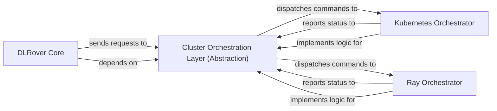

## Details

The DLRover system's core functionality for managing distributed deep learning jobs is orchestrated through a layered architecture. The `DLRover Core` component acts as the central job controller, responsible for defining job specifications and initiating resource requests. It interacts with the `Cluster Orchestration Layer (Abstraction)`, which provides a unified interface to various cluster management systems. This abstraction layer dispatches commands to specific orchestrators, such as the `Kubernetes Orchestrator` and `Ray Orchestrator`, which handle the lifecycle management of jobs within their respective cluster environments. These concrete orchestrators report their status back to the abstraction layer, ensuring the DLRover Core maintains a high-level view of job execution without needing to understand the intricacies of each underlying cluster technology. This design promotes modularity and allows DLRover to support diverse compute environments.

### Cluster Orchestration Layer (Abstraction)
Provides a unified, high-level interface for DLRover to provision, scale, and monitor compute resources, abstracting away the complexities and specific APIs of underlying cluster management systems. It acts as a facade for different cluster technologies.

**Related Classes/Methods**:

- <a href="https://github.com/intelligent-machine-learning/dlrover/blob/master/dlrover/python/scheduler/kubernetes.py" target="_blank" rel="noopener noreferrer">`dlrover.python.scheduler.kubernetes`</a>
- <a href="https://github.com/intelligent-machine-learning/dlrover/blob/master/dlrover/python/scheduler/ray.py" target="_blank" rel="noopener noreferrer">`dlrover.python.scheduler.ray`</a>

### Kubernetes Orchestrator
Manages the lifecycle of distributed deep learning jobs within a Kubernetes cluster, including creating, updating, and deleting Kubernetes resources (e.g., Pods, Deployments, Services) and monitoring their status. It translates abstract resource requests into Kubernetes-specific API calls.

**Related Classes/Methods**:

- <a href="https://github.com/intelligent-machine-learning/dlrover/blob/master/dlrover/python/scheduler/kubernetes.py" target="_blank" rel="noopener noreferrer">`dlrover.python.scheduler.kubernetes`</a>

### Ray Orchestrator
Manages the lifecycle of distributed deep learning jobs within a Ray cluster, orchestrating Ray actors, tasks, and handling resource allocation and monitoring specific to the Ray ecosystem. It translates abstract resource requests into Ray-specific API calls.

**Related Classes/Methods**:

- <a href="https://github.com/intelligent-machine-learning/dlrover/blob/master/dlrover/python/scheduler/ray.py" target="_blank" rel="noopener noreferrer">`dlrover.python.scheduler.ray`</a>

### DLRover Core
Represents the higher-level scheduler or job controller components of DLRover that manage overall job execution, define job specifications, and initiate resource requests. It is the primary consumer of the Cluster Orchestration Layer's services.

**Related Classes/Methods**:

- <a href="https://github.com/intelligent-machine-learning/dlrover/blob/master/dlrover/python/scheduler/job.py" target="_blank" rel="noopener noreferrer">`dlrover.python.scheduler.job`</a>

### [FAQ](https://github.com/CodeBoarding/GeneratedOnBoardings/tree/main?tab=readme-ov-file#faq)