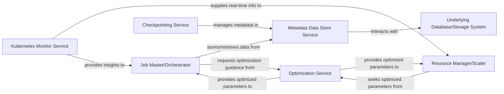

## Details

The DLRover system orchestrates distributed training jobs through a set of interconnected services. The Job Master/Orchestrator acts as the central control, managing job lifecycles and interacting with the Metadata Data Store Service for persistent state management. The Checkpointing Service also leverages the Metadata Data Store Service to ensure job fault tolerance and resumability, with the Underlying Database/Storage System providing the actual data persistence. For performance optimization, both the Job Master/Orchestrator and the Resource Manager/Scaler request guidance from the Optimization Service, which in turn provides tailored parameters. Real-time cluster insights are gathered by the Kubernetes Monitor Service, which supplies critical operational data to both the Resource Manager/Scaler for dynamic scaling and the Job Master/Orchestrator for adaptive job execution. This architecture ensures robust, fault-tolerant, and optimized distributed training.

### Job Master/Orchestrator
This component serves as the central control plane for managing and orchestrating distributed training jobs. It oversees job lifecycle, interacts with the Metadata Data Store Service for state persistence, requests optimization guidance from the Optimization Service, and utilizes insights from the Kubernetes Monitor Service to adapt job execution dynamically.

**Related Classes/Methods**: _None_

### Checkpointing Service
Responsible for managing and persisting job checkpoints and related metadata. This service ensures fault tolerance and job resumability by storing critical state information, such as model weights and training progress, in the Metadata Data Store Service.

**Related Classes/Methods**: _None_

### Metadata Data Store Service
This service provides robust and persistent storage for critical job metadata, configurations, and training states. It is fundamental for maintaining the state of distributed training jobs, enabling fault tolerance, and supporting job resumption. It acts as the reliable backend for the DLRover control plane's data needs.

**Related Classes/Methods**: _None_

### Underlying Database/Storage System
This represents the foundational persistent storage layer that the Metadata Data Store Service utilizes to store all its metadata, configurations, and training states. It is the actual database or storage solution providing durability and retrieval capabilities for the DLRover system.

**Related Classes/Methods**: _None_

### Optimization Service
Implements advanced algorithms to provide intelligent recommendations or decisions for optimizing various aspects of distributed training. This includes resource allocation strategies, task scheduling heuristics, or performance tuning parameters, aiming to improve efficiency and resource utilization.

**Related Classes/Methods**: _None_

### Resource Manager/Scaler
This component dynamically manages and scales computational resources for distributed training jobs. It interacts with the Optimization Service for resource allocation strategies and utilizes real-time cluster information from the Kubernetes Monitor Service to make informed scaling decisions.

**Related Classes/Methods**: _None_

### Kubernetes Monitor Service
Continuously collects real-time operational data from the Kubernetes cluster where DLRover jobs are running. This includes monitoring node status, pod lifecycle events, resource utilization (CPU, memory, GPU), and network metrics. The collected data is crucial for dynamic resource management, fault detection, and proactive scaling.

**Related Classes/Methods**: _None_

### [FAQ](https://github.com/CodeBoarding/GeneratedOnBoardings/tree/main?tab=readme-ov-file#faq)