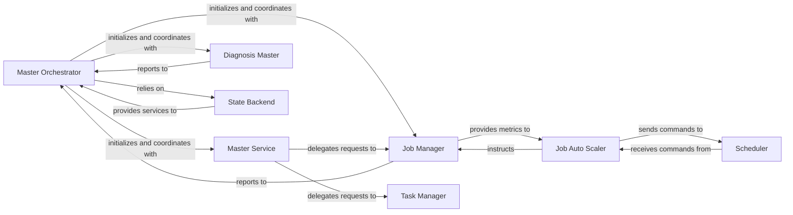

## Details

The DLRover master control plane is orchestrated by the **Master Orchestrator**, which serves as the central coordinator for the entire job lifecycle, ensuring state persistence and fault recovery through its reliance on the **State Backend**. External interactions and agent communications are handled by the **Master Service**, which delegates specific requests to the **Job Manager** for distributed node management and the **Task Manager** for task and shard distribution. The **Job Manager** continuously monitors training nodes and reports their status back to the Master Orchestrator. For dynamic resource optimization, the **Job Auto Scaler** receives metrics from the Job Manager and, based on these insights, instructs the Job Manager and sends commands to the **Scheduler** to adjust cluster resources. Proactive and reactive issue detection is managed by the **Diagnosis Master**, which reports its findings to the Master Orchestrator to trigger necessary recovery actions. The **Scheduler** acts as the interface to the underlying cluster management system, executing scaling operations as directed by the Job Auto Scaler. This interconnected system ensures efficient, fault-tolerant, and dynamically scalable distributed training.

### Master Orchestrator
The central coordinator, managing the overall job lifecycle (start, run, stop, exit), handling job state persistence, failure recovery, and coordinating other master components. It acts as the brain of the control plane.

**Related Classes/Methods**:

- <a href="https://github.com/intelligent-machine-learning/dlrover/blob/master/dlrover/python/unified/master/master.py" target="_blank" rel="noopener noreferrer">`dlrover/python/unified/master/master.py`</a>
- <a href="https://github.com/intelligent-machine-learning/dlrover/blob/master/dlrover/python/master/dist_master.py" target="_blank" rel="noopener noreferrer">`dlrover/python/master/dist_master.py`</a>

### Master Service
Serves as the external API layer for the control plane. It provides gRPC/HTTP interfaces for DLRover agents (running on training nodes) to report status, request tasks, query job information, and synchronize states.

**Related Classes/Methods**:

- <a href="https://github.com/intelligent-machine-learning/dlrover/blob/master/dlrover/python/master/servicer.py" target="_blank" rel="noopener noreferrer">`dlrover/python/master/servicer.py`</a>

### Job Manager
Manages the distributed training nodes (workers, PS, etc.). It monitors node heartbeats, processes node events (failures, successes), handles node relaunching, and maintains the overall job topology.

**Related Classes/Methods**:

- <a href="https://github.com/intelligent-machine-learning/dlrover/blob/master/dlrover/python/master/node/dist_job_manager.py" target="_blank" rel="noopener noreferrer">`dlrover/python/master/node/dist_job_manager.py`</a>
- <a href="https://github.com/intelligent-machine-learning/dlrover/blob/master/dlrover/python/unified/master/elastic/job_manager.py" target="_blank" rel="noopener noreferrer">`dlrover/python/unified/master/elastic/job_manager.py`</a>

### Job Auto Scaler
Implements dynamic resource management. It adjusts the number and resources of training nodes based on real-time job performance, resource utilization, and diagnosed issues to optimize efficiency and cost.

**Related Classes/Methods**:

- <a href="https://github.com/intelligent-machine-learning/dlrover/blob/master/dlrover/python/master/node/job_auto_scaler.py" target="_blank" rel="noopener noreferrer">`dlrover/python/master/node/job_auto_scaler.py`</a>

### Task Manager
Manages the distribution and lifecycle of dataset shards and training tasks. This includes creating tasks, assigning them to nodes, tracking their progress, and handling task recovery in case of failures.

**Related Classes/Methods**:

- <a href="https://github.com/intelligent-machine-learning/dlrover/blob/master/dlrover/python/master/shard/task_manager.py" target="_blank" rel="noopener noreferrer">`dlrover/python/master/shard/task_manager.py`</a>

### Diagnosis Master
Focuses on proactive and reactive diagnostics. It performs pre-training checks, continuously observes training metrics and events, identifies common distributed training issues (e.g., hangs, tensor drops), and triggers appropriate diagnosis and recovery actions.

**Related Classes/Methods**:

- <a href="https://github.com/intelligent-machine-learning/dlrover/blob/master/dlrover/python/master/diagnosis/diagnosis_master.py" target="_blank" rel="noopener noreferrer">`dlrover/python/master/diagnosis/diagnosis_master.py`</a>

### State Backend
Provides the persistence layer for the master's internal state and job context. This is critical for fault tolerance, enabling the control plane to save its state and recover from failures without losing job progress.

**Related Classes/Methods**:

- <a href="https://github.com/intelligent-machine-learning/dlrover/blob/master/dlrover/python/unified/master/state_backend.py" target="_blank" rel="noopener noreferrer">`dlrover/python/unified/master/state_backend.py`</a>

### Scheduler
Acts as the interface to the underlying cluster management system (e.g., Kubernetes, Ray). It translates scaling plans into actual cluster operations, creating, deleting, and updating training pods/actors.

**Related Classes/Methods**:

- <a href="https://github.com/intelligent-machine-learning/dlrover/blob/master/dlrover/python/master/scaler/pod_scaler.py" target="_blank" rel="noopener noreferrer">`dlrover/python/master/scaler/pod_scaler.py`</a>
- <a href="https://github.com/intelligent-machine-learning/dlrover/blob/master/dlrover/python/unified/master/scheduler.py" target="_blank" rel="noopener noreferrer">`dlrover/python/unified/master/scheduler.py`</a>

### [FAQ](https://github.com/CodeBoarding/GeneratedOnBoardings/tree/main?tab=readme-ov-file#faq)