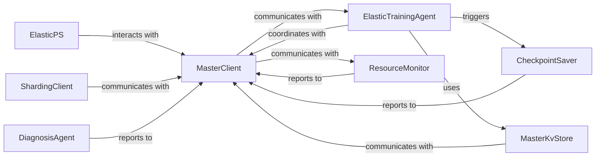

## Details

The DLRover Elastic Agent subsystem is a lightweight, resilient process deployed on each training worker node. It serves as the primary interface between the training framework (PyTorch, TensorFlow) and the DLRover Control Plane, executing commands, reporting status, and managing local resources and data. Its boundaries are defined by the modules responsible for communication with the control plane, resource monitoring, data sharding, fault tolerance, and framework-specific adaptations for elastic training.

### MasterClient
The central communication hub for the Elastic Agent, responsible for reporting local status (resource usage, training progress, diagnosis) and fetching commands or configurations from the DLRover Control Plane (Master). It acts as the agent's primary interface to the distributed system.

**Related Classes/Methods**:

- <a href="https://github.com/intelligent-machine-learning/dlrover/blob/master/dlrover/python/elastic_agent/master_client.py" target="_blank" rel="noopener noreferrer">`dlrover.python.elastic_agent.master_client`</a>

### ElasticTrainingAgent
The PyTorch-specific orchestrator within the agent, managing the lifecycle of PyTorch training processes. It handles rendezvous, worker initialization/restarts, and integrates with other agent components for elastic behavior.

**Related Classes/Methods**:

- <a href="https://github.com/intelligent-machine-learning/dlrover/blob/master/dlrover/python/elastic_agent/torch/training.py" target="_blank" rel="noopener noreferrer">`dlrover.python.elastic_agent.torch.training`</a>

### ElasticPS
The TensorFlow-specific adapter for managing the elastic behavior of Parameter Servers within a TensorFlow training job. It enables TensorFlow components to participate in the DLRover elastic ecosystem.

**Related Classes/Methods**:

- <a href="https://github.com/intelligent-machine-learning/dlrover/blob/master/dlrover/python/elastic_agent/tensorflow/elastic_ps.py" target="_blank" rel="noopener noreferrer">`dlrover.python.elastic_agent.tensorflow.elastic_ps`</a>

### ShardingClient
Manages data sharding for distributed training, including fetching data shards from the Master and reporting task completion or errors. It ensures data is correctly distributed and processed across workers.

**Related Classes/Methods**:

- <a href="https://github.com/intelligent-machine-learning/dlrover/blob/master/dlrover/python/elastic_agent/sharding/client.py" target="_blank" rel="noopener noreferrer">`dlrover.python.elastic_agent.sharding.client`</a>

### CheckpointSaver
Handles the saving and loading of training checkpoints, crucial for fault tolerance and resuming training from a specific state. It ensures training progress is preserved across failures or reconfigurations.

**Related Classes/Methods**:

- <a href="https://github.com/intelligent-machine-learning/dlrover/blob/master/dlrover/python/elastic_agent/torch/ckpt_saver.py" target="_blank" rel="noopener noreferrer">`dlrover.python.elastic_agent.torch.ckpt_saver`</a>

### DiagnosisAgent
Performs local diagnosis on the agent to detect issues and reports detected problems or heartbeats to the Master. It contributes to the overall health monitoring and fault detection of the distributed system.

**Related Classes/Methods**:

- <a href="https://github.com/intelligent-machine-learning/dlrover/blob/master/dlrover/python/elastic_agent/diagnosis/diagnosis_agent.py" target="_blank" rel="noopener noreferrer">`dlrover.python.elastic_agent.diagnosis.diagnosis_agent`</a>

### ResourceMonitor
Collects and reports local resource utilization metrics (CPU, GPU, memory) of the training worker node to the Master. It provides essential data for resource management and scaling decisions.

**Related Classes/Methods**:

- <a href="https://github.com/intelligent-machine-learning/dlrover/blob/master/dlrover/python/elastic_agent/monitor/resource.py" target="_blank" rel="noopener noreferrer">`dlrover.python.elastic_agent.monitor.resource`</a>

### MasterKvStore
Provides a key-value store interface for PyTorch components to interact with a distributed KV store managed by the DLRover Master. It enables distributed state sharing and coordination among training workers.

**Related Classes/Methods**:

- <a href="https://github.com/intelligent-machine-learning/dlrover/blob/master/dlrover/python/elastic_agent/torch/master_kv_store.py" target="_blank" rel="noopener noreferrer">`dlrover.python.elastic_agent.torch.master_kv_store`</a>

### [FAQ](https://github.com/CodeBoarding/GeneratedOnBoardings/tree/main?tab=readme-ov-file#faq)